# How to make slides for an academic talk

> Documentation index (GitHub repo): [https://github.com/pengsida/learning_research](https://github.com/pengsida/learning_research)

> Before you start putting slides together, answer a few questions:
> 1. Which works are you going to present? They should all tackle problems within the same research direction.
> 2. Which problems in that direction did these works actually solve?
> 3. How will you motivate those problems through related work? (You need to introduce all of the problems in one pass.)

How to think about an academic talk:

1. Introduce the research goal.
2. Introduce applications of the research direction.
3. Introduce the challenges through a discussion of related work (similar to the introduction of a paper).
   1. Related work 1.
   2. Challenges that related work 1 still faces.
   3. Related work 2 addresses those challenges.
   4. New challenges that related work 2 still faces (the challenges that the works in this talk solve). Use one slide to lay out the technical challenges that this talk addresses overall.
4. Give an overview of what this talk covers.
5. Present the first work.
   1. Task setting.
   2. The challenges it faces.
   3. The core idea behind the solution.
   4. Our method.
   5. Experimental results.
6. Present the second work.
7. ...
8. Conclusion.
9. Outlook for future work.

Reference materials to organise

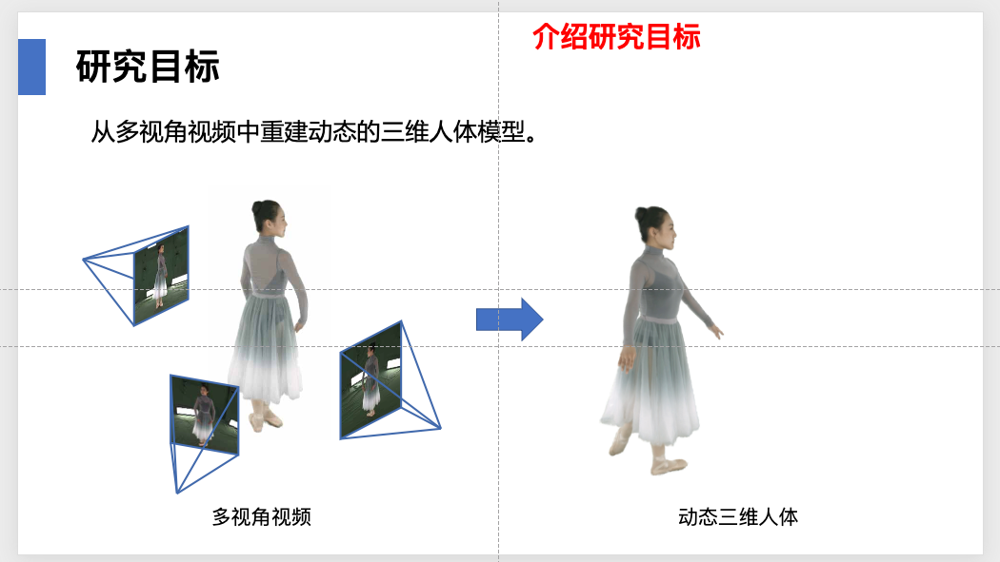

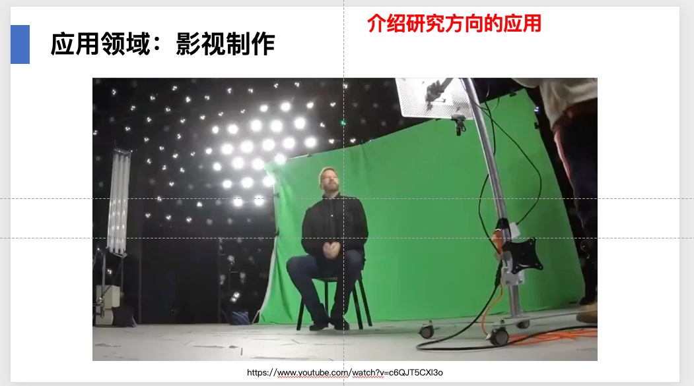

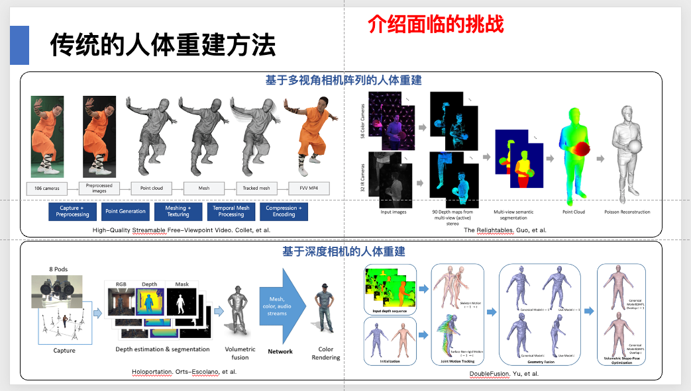

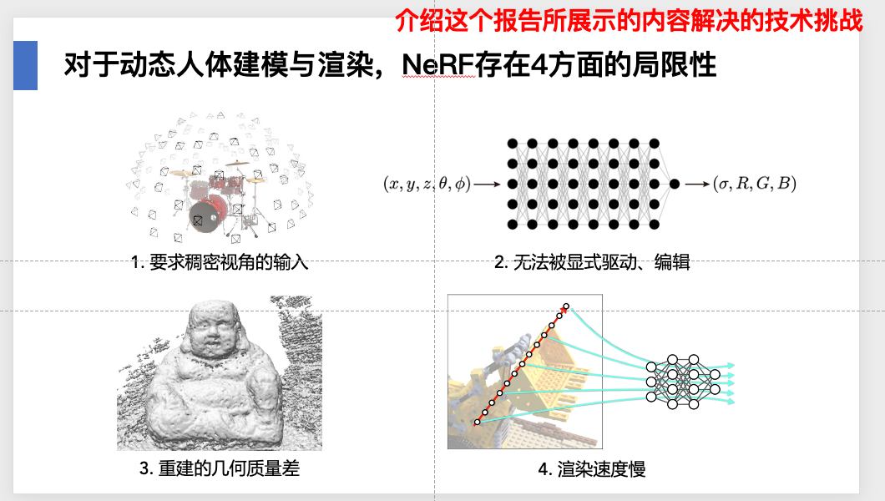

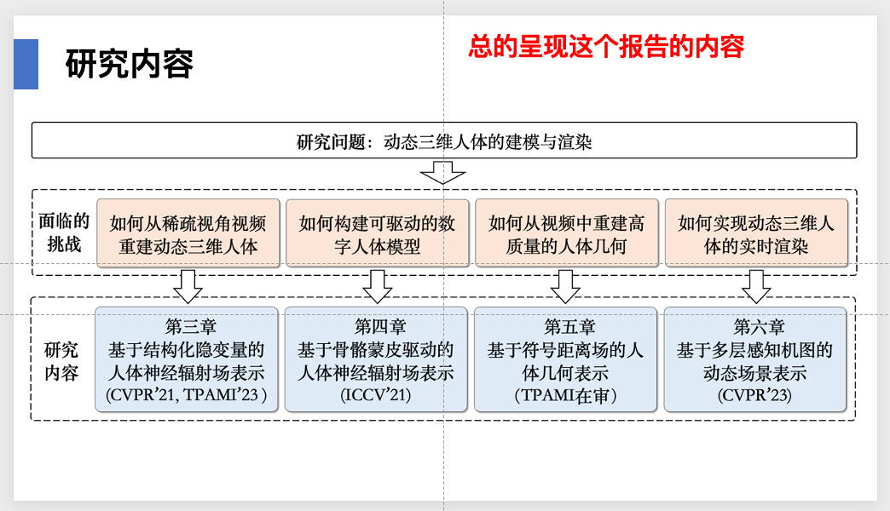

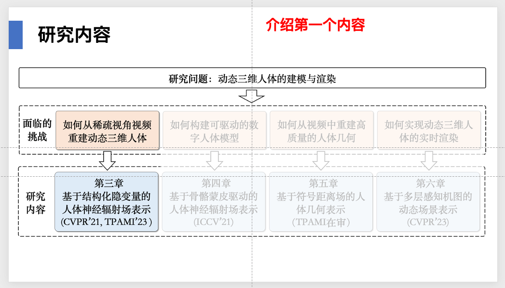

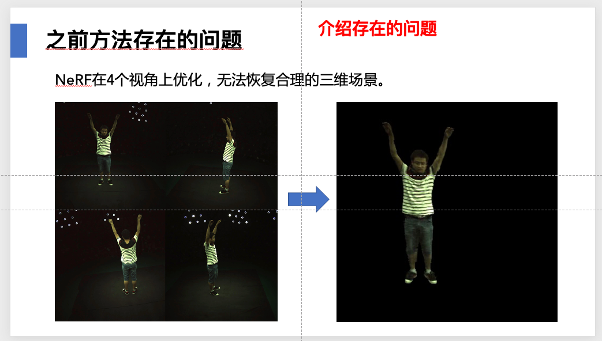

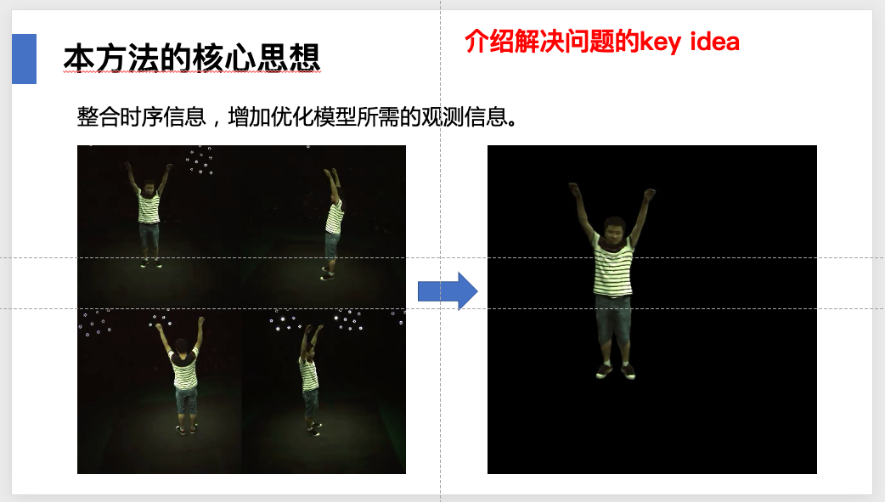

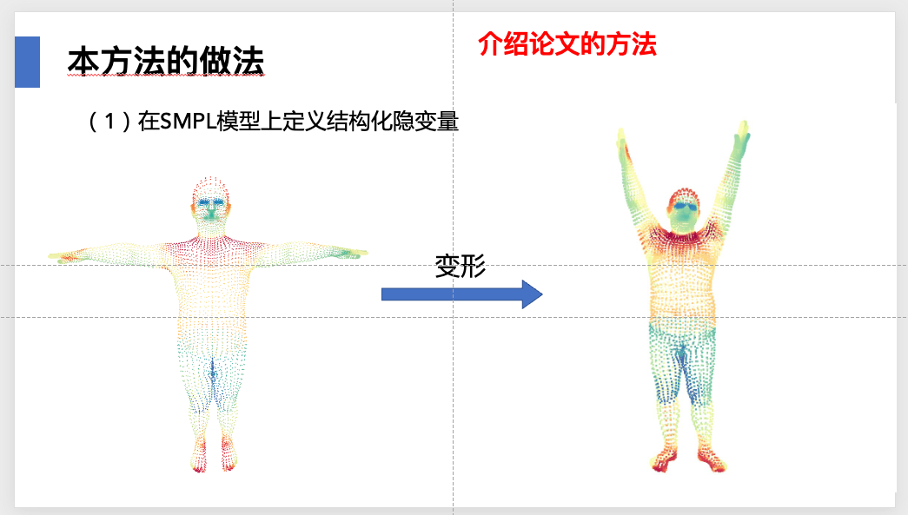

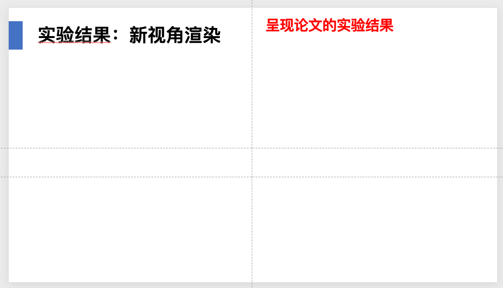

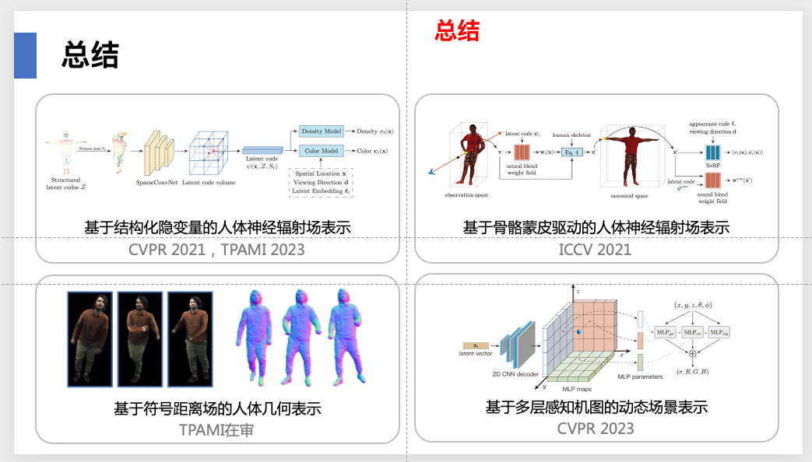

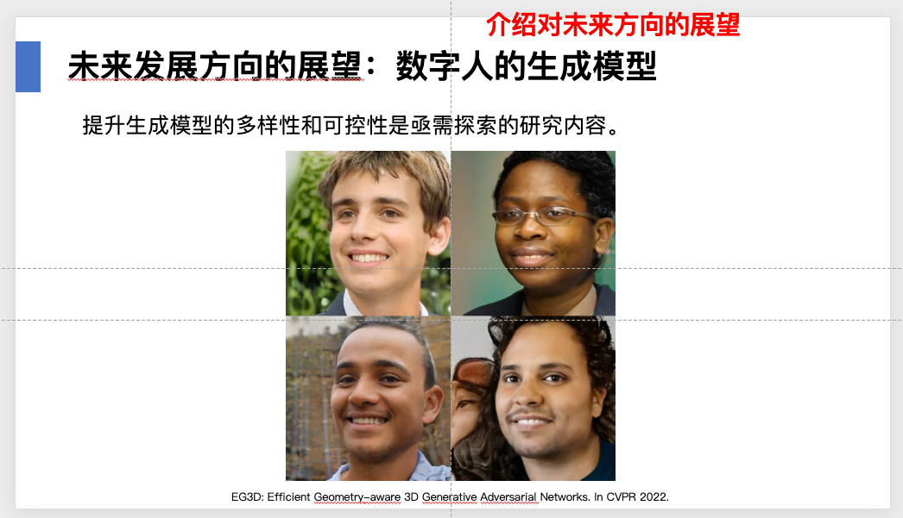

PPT techniques and visual design

Learn how to use PowerPoint master slides.

PPT learning notes: [PPT layout and design](./ppt-layout-and-design.md)

Academic talk slide template: [https://alidocs.dingtalk.com/i/nodes/QOG9lyrgJPwBpdn0u1bOA6m2VzN67Mw4](https://alidocs.dingtalk.com/i/nodes/QOG9lyrgJPwBpdn0u1bOA6m2VzN67Mw4) (DingTalk mind map. DingTalk's sharing model does not allow direct public sharing, so you will need to request access separately.)

An alternative way to structure an academic talk

Start with the application scenario, draw out the research goal from there, then present the research content, and finally discuss the underlying scientific question.

> This differs from leading with the research goal and then talking about applications.
> The style of this kind of talk is to focus on a specific application scenario and then draw the research goal and research content out of it.

