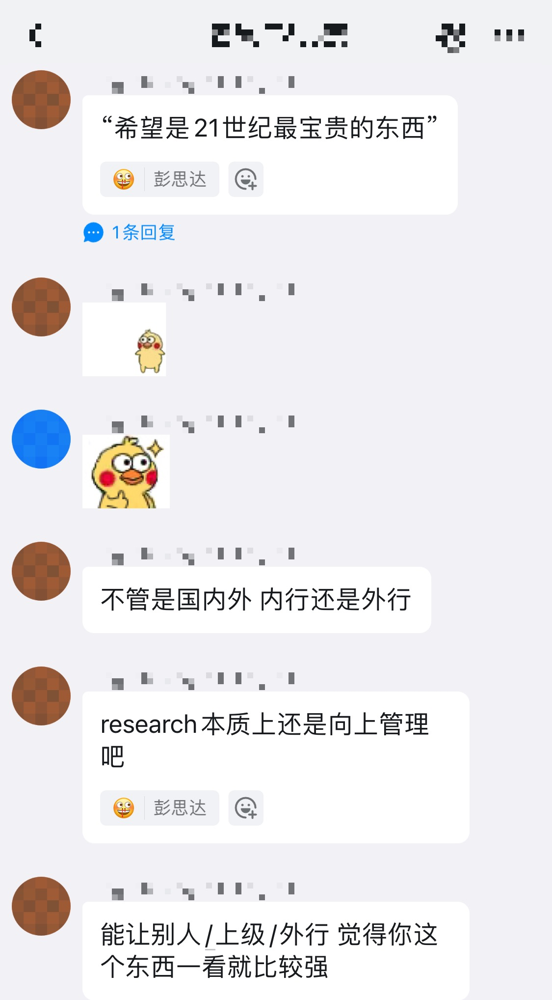

# How to make appealing demos and applications

> Document index (GitHub repo): [https://github.com/pengsida/learning_research](https://github.com/pengsida/learning_research)

Why you should make appealing demos and applications: [to grow the impact and citation count of the paper (Notion)](https://www.notion.so/e94fd42c49614acc98d8457cf00d5903) (Notion).

**Principle: demos and applications should target the downstream research community. Carefully analyse what the downstream research community is interested in.**

Once your algorithm works on the target data, try to run it on as much new and more challenging data as you can, to see the limits of the algorithm and bring out its potential. Everyone wants to see how far an algorithm can go, and that on its own is a big contribution.

Examples

Example 1: if Neural Body had not done the street-dance data, it probably would not have made best paper candidate. If it had done the multi-NB data, then because it shows more possibilities, it would likely have got best student paper.

Example 2: if the AniNeRF paper had run experiments on this kind of data, the impact would have been a lot bigger.

- Mirror demo (video, embedded in source) <!-- zh: mirror-demo.mp4 -->

Example 3: vid2avatar ran experiments on in-the-wild data, which brings out the potential of the algorithm and makes it feel really cool. [https://github.com/MoyGcc/vid2avatar](https://github.com/MoyGcc/vid2avatar)

A student in our group summed up why running experiments on more challenging new data has so much impact

Putting interactive demos on Hugging Face is also a good way to draw attention to our papers.

## See also

- [Which applications and demos to make](./which-applications-demos.md)
- [Writing the Experiments section](./paper-writing/experiments.md)
- [Paper writing template](./paper-writing/template.md)
