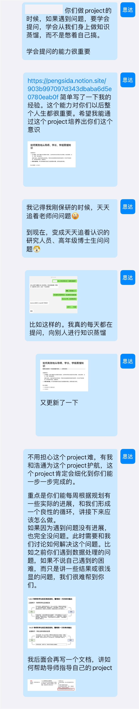

# Extracting knowledge from supervisors and senior students

> The first sign of a wise mind is being good at asking questions. Plekhanov.

> Document index (GitHub repo): [https://github.com/pengsida/learning_research](https://github.com/pengsida/learning_research)

There are two key points:

1. **Be willing to ask questions.** Build the habit of "knowledge distillation" whenever you don't understand something. Distil knowledge from a wide range of sources, including large language models like Kimi, the internet, papers, your supervisor, and senior students.

   Have the courage to ask. Get over the fear that many Chinese students have. Don't be afraid of your supervisor or senior students for no reason. Treating them with politeness and respect is the best approach.
2. **Refine the key question.** Learn how to organise and summarise the problem you are currently facing. This is similar to the skill of expressing yourself clearly.

Tutorials online:

1. [How to build the ability to "ask" questions](https://www.youtube.com/watch?v=uKgnxNldXO8)
2. [How to ask questions](https://github.com/ryanhanwu/How-To-Ask-Questions-The-Smart-Way/blob/main/README-zh_CN.md)

Lab style

A note I gave to students in the lab who were just starting out in research:

