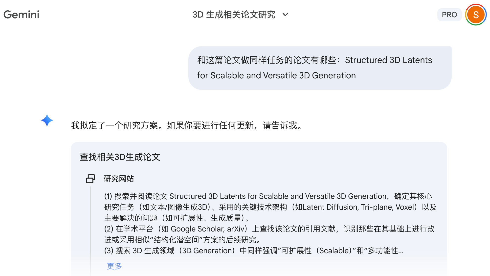
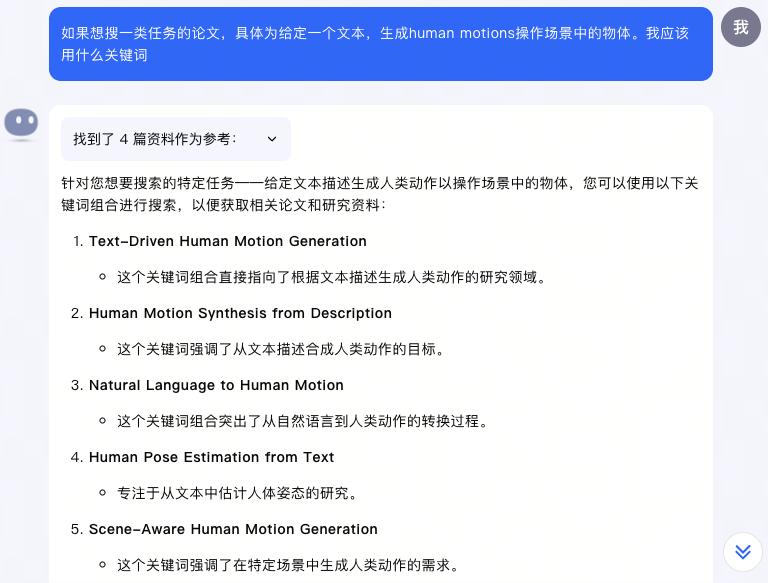
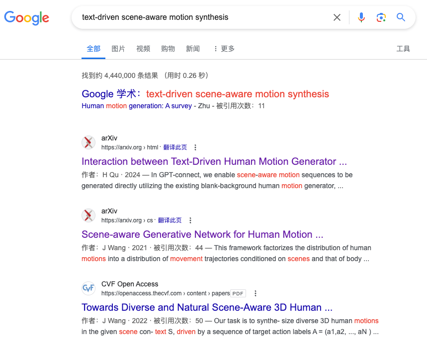
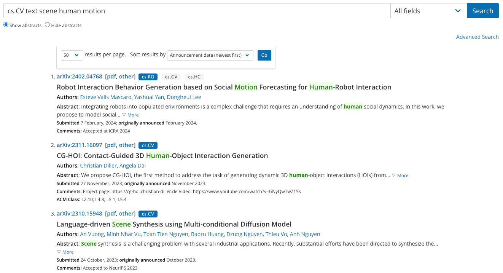

# How to find papers

Use Deep Research to find papers. It is very simple to use.

Older approach (before January 2026)

AI-based paper search website: [https://www.wispaper.ai/scholar-search/](https://www.wispaper.ai/scholar-search/)

1. Ask Kimi for the search keywords for the relevant papers, then search on Google and arXiv. Here is an example:

    

    

    

2. Ask Kimi to recommend papers.
3. Keep track of researchers in the relevant area over time, and check whether they have done any related work.
4. Build up a personal collection of papers in the relevant area over time.
5. Once you have found a relevant paper, look at the papers it cites and the papers that cite it. That is a good way to find more related work.

