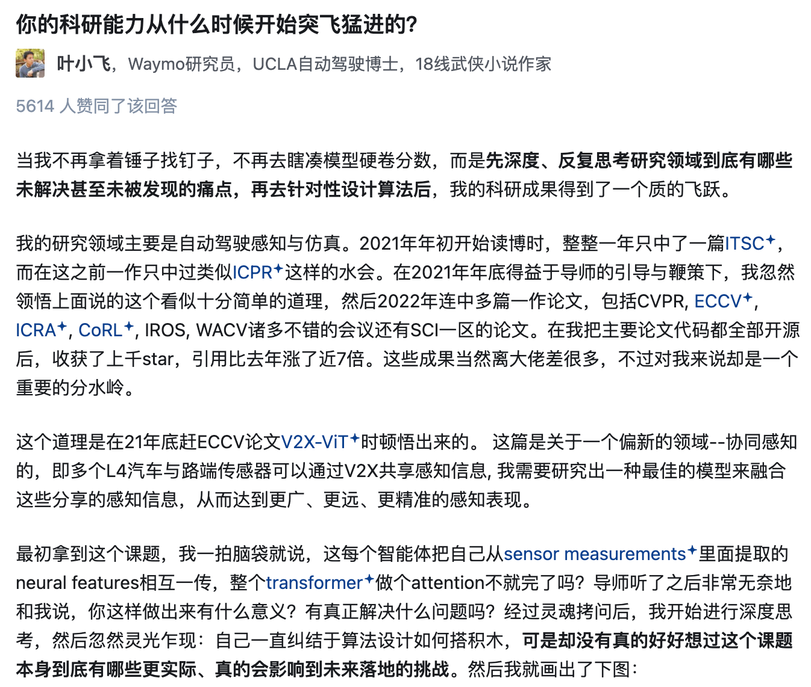
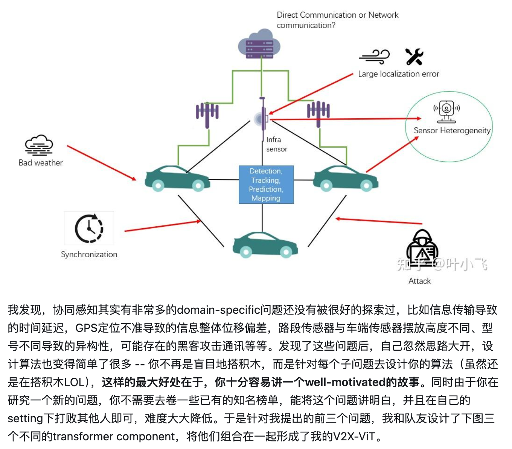
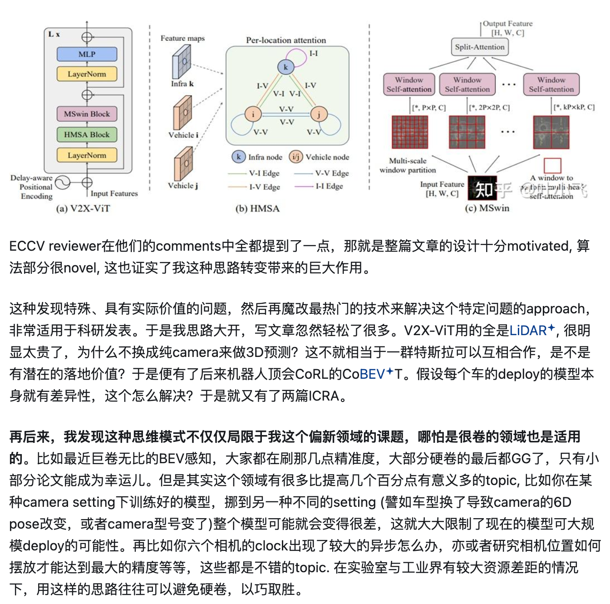
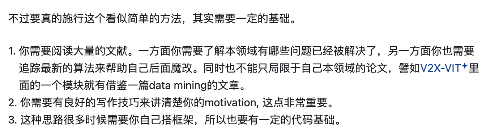
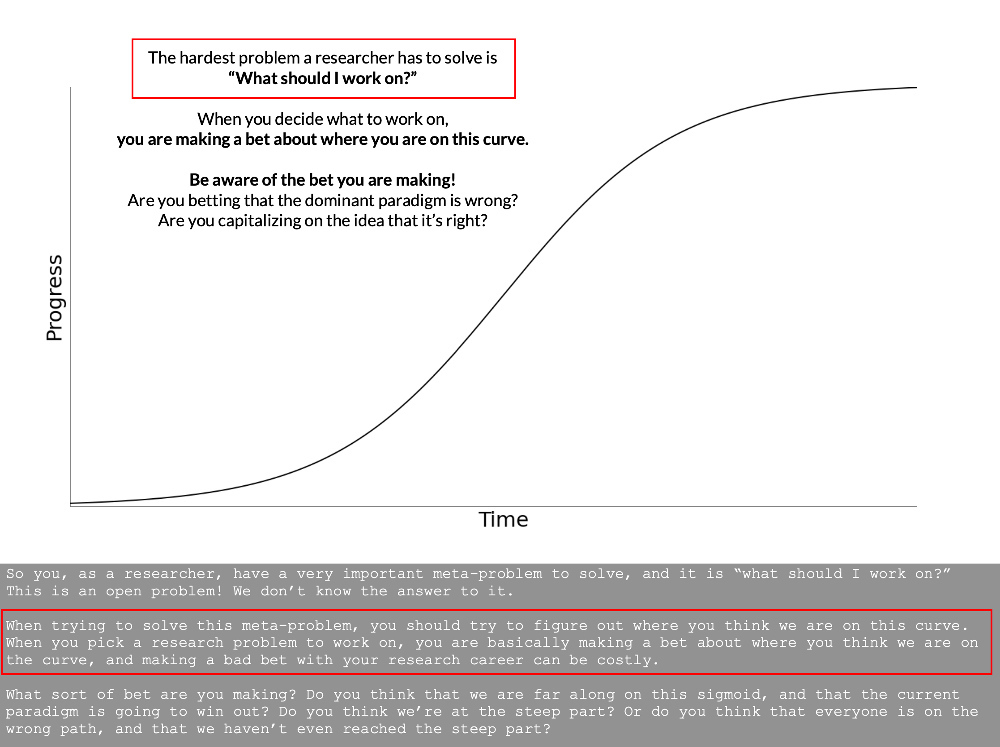

# How to build the ability to come up with ideas

> Document index (GitHub repo): [https://github.com/pengsida/learning_research](https://github.com/pengsida/learning_research)

Reference material

- John Schulman on doing research (PDF, Notion attachment)
- Michael Nielsen on doing research (PDF, Notion attachment)
- [Chinese summary of Michael Nielsen's research notes](https://zhuanlan.zhihu.com/p/560852116)

Zhihu answer

When did your research ability start to take off? Answer by Ye Xiaofei on Zhihu.
[https://www.zhihu.com/question/524855881/answer/2819447733](https://www.zhihu.com/question/524855881/answer/2819447733)

Coming up with an idea has two steps: pick a good problem, then solve it.

Use a literature tree (a novelty tree and a challenge-insight tree) to practise and build up your ability to come up with ideas.

A specific process for coming up with ideas (goal-driven research)

1. Plan the general goal of the research direction, and lay out the roadmap that gets you there.

   

   
How to do this

   Generally the general goal is easy to define, but laying out the roadmap takes a deep understanding of the field. You can build that understanding of the field by constructing a literature tree (doing a literature review and building a novelty tree and a challenge-insight tree).

   See: [How to build a literature tree](../literature-tree.md).

   

2. **Topic selection.** Working from the roadmap given by the novelty tree, pick a task that has research room left, then look into whether the task has an important technical challenge. **Topic selection has more impact on a research project than anything else, more than the methods you come up with later.**

   > How to find important research problems:
   > - Think about the long-term aim of this task and what its final form might look like.
   > - Ask why current work only runs on these particular datasets and not others. Try more general data.
   > - **Aim to find new failure cases, and start improving the existing techniques from those new failure cases.** (1) New task settings or new data make new failure cases easier to find. (2) Exploring methods on new data so the community sees new experimental conclusions is itself a big contribution.

   

   
How high-level researchers think about "finding important research problems"

   

   

3. **Topic selection.** Think about whether the current failure case already has a well-established solution. If it does, do not solve this failure case, switch to another problem. If it does not, then any technical method that solves this failure case will be novel.

   > How to judge whether the current failure case has a well-established solution:
   > 1. Case one: a task with the same input and output already has a decent solution; only some parts are not done well enough.
   > 2. Case two: a task with slightly different inputs or outputs already has a decent solution. Or, several tasks across very different data domains but with the same technical core all have decent, similar solutions.
   > 3. Case three: only one or two tasks across completely different data domains, with the same technical core, have a decent solution.
   > 4. Case four: across various tasks in different fields, although there is a similar technical problem, none of them have a good solution.
   >
   > If you hit cases one or two, switch to a different failure case. Otherwise the project will be dull and a struggle, will waste people's time, and will burn through their motivation for research.
   > Case three suits beginners. Case four suits experienced researchers.

4. **Solving the problem.** How to build the ability to design solutions: see [Improving your ability to design solutions](../designing-solutions.md).

   

   
How to build the ability to design solutions

   How to propose a novel and effective technique: first know what techniques exist and what problems they solve. Then combine some of them.

   My approach: (1) build a challenge-insight tree. (2) Pick some techniques from the challenge-insight tree and combine them in a creative way to solve the technical challenge of the current task. (3) **List every possible pipeline, then compare strengths and weaknesses, and pick one pipeline.**

   > A high-level researcher's view: **the essence of technique is combining methods, combining small techniques into bigger ones, combining old techniques into new ones.**
   >
   > Combining existing techniques and digging out their properties on new tasks and new data is a large contribution.
   >
   > The combination cannot be the kind of "input → A → intermediate output → B → output" that is just A + B stuck together (a purely concatenated combination). **The combination needs to be creative.**
   > **Normally, just stitching two methods together does not solve the problem; otherwise the problem would not have any technical challenge.**

   

   
Most new techniques look like this (can you find a counter-example?)

   1. NeRF combines occupancy network and differentiable rendering, on the task of reconstruction from images.
   2. EG3D combines StyleGAN, GRAF, and convolutional occupancy network, on the task of 3D GAN.
   3. DreamFusion combines SDS loss and NeRF, on the task of text-to-3D.
   4. MVP combines neural volumes and local radiance fields, on the task of image-based human reconstruction.

   

   

5. Validate the technical contribution on some data and tune the results.

   > Do not expect that a nice paper story or an interesting application will get reviewers to wave the technical contribution through.
   > For details, see [https://www.notion.so/pengsida/434a6b3e34d0403ca178fb0db2338232 (Notion)](https://www.notion.so/pengsida/434a6b3e34d0403ca178fb0db2338232) (Notion).

   

   
How a high-level researcher thinks about goal-driven research (this person does not recommend idea-driven research)

   See the discussion at [Edinburgh PhD Handbook: problem-driven research](https://agents.inf.ed.ac.uk/phd-handbook/?show=problem-research) (image not archived locally).

   

   
My personal take on idea-driven research

   Trying to propose a better technique on top of an existing one makes it hard to set a clear target (what counts as "better"), and it is easy to get stuck inside the current task setting just chasing numbers.

   You should look at the current technique from the angle of which milestone tasks are still out of reach for the general goal, rather than fixating on the technique's shortcomings within its current task setting (chasing numbers narrows your view).

   **Do not try to improve a technique on its original setting / data / failure cases; the room for improvement there is usually small.** Find new failure cases and start from those.

   

   

   See also: [Idea-driven vs goal-driven research](../idea-vs-goal-driven-research.md).

   

   
Why goal-driven research helps research output

   Goal-driven research is about going after important tasks and trying various methods until you make the task work. By relaxing some conditions, you can usually get some working results on important tasks. That gives the project a guaranteed output.

   Some people like chasing new techniques, just trying to get a new technique to work. But our area is experimental science. Without a lot of experiments it is hard to tell whether a technique really works, which makes that style of research too risky.

   

   

   
A special case for coming up with ideas (important! this case often produces influential papers)

   When a new hammer appears, it is well worth picking it up to tackle one of the milestone tasks on your own roadmap, because that often produces influential work.

   > Note: this is not about improving things on the new hammer's own task setting (for example tuning view-synthesis numbers on NeRF's own datasets). It is about using the new hammer to solve the milestone tasks you are already working on (still goal-driven research).

   

   
There are many examples of this

   1. When Transformers came out, they were used to build LoFTR.
   2. When NeRF came out, it was used to build Neural Body.
   3. When Stable Diffusion came out, it was used to build DreamFusion and DreamBooth.

   What will the next new hammer be? What will the next example be?

   

   

   

   
Things to watch out for when coming up with ideas (which projects are not worth doing)

   > **Proposing an idea and writing a paper is meant to make a real contribution to the field, not for the sake of the paper itself.**
   > If a paper does not contribute to the field, then writing it is wasting your own time, because the paper will not earn you respect from the field, and may even attract negative comments.
   > Upsides of writing this kind of paper: (1) you get familiar with the submission process. (2) There is some chance of getting a paper out (small chance).
   > Downsides: (1) wasted time. The time on this project could go to something more meaningful. (2) You may be judged negatively.

   

A point worth special attention: **do not develop a habit of relying on your supervisor. Build your own ability and habit of doing research independently.** (In some sense this matters more than publishing the paper itself. And in fact, you need this ability before you have a real chance of producing a paper, otherwise the project is mostly doomed.)

> In practice, supervisors do not have time to design the technical details of a project. **Students need to accept that the only way out is to come up with the solution themselves.**
>
> If a student depends on the supervisor to come up with detailed solutions, the project is mostly doomed. The supervisor cannot spend more than half a day every day thinking about solutions; they can only give some intuitive, rough ideas. In that situation, only the student can put together or refine a complete solution.

How the lab builds up a student's ability to do research independently, two points, when working on a project:
**(1) When a problem comes up, ask the student first for their thoughts and encourage them to have their own thoughts** (on the solution to the problem and on what to do next). Listen patiently to the student's thoughts.
**(2) Do not let the student become dependent** (respect the student's thoughts, do not order them around, do not pin down very specific algorithm-level work for them, only offer some optional suggestions).

> In a research project, the lab usually contributes the most in two areas: **(1) coming up with important novel tasks and helping find important research problems. (2) Reviewing the paper,** suggesting interesting experiments, applications, and demos, and trying to spot every problem in the paper and offer fixes.
>
> On building the solution itself, the lab usually contributes in three ways:
> 1. Stops the student's thinking from getting stuck in a local minimum, and encourages and prompts the student to think more broadly and list more candidate solutions.
> 2. Points out any technical flaw in a solution the student has proposed, or any need for many handcrafted tricks that make it too narrow, and gives other possible rough solutions for the student to flesh out.
> 3. Helps the student improve their proposed solution and make it more elegant.

Typical division of work between supervisor and student in a research project:

<table>
<thead>
<tr>
<th>Item in the research project</th>
<th>Owner</th>
<th>Notes</th>
</tr>
</thead>
<tbody>
<tr>
<td>1. Come up with an important task</td>
<td>Student</td>
<td>The supervisor contributes a lot here. The lab aims to set up a long-term, important research goal for the student.</td>
</tr>
<tr>
<td>2. Come up with the technical challenge or failure case to solve</td>
<td>Student</td>
<td>Supervisor</td>
</tr>
<tr>
<td>3. Judge whether the failure case has a well-established solution</td>
<td>Student</td>
<td>Supervisor</td>
</tr>
<tr>
<td>4. Come up with a solution to the problem</td>
<td>Student</td>
<td></td>
</tr>
<tr>
<td>5. Sort out the logic of the solution</td>
<td>Student (lead)</td>
<td>Supervisor (support)</td>
</tr>
<tr>
<td>6. Judge whether the solution is correct and novel</td>
<td>Student (lead)</td>
<td>Supervisor (support)</td>
</tr>
<tr>
<td>7. Design simple experiments to quickly verify the solution</td>
<td>Student (lead)</td>
<td>Supervisor (support)</td>
</tr>
<tr>
<td>8. Improve the solution</td>
<td>Student (lead)</td>
<td>Supervisor (support)</td>
</tr>
<tr>
<td>9. Brainstorm more candidate solutions</td>
<td>Student (lead)</td>
<td>Supervisor (support)</td>
</tr>
<tr>
<td>10. Run experiments and get the solution to work</td>
<td>Student</td>
<td></td>
</tr>
<tr>
<td>11. Decide what to do next</td>
<td>Student</td>
<td></td>
</tr>
<tr>
<td>12. Sort out what to do next</td>
<td>Student (lead)</td>
<td>Supervisor (support)</td>
</tr>
<tr>
<td>13. Set your key paper deadlines based on the submission deadline (comparison experiments, ablation study, introduction writing, method writing, abstract writing, experiment writing, related work writing). **Generally, you should start writing the paper at least one month before the submission deadline.**</td>
<td>Student (lead)</td>
<td>Supervisor (support)</td>
</tr>
<tr>
<td>14. Write the paper</td>
<td>Student</td>
<td></td>
</tr>
<tr>
<td>15. Review the paper (list missing experiments and writing problems)</td>
<td>Student</td>
<td>The supervisor contributes a lot here. The lab will suggest interesting experiments, applications, and demos, and try to find every problem and offer fixes.</td>
</tr>
<tr>
<td>16. Revise the paper</td>
<td>Student (lead)</td>
<td>Supervisor (support)</td>
</tr>
</tbody>
</table>
