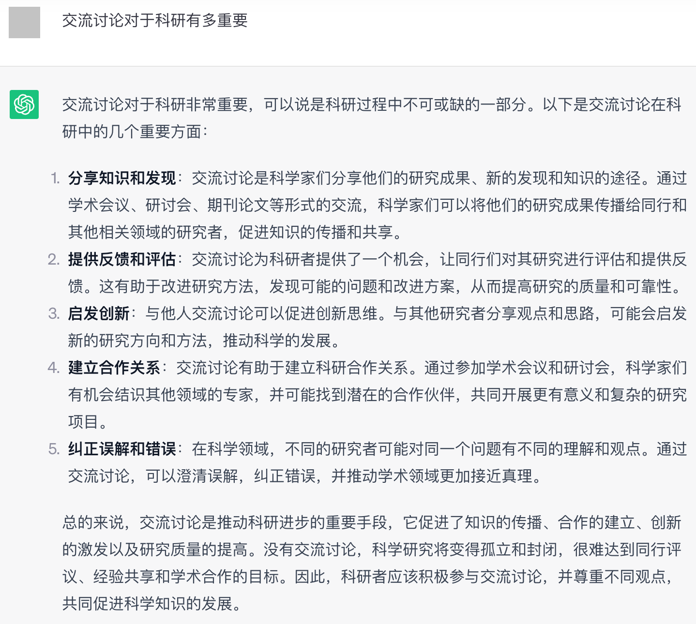
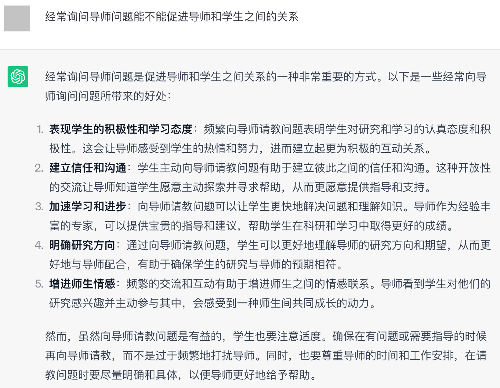
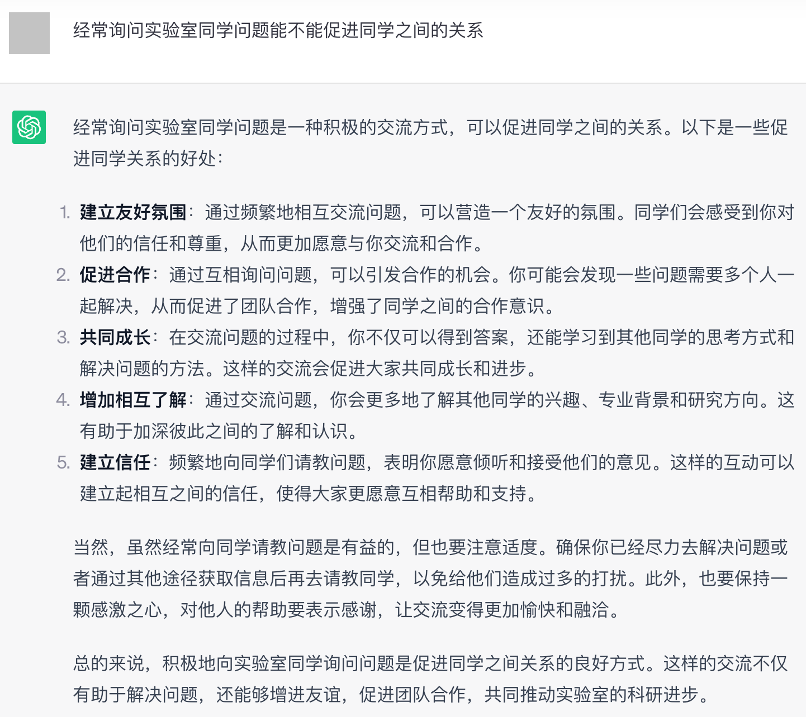

# Why discussion and conversation matter for research

<!-- zh: ChatGPT的回答： -->
ChatGPT's answer:

How important is discussion and conversation for research

Does asking your supervisor questions often help build the relationship between supervisor and student

Does asking lab mates questions often help build the relationship between students

