# Experiment Notes Example: 24 March

Goals for this week:

1. Replace the generalisable rendering head
   1. Pre-train a rendering head with the same structure on DTU
   2. Swap it in

   After swapping it in, it did not work well.
   1. Suspect the sample count is the cause
   2. Suspect a bug in the code
2. Try single point
   1. Investigate how many points K-Planes and K-Planes IBR each need before they work
      1. K-Planes:
         1. 4, 8, 48
      2. K-Planes IBR:
         1. 4, 8, 48
   2. Use depth + 1 point.
      Results were poor.

<!-- Table of contents -->

## 1. Edge flickering

1. Adding a mask resolves it, but the outcome also depends on training time.

<table>
<tr>
<td>

[6.3 hours, no mask](./assets/experiment-notes-example-march-24/6-3-hours-no-mask.mp4)

</td>
<td>

[With mask](./assets/experiment-notes-example-march-24/with-mask.mp4)

</td>
</tr>
<tr>
<td>

[4.2 hours, no mask](./assets/experiment-notes-example-march-24/4-2-hours-no-mask.mp4)

</td>
<td>

[With mask](./assets/experiment-notes-example-march-24/with-mask-2.mp4)

</td>
</tr>
<tr>
<td>

[2.1 hours, no mask](./assets/experiment-notes-example-march-24/2-1-hours-no-mask.mp4)

</td>
<td>

[With mask](./assets/experiment-notes-example-march-24/with-mask-3.mp4)

</td>
</tr>
</table>

## 2. Replacing the generalisable rendering head

### 2.1 Pre-train the ENeRF rendering head

1. Modify the ENeRF rendering head so it does not depend on the voxel features.
2. Modify the ENeRF rendering pipeline accordingly.

### 2.2 After swapping the rendering head, quality drops noticeably

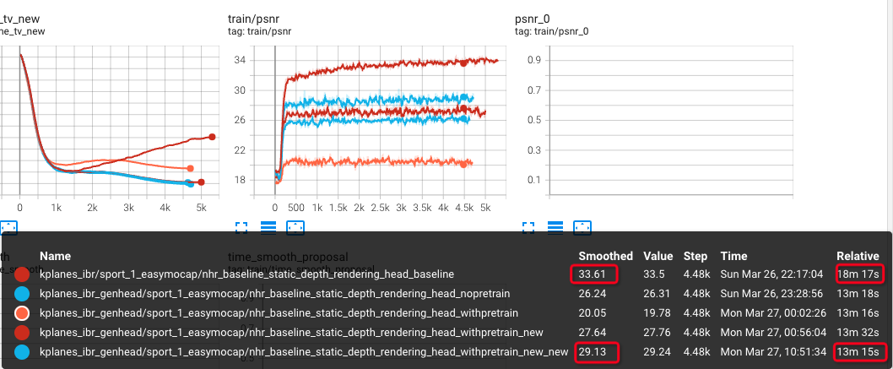

<table>
<tr>
<td>

</td>
<td>

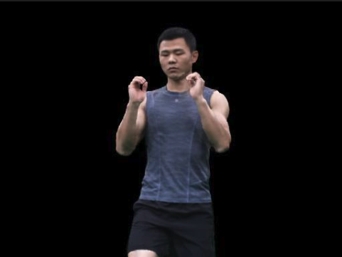

</td>
<td>

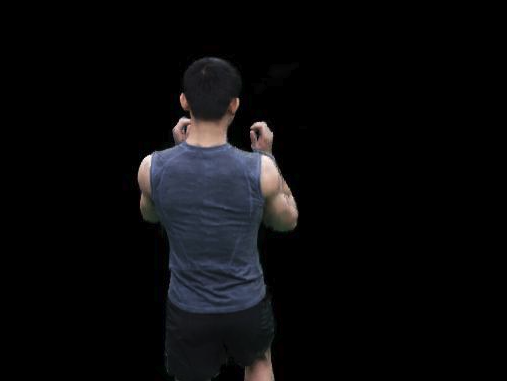

</td>
</tr>
<tr>
<td>

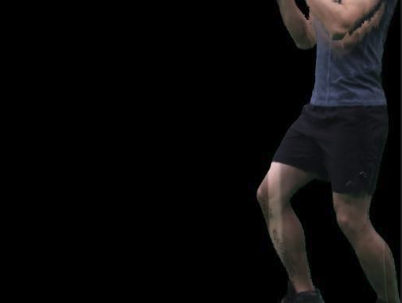

</td>
<td>

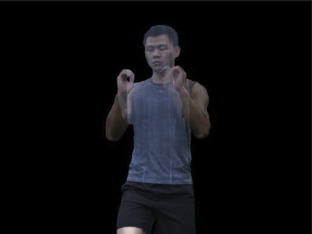

</td>
<td>

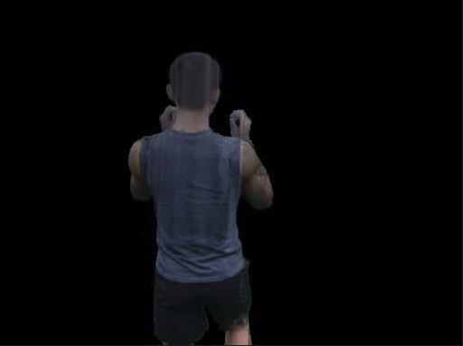

</td>
</tr>
<tr>
<td>

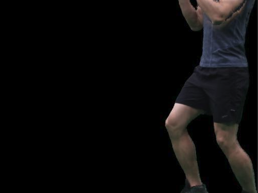

</td>
<td>

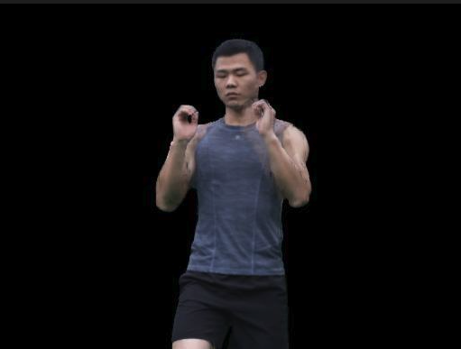

</td>
<td>

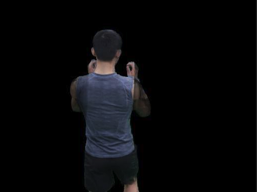

</td>
</tr>
</table>

### 2.2 Possible causes

1. Generalisation is not strong enough.
   1. Check how well ENeRF generalises to this scene.
   2. Possible fixes:
      1. Quickly fine-tune one frame.
      2. Use a slightly more involved policy: fine-tune the first n frames, then fine-tune every 10 frames after that.

   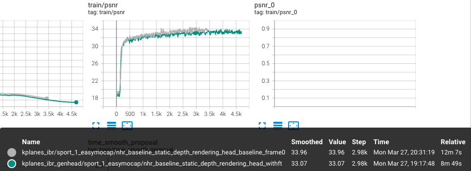

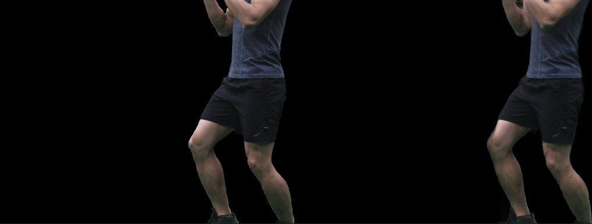
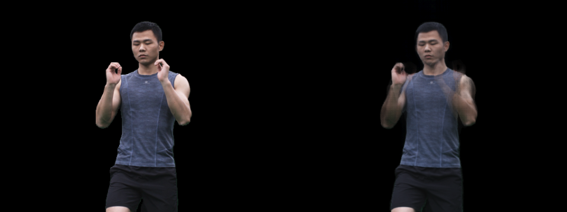
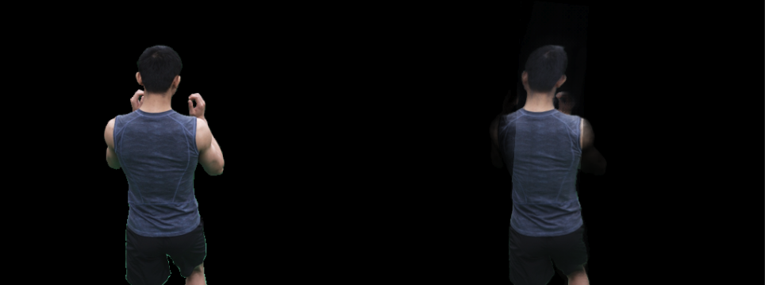
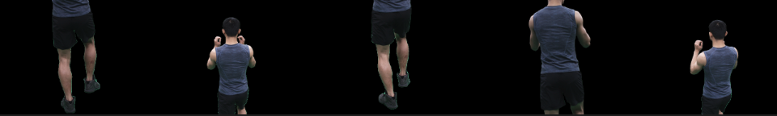

<table>
<tr>
<td>

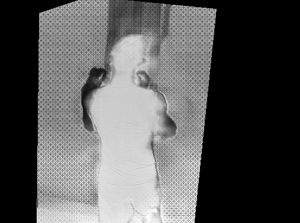

</td>
<td>

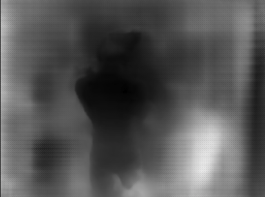

</td>
</tr>
</table>

### 2.3 After swapping in a one-frame fine-tuned rendering head, the result improves

Current issues:

1. Training time is still long.
   1. Many hyper-parameters left to explore:
      1. Sampling strategy: \[256, 128, 48\]
      2. Half precision
      3. Pixel sampling strategy: use the human mask
      4. Compress the geometry-representation parameters: drop the MLP, use a smaller feature grid
2. The path-rendered output has some ghosting.
   1. Cause analysis:
      1. ~~Rendering head~~
      2. Other directions to investigate:
         1. Why does CNN + IBR head not have this problem?
            1. The IBR training strategy
            2. (other)
         2. Whether fine-tuning specifically on the failing frames helps

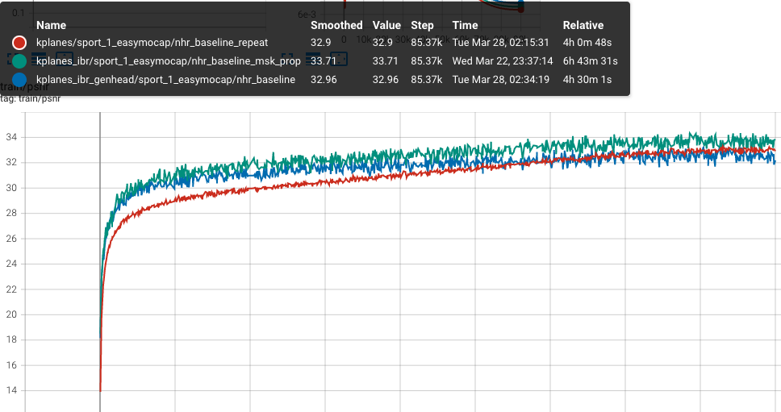

<table>
<tr>
<td>

[Depth, step 30000](./assets/experiment-notes-example-march-24/depth-step-30000.mp4)

</td>
<td>

[1.5 hours](./assets/experiment-notes-example-march-24/1-5-hours.mp4)

</td>
</tr>
<tr>
<td>

[Depth, step 60000](./assets/experiment-notes-example-march-24/depth-step-60000.mp4)

</td>
<td>

[3 hours](./assets/experiment-notes-example-march-24/3-hours.mp4)

</td>
</tr>
<tr>
<td>

[Depth, step 90000](./assets/experiment-notes-example-march-24/depth-step-90000.mp4)

</td>
<td>

[4.5 hours](./assets/experiment-notes-example-march-24/4-5-hours.mp4)

</td>
</tr>
</table>

<table>
<tr>
<td>

[Depth, step 0](./assets/experiment-notes-example-march-24/depth-step-0.mp4)

</td>
<td>

[RGB, step 0](./assets/experiment-notes-example-march-24/rgb-step-0.mp4)

</td>
</tr>
</table>

**KPlanes**

<table>
<tr>
<td>

[1.35 hours](./assets/experiment-notes-example-march-24/1-35-hours.mp4)

</td>
<td>

[2.7 hours](./assets/experiment-notes-example-march-24/2-7-hours.mp4)

</td>
<td>

[4 hours](./assets/experiment-notes-example-march-24/4-hours.mp4)

</td>
</tr>
</table>

KPlanes IBR joint training

<table>
<tr>
<td>

[2.1 hours](./assets/experiment-notes-example-march-24/2-1-hours.mp4)

</td>
<td>

[4.2 hours](./assets/experiment-notes-example-march-24/4-2-hours.mp4)

</td>
<td>

[6.3 hours](./assets/experiment-notes-example-march-24/6-3-hours.mp4)

</td>
</tr>
</table>

<table>
<tr>
<td>

[Run A, step 0](./assets/experiment-notes-example-march-24/run-a-step-0.mp4)

</td>
<td>

[Run B, step 0](./assets/experiment-notes-example-march-24/run-b-step-0.mp4)

</td>
</tr>
</table>

## 3. Depth sampling

1. Did not work. The point count may be too low for the model to converge.

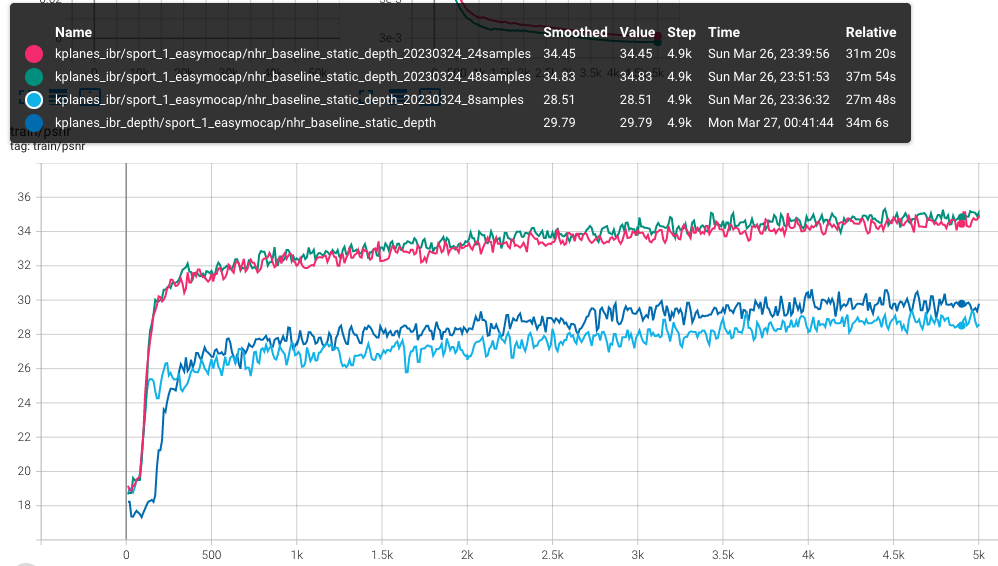

<table>
<tr>
<td>

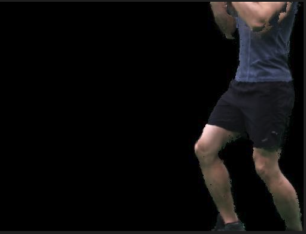

</td>
<td>

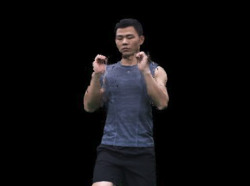

</td>
</tr>
<tr>
<td>

</td>
<td>

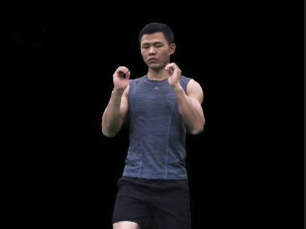

</td>
</tr>
<tr>
<td>

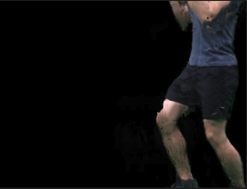

</td>
<td>

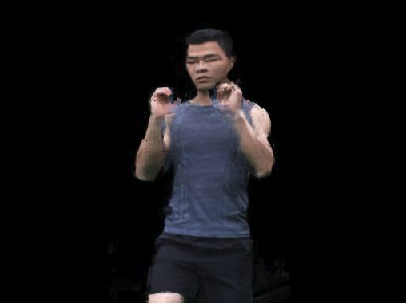

</td>
</tr>
</table>

## 4. The current problem: joint training still has issues

### 4.1 Current observations

1. Joint training shows flickering.
2. Single-frame joint training also shows flickering.
3. The source input looks fine.
4. It is not caused by random source images.

<table>
<tr>
<td>

[Joint training](./assets/experiment-notes-example-march-24/joint-training.mp4)

</td>
<td>

[Single-frame joint training](./assets/experiment-notes-example-march-24/single-frame-joint-training.mp4)

</td>
</tr>
</table>

[Random multi-image](./assets/experiment-notes-example-march-24/random-multi-image.mp4)

### 4.2 Experimental observations

### 4.3 Causes and analysis
