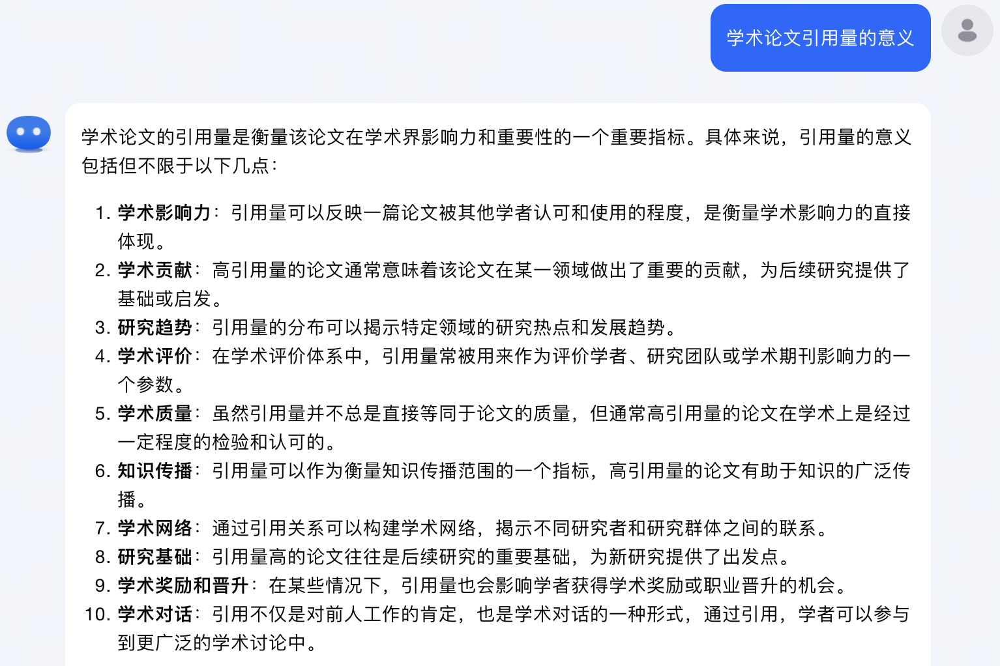
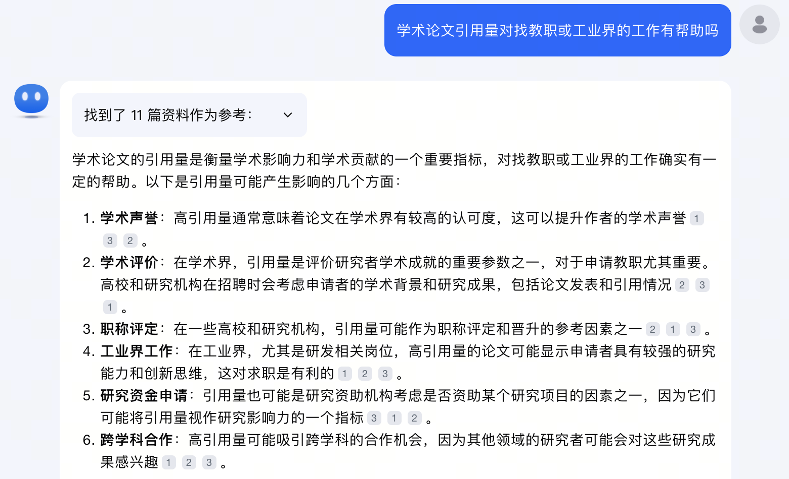

# How to produce impactful work

<!-- zh: 为什么要增加论文的引用量： -->
Why you should aim to raise the citation count of your papers:

<!-- zh: 1. 论文引用量的意义 -->
1. What citation count actually means.

	

<!-- zh: 2. 论文引用量对找工作的帮助 -->
2. How citation count helps when you look for a job.

	

<!-- zh: 怎么增加自己的论文引用量： -->
How to raise the citation count of your own papers:

<!-- zh: 1. 高引用论文的特征：要么是提前投资了很重要的方向，大家也都来做，比如DreamFusion；要么是做出了一个很通用的工具，各个领域都来用，比如NeRF、Implicit Neural Representation。 追求这样的高引用量论文。 -->
1. What highly cited papers have in common: either they invested early in an important direction that everyone later piles into, such as DreamFusion, or they produced a general-purpose tool that gets picked up across many fields, such as NeRF or Implicit Neural Representation. Aim for papers of that kind.

	> 
	<!-- zh: 类似于创业，成功的企业，要么是有很好的方向投资眼光，要么是产品很好用。 -->
		It is similar to running a startup. Successful companies either pick a great direction to invest in, or they ship a product that is very good to use.

<!-- zh: 2. 已经做完一篇论文以后，怎么增加这篇论文的引用量： -->
2. After a paper is finished, how to raise its citation count:

<!-- zh: 1. 增加论文的阅读量：做漂亮的project page、demo，在社交媒体上宣传自己的工作。 -->
	1. Increase how many people read it: build a nice project page and demo, and promote the work on social media.

<!-- zh: 2. 增加论文算法的使用量：尽早开源论文的代码，并维护好代码的Readme文档和回复代码的Issue。 -->
	2. Increase how much the algorithm gets used: release the code as soon as possible, keep the README well maintained, and reply to issues on the code.

<!-- zh: 什么样的行为会导致论文引用量很低： -->
Behaviours that lead to a low citation count:

<!-- zh: 1. 不宣传自己的论文，不把论文挂到arxiv。 -->
1. Not promoting your paper and not putting it on arXiv.

<!-- zh: 2. 不开源论文代码，大家没法用这篇论文的工具。 -->
2. Not releasing the code, so nobody can use the tool from the paper.

<!-- zh: 论文引用量低的坏处：大家可能倾向于觉得这个人做得不够好。 -->
The downside of a low citation count: people tend to assume the author's work is not good enough.
