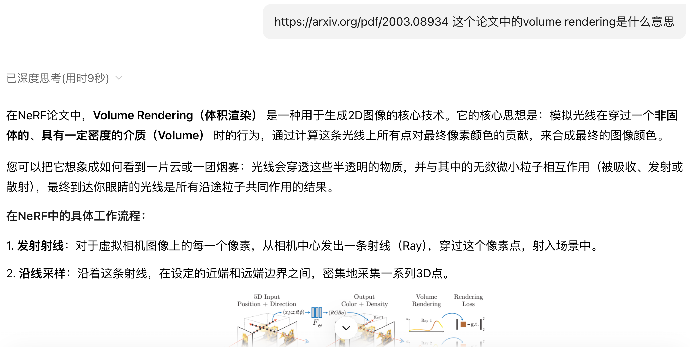
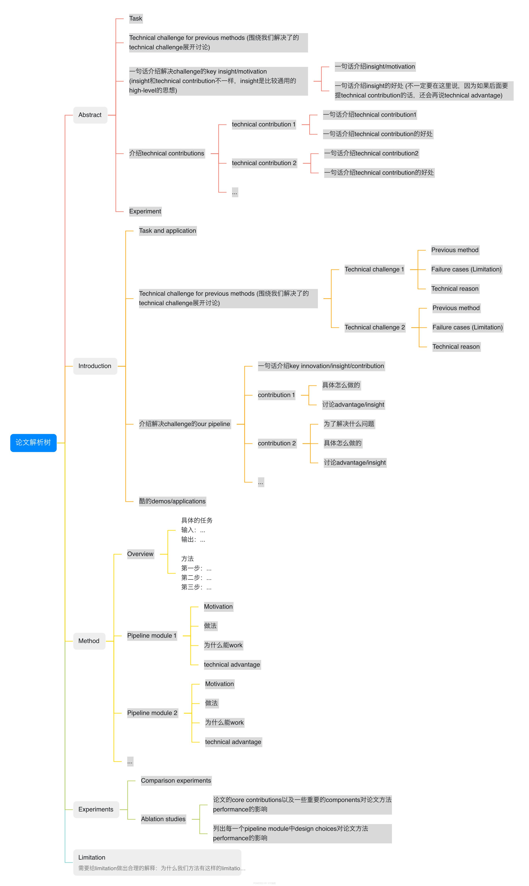
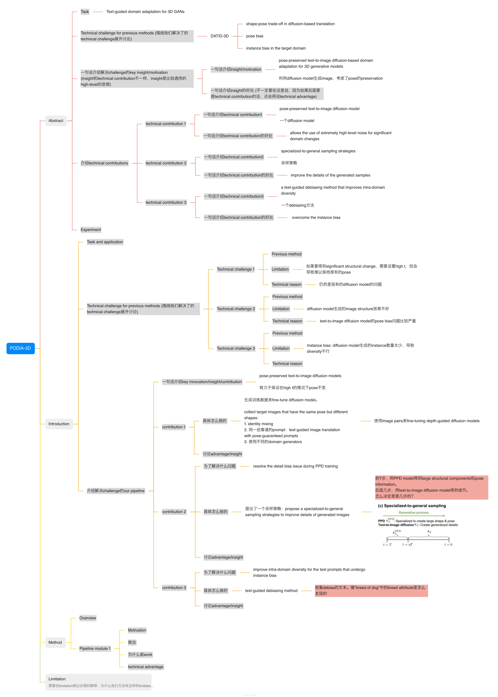

# How to read papers effectively

> Document index (GitHub repo): [https://github.com/pengsida/learning_research](https://github.com/pengsida/learning_research)

Some students sometimes feel that "after reading a paper it is as if they had not read it at all". **You can use a paper analysis tree to address this. Turn paper reading into answering questions, and that way you read papers effectively.**

How to do it

Paper analysis tree: [https://alidocs.dingtalk.com/i/nodes/mExel2BLV5LaqbQeSx2LpNrAWgk9rpMq](https://alidocs.dingtalk.com/i/nodes/mExel2BLV5LaqbQeSx2LpNrAWgk9rpMq) (DingTalk mind map. The DingTalk Docs sharing setup does not allow direct external sharing, so you need to apply for access separately.)

1. While reading the paper, answer the questions in the paper analysis tree.
2. If you have questions while reading, it is strongly recommended to ask AI to help.

As shown below:

An example of using a paper analysis tree to read a paper

Three levels of reading a paper:

1. First level, the basic standard: understand every technical detail and term in the paper (you may need to read the code as well to fully follow the paper).
2. Second level: know what problem the paper is solving. Know why it proposes a particular technique, and why the proposed approach is better.
3. Third level: be clear about where the paper sits in the [literature tree](../literature-tree.md), and think about whether the milestone tasks in the literature tree (the important problems the research direction needs to solve) should be updated. Think about the limitations of the paper (on what kind of data does it have failure cases. You may need to run experiments to find failure cases).

Tools that can help with reading papers:

1. [https://bohrium.dp.tech/home](https://bohrium.dp.tech/home)
2. [https://kimi.moonshot.cn/](https://kimi.moonshot.cn/)
