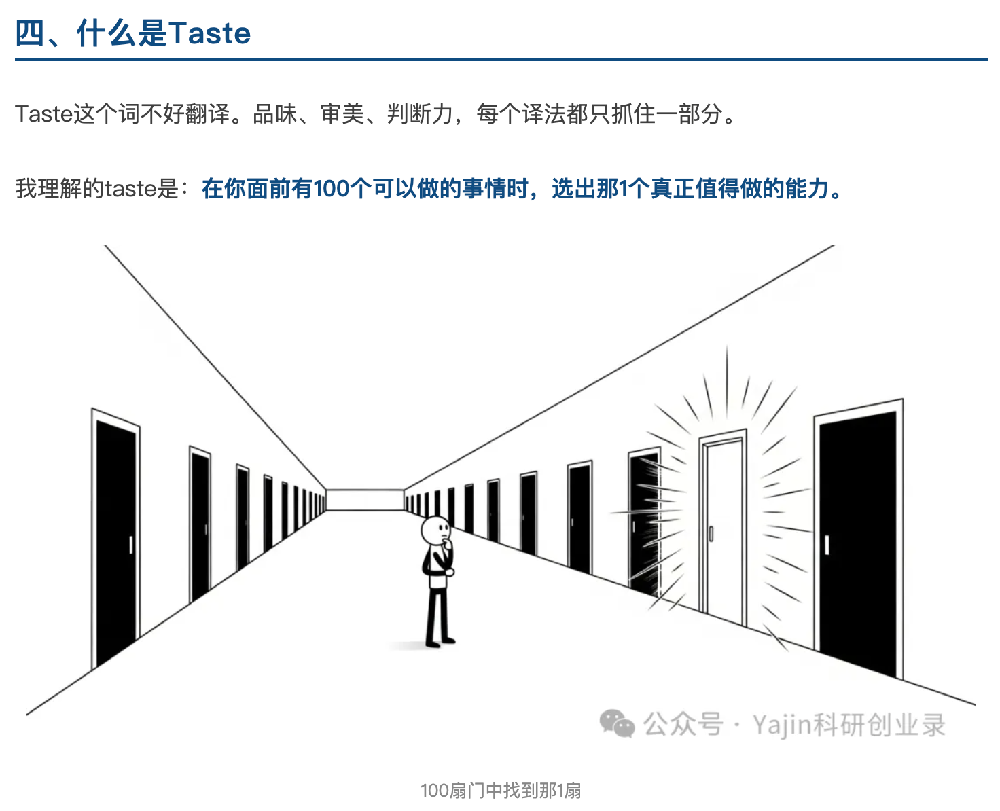

# How to cultivate research taste

A definition of taste, from [this WeChat article](https://mp.weixin.qq.com/s/27SHpIpcB1hG_Xt92BCadQ):

How to cultivate taste

The natural question at this point is: **can taste be cultivated, or is it innate?**

Paul Graham gives a good answer in his essay "Taste for Makers": taste is not subjective preference, it is a kind of judgement that you can develop. \[4\]

He says good design has some shared features: **simplicity, solving the right problem, looking effortless while taking a lot of work behind the scenes**. The key to building taste is "intolerance for ugliness".

There is something that looks like a contradiction here. People who build products often say "don't chase perfection, ship first then iterate". Doesn't that clash with "intolerance for ugliness"? I don't think it does. Taste means not settling on direction. If you pick the wrong problem, perfect execution doesn't help. But at the execution layer, building a rough version first to check the direction is itself a sign of taste: you spend the energy on judgement, not on polishing something that maybe shouldn't have been built at all.

From my own experience and from what I have seen, I think there are a few ways to build taste.

**First, expose yourself to a lot of "good" things.**

You only know what a bad paper is after reading enough good ones. You only tell good products apart after using enough of them. Taste starts with exposure.

**Second, work with people who have taste.**

My taste in Android security came from my advisor. He never explicitly taught me what taste was, but in every discussion I gradually picked up how he looked at problems and how he judged whether a direction was worth pursuing.

Taste is hard to learn from books because it is judgement, not knowledge, but it transfers through long-term contact with people who have it.

That is why working in a good lab and with good peers matters so much. When strong people become your classmates and colleagues, you grow through talking to them. Sadly, I have seen quite a few people treat the strong people around them as enemies, letting jealousy cloud their eyes and ruin their judgement.

**Third, go deep in one area.**

The problem with collecting experiences is that you stay a tourist in every area. Tourists see the landmarks. Residents know which road leads where.

When you work deeply in one area, you slowly build up a feel: you know which problems in this field are the real hard ones and which are only hard on the surface, which methods are heading in the right direction and which lead to dead ends. That feel is taste.

**Fourth, learn to say "don't do it".**

In the end, taste is about choosing what not to do. For a researcher it means turning down topics that "can publish but don't matter". For a founder it means turning down directions that "have a market but aren't worth doing".

The full taste essay

A few recent things have given me some thoughts about the word "taste" that has been popular lately. I'm writing them down to share.

## One. A full résumé, shallow understanding

This week I interviewed an undergraduate applying to our group.

His résumé looked great. He had been on three research projects and had a paper out. For an undergraduate, that output is already past what many master's students produce.

The interview started. I asked about the motivation for his first project. He gave a fairly vague answer. I pressed on the technical details. He could say what he had done, but not why it had been done that way. What problem did the work solve? How was it different in essence from earlier methods? He couldn't answer.

The second project was the same.

By the third project I more or less had the picture. This student had done a lot, but had never really understood any of it. His research history wasn't "I got interested in a problem and dug in". It was the kind of thing people on Xiaohongshu call "stacking research experiences": jump on whatever comes up, finish it, move to the next, get one more line on the résumé. **Doing research had become a points game.**

## Two. Another kind of "grinder"

Around the same time, a friend told me about a phenomenon in the hackathon scene.

There is a class of contestants who go to every hackathon. This weekend they're at one event, next weekend at another. Their résumés are full of "won XX hackathon". Look closely and they are all doing the same thing: wrap an AI API, put a UI on it, ship a demo. After the event the project dies.

My friend calls these people "hackathon grinders".

Hearing the term, I suddenly saw that this is the same problem as my interviewee. On the surface one is academia and the other is the startup world, totally different settings, but the core is identical: **using volume to substitute for depth, experiences for understanding, résumé numbers for real judgement.**

There is a more precise name for this pattern: **grinding experiences**.

Grinding experiences vs deep work

## Three. The ceiling of grinding experiences

Don't get me wrong, I'm not saying grinding experiences is useless. For someone just starting out, sampling widely helps you see what a field looks like and find what interests you.

But there is a hard ceiling: it can help you "know what's out there", but it can't help you judge "what is worth doing".

You can see this ceiling in many places.

The Apple App Store has more than two million apps. According to Business of Apps, nearly a quarter get fewer than 100 downloads. \[1\] Developers all work hard, but most build something "usable" that nobody needs.

The AI tools area shows it even more clearly. Over the last two years a flood of AI wrappers has hit the market doing very similar things: put a UI on ChatGPT, add a bit of prompt engineering, ship an "AI writing assistant" or "AI meeting summarizer". Most go nowhere, but a few have stuck around and are doing very well. The difference between them and the dead AI wrappers is not technical capability and not funding, it is taste.

Out of many apps only a few stand out

## Four. What is taste

The word "taste" is hard to translate. Aesthetic sense, judgement, sense of style, each translation only catches part of it.

The way I understand taste: **when there are 100 things in front of you that you could do, the ability to pick the 1 that is actually worth doing.**

Finding the one door out of a hundred

In that famous 1995 interview, Steve Jobs said: "The only problem with Microsoft is they just have no taste. They have absolutely no taste. And I don't mean that in a small way. I mean that in a big way, in the sense that they don't think of original ideas and they don't bring much culture into their product." \[2\]

Jobs's point is not about whether interfaces look nice. He's saying Microsoft does not think about what makes a product original or culturally interesting. Microsoft can build anything but does not know what is most worth building.

To be fair, it would be wrong to call Microsoft unsuccessful. Microsoft is very successful commercially, it is just that the product line feels disjointed. I work at CUHK, where the school uses Microsoft enterprise solutions, and our company also used Microsoft 365 in the early days. Honestly, it was hard to use, in ways I won't get into. Selling B2B products involves many factors beyond the product itself, and taste is not the only variable in that setting.

Richard Hamming told a story in his classic 1986 talk "You and Your Research". When he was at Bell Labs he often asked his lunch companions three questions: what are the most important problems in your field, which of them are you working on, and if what you are doing isn't important, why are you doing it? \[3\]

Most people stopped having lunch with him after the third question.

But Hamming's logic is clear: **picking the right problem matters more than solving the problem right.** "If you do not work on an important problem, it's unlikely you'll do important work."

Some people might say: I'm not trying to be a great scholar like Hamming, what does this have to do with me? Hamming's point applies beyond top scientists. Whether you are doing research, building products, or even just picking a job, the core question is the same: **what are you spending your time on.**

That is taste. In academia, taste is the ability to pick the right research problem. In industry, taste is the ability to pick the right product direction.

## Five. Taste in academia: a personal story

In 2012 we published a paper on Android security at IEEE S&P, the top venue in security.

Looking back today, Android security is a mature area that has been studied for over a decade, but the situation in 2012 was very different. Android had only been out for a few years and the academic community paid little attention to mobile security. Most security researchers were still focused on PCs.

**As a PhD student at the time, I had no real judgement about direction. The choice to work on Android security was my advisor's taste.** He saw that smartphones were becoming the mainstream computing platform and that security problems would follow. That call was not obvious back then. Many people thought there wasn't much security work to do on phones.

It turned out the direction was right. The paper was cited many times, and more importantly it gave us a foothold in Android security. A lot of the work we did later built on that base.

Flip it the other way. If my advisor hadn't had that taste, we might have chased whatever was hot, working on what everyone else was working on. We might still have published, but the impact would almost certainly have been smaller.

That is the value of taste in academia. Pick the right problem and the next few years of work have a sense of direction. Pick the wrong one and however hard you work, you are just stacking numbers.

## Six. Taste in industry: more obvious in the AI era

In industry, taste shows up in a different place: **picking products. Building something "usable" is easy. Building something users "can't live without" is hard.**

The AI era has amplified this.

AI has hugely lowered the cost of execution. Building a product used to take a team several months. Now one person with AI can put a prototype together in a few days. Execution is no longer the bottleneck. Judgement is.

This is the same situation as the App Store. The ability to build is no longer the gate. What most people lack is direction. When everyone can ship an app, shipping an app is no longer the edge. Knowing what kind of app to build is.

The AI tools area is the clearest example. In 2024 to 2025 hundreds, then thousands of AI productivity tools showed up. Most do roughly the same thing: call a large model API, wrap a UI around it, address a vague "boost productivity" need.

A few products at least got the direction right early on. Some teams have rethought "what should programming look like with AI assistance"; others have rethought "what should search feel like in the AI era". Whether they will ultimately break out is still open, but the gap between them and the cookie-cutter wrappers starts at taste: choosing what problem to solve and who to solve it for.

## Seven. Where taste comes from

The natural question at this point is: **can taste be cultivated, or is it innate?**

Paul Graham gives a good answer in his essay "Taste for Makers": taste is not subjective preference, it is a kind of judgement that you can develop. \[4\]

He says good design has some shared features: **simplicity, solving the right problem, looking effortless while taking a lot of work behind the scenes**. The key to building taste is "intolerance for ugliness".

There is something that looks like a contradiction here. People who build products often say "don't chase perfection, ship first then iterate". Doesn't that clash with "intolerance for ugliness"? I don't think it does. Taste means not settling on direction. If you pick the wrong problem, perfect execution doesn't help. But at the execution layer, building a rough version first to check the direction is itself a sign of taste: you spend the energy on judgement, not on polishing something that maybe shouldn't have been built at all.

From my own experience and from what I have seen, I think there are a few ways to build taste.

**First, expose yourself to a lot of "good" things.**

You only know what a bad paper is after reading enough good ones. You only tell good products apart after using enough of them. Taste starts with exposure.

**Second, work with people who have taste.**

My taste in Android security came from my advisor. He never explicitly taught me what taste was, but in every discussion I gradually picked up how he looked at problems and how he judged whether a direction was worth pursuing.

Taste is hard to learn from books because it is judgement, not knowledge, but it transfers through long-term contact with people who have it.

That is why working in a good lab and with good peers matters so much. When strong people become your classmates and colleagues, you grow through talking to them. Sadly, I have seen quite a few people treat the strong people around them as enemies, letting jealousy cloud their eyes and ruin their judgement.

**Third, go deep in one area.**

The problem with collecting experiences is that you stay a tourist in every area. Tourists see the landmarks. Residents know which road leads where.

When you work deeply in one area, you slowly build up a feel: you know which problems in this field are the real hard ones and which are only hard on the surface, which methods are heading in the right direction and which lead to dead ends. That feel is taste.

**Fourth, learn to say "don't do it".**

In the end, taste is about choosing what not to do. For a researcher it means turning down topics that "can publish but don't matter". For a founder it means turning down directions that "have a market but aren't worth doing".

The points below are summarized from this page: [https://colah.github.io/notes/taste/](https://colah.github.io/notes/taste/)

Daily practice:

1. Each week, come up with some ideas and discuss them with a senior advisor and the people around you to see whether the ideas are good or bad.
2. Talk to different researchers regularly, ask them about the big picture of their research, what problems they think are important, and how they pick the topic for a project.
3. Think about why some papers get many citations and others do not.

Negative examples in research:

1. Coming up with an idea and not discussing it with anyone, then putting in months of work before you finally get feedback on it from practice.
2. Spending one or two months on a project, finding out it isn't valuable, but being unwilling to drop it, which only wastes more time.
3. Thinking an idea is workable and immediately turning it into a paper without digging deeper. (This one is hard to calibrate. Sometimes you dig too deep and it becomes hard to write up as a single paper.)
