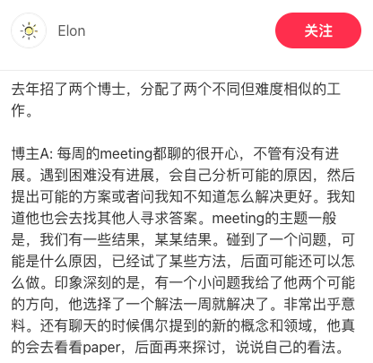
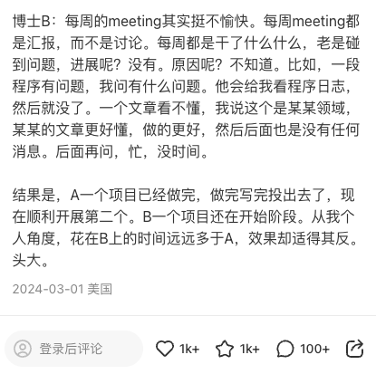
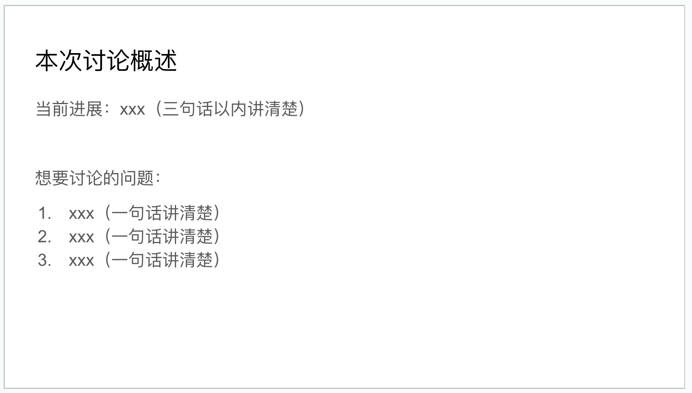
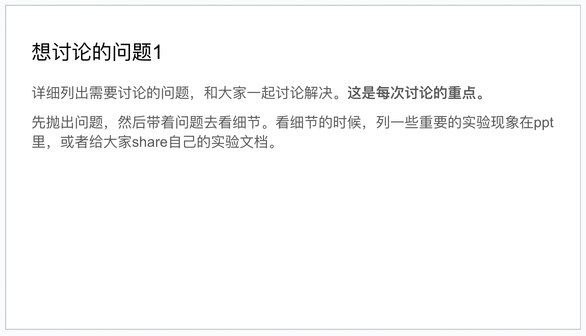
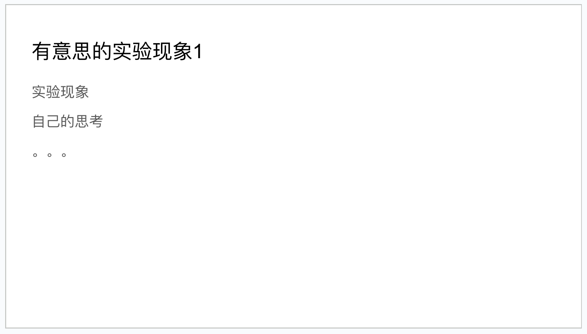
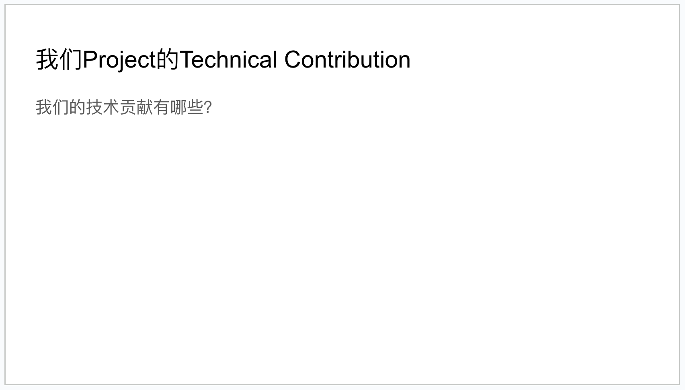
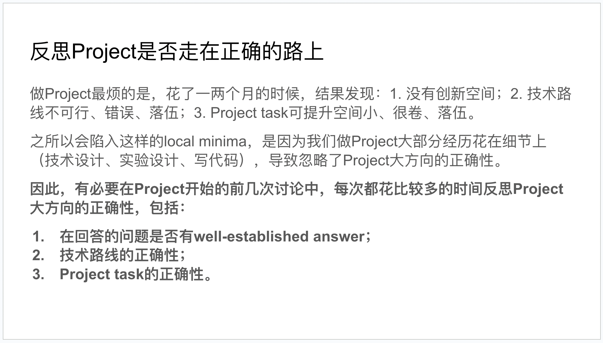
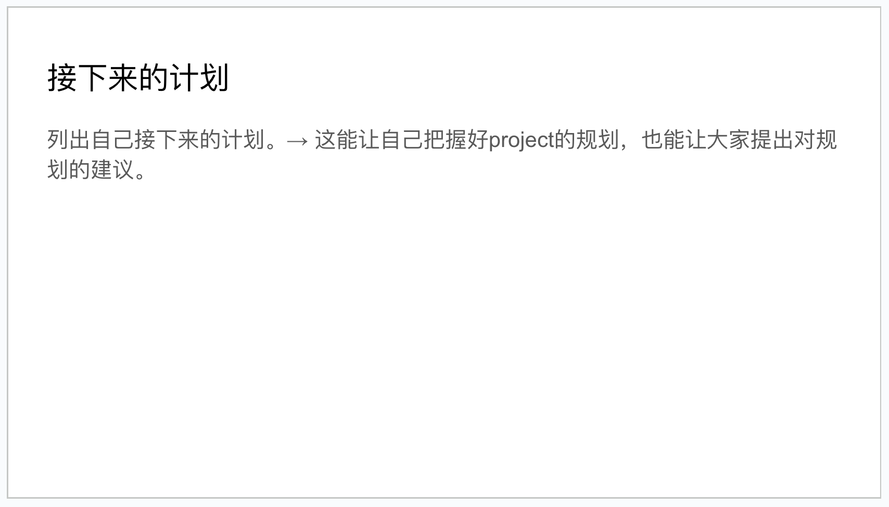
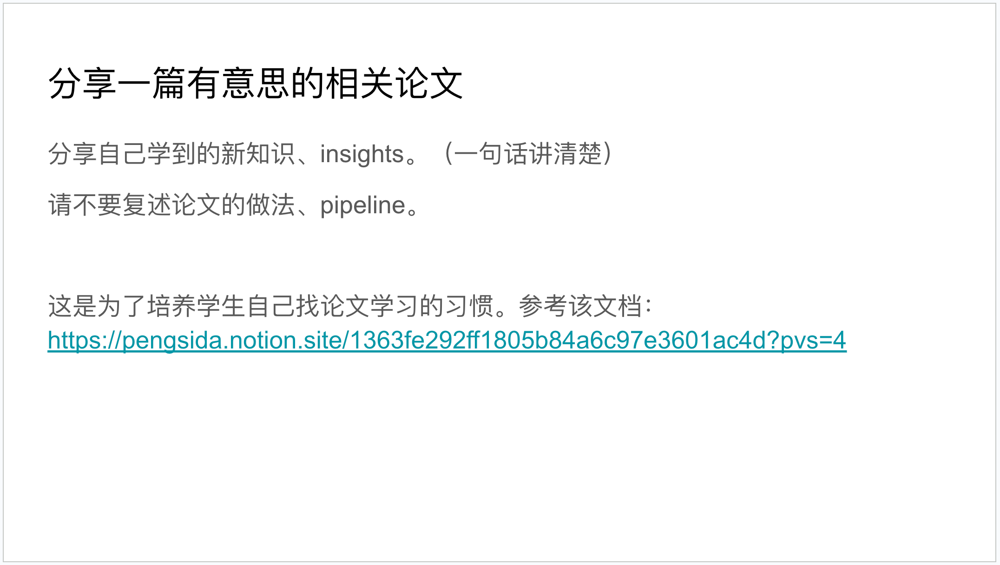

# Weekly meeting slides

> Document hub (GitHub repo): [https://github.com/pengsida/learning_research](https://github.com/pengsida/learning_research)

The point of these discussions:
1. Get help from the group to push your project forward. **Do not treat the "discussion" as a status report** (the short-term goal).
2. Build the habit of discussing problems as soon as they come up (the long-term goal).

> If a "discussion" doesn't actually discuss problems and only reports progress, it wastes everyone's time. **Discuss, don't report.**

A classic bad example of a "discussion": **the meeting drags on without a clear focus, exhausting the senior advisor's patience and wasting everyone's time.**

> What this looks like in practice. During the discussion, some students are afraid that a short "discussion" will make them look like they haven't done anything, so they pad the meeting **by sharing papers or trivial experimental observations** (sometimes because they ran into problems and have little to report, sometimes for other reasons).
>
> Why this is a problem:
> 1. The "discussion" no longer focuses on solving problems.
> 2. An unfocused discussion is draining and wastes the senior advisor's time. A meeting that could have wrapped up quickly stretches to half an hour or an hour.
> 3. It wastes your own time. People can't help you effectively.
>
> The right approach:
> 1. If you genuinely have nothing to discuss, just skip the discussion. Sync the progress and the next plan briefly.
> 2. If you have run into problems, list the questions you want to discuss and keep the focus on "the problems I am hitting". Wrapping up quickly is fine. The higher the efficiency, the better.
> 3. **In the "discussion", do not share papers or trivial experimental observations.** These don't show your own thinking. **If you want to share a paper, send it to me at any time. I will make time to read it.** What does show your own thinking: thoughtful questions of some depth, planning for the project, and reflections on the technical contribution.

> I can promise that, in lab discussions, no one will be blamed by the senior advisor if a project is moving slowly for technical reasons.

Other positive and negative examples of "discussions"

[http://xhslink.com/VBCUFC](http://xhslink.com/VBCUFC)

Why PhD student A is a good example:
1. **Has their own thinking.** When stuck, they analyse the possible causes themselves, then propose possible solutions or ask whether I know a better way.
2. **Good at asking questions and learning from others.** They go to other people for answers.
3. **Clear thinking in the discussion.** A typical meeting goes like: we have these results, this specific result; we hit a problem; here is the likely cause; we have already tried these methods; here is what we could try next.
4. **Strong experimental ability.** I once gave them a small problem with two possible directions. They picked one and solved it within a week.
5. **Curious about new things.** When new concepts or fields come up in conversation, they actually go and read the paper, then come back to discuss it and share their views.

Why PhD student B is a bad example:
1. **Reports rather than discusses.** Every weekly meeting is a status report, not a discussion.
2. **Weak experimental ability.** Every week is "I did this and that, ran into a problem". Progress? None.
3. **Lacks their own thinking.** Causes of the problem? No idea. For example, a piece of code is broken. I ask what's wrong. They show me the program logs and stop there.
4. **Low time investment in research.** They don't understand a paper. I tell them this is a known area, point them at a clearer paper that does the work better, and then I hear nothing back. When I ask later: too busy, no time.

## How to discuss efficiently

1. **Cap each discussion at half an hour to one hour.** If the content is interesting and the meeting feels exciting, the discussion can run longer.
2. **Because the time is limited, discuss the important things first.** If I feel that the meeting is drifting or the content isn't important, **I'll say so**.
3. To discuss problems efficiently, prepare slides ahead of time. [https://docs.google.com/presentation/d/1m9SJ6cRZeYXVoqO97x1iCJwWlhDs1bbuzJrKzcSx3Ws/edit#slide=id.g1a080df7cc6_0_17](https://docs.google.com/presentation/d/1m9SJ6cRZeYXVoqO97x1iCJwWlhDs1bbuzJrKzcSx3Ws/edit#slide=id.g1a080df7cc6_0_17). This is the project slides template. Make your own Google Slides and update them based on this template.

   Here is the slides deck from a previous project, for reference: [https://docs.google.com/presentation/d/19JDX9zjA4Ew3IkDxTlZfvAXiXs1CrHaevJLKBULwjZM/edit?usp=sharing](https://docs.google.com/presentation/d/19JDX9zjA4Ew3IkDxTlZfvAXiXs1CrHaevJLKBULwjZM/edit?usp=sharing)

   It doesn't have to be slides. Notion or Wolai works fine if you find them more useful. The point is to match the format the discussion needs.

   Organise the slides like this (**don't give a detailed progress report**):

   1. One slide explaining the gist of this discussion. In three sentences or fewer, summarise the project's progress and list the questions you want to discuss.

      

   2. List the questions to discuss and work through them with the group. Put the question first, then dig into the details with that question in mind, sharing some of your own thinking. When going into details, list the important experimental observations on the slide, or share your [experiment notes](./keeping-experiment-notes.md) with everyone.

      

   3. List the interesting experimental observations and conclusions.

      

   4. For research-project discussions, **review the technical contribution every meeting**. (I have had enough of reviewers tearing into us for weak contributions, or of a project running for several months only to find it has no contribution and the months are wasted.)

      

   5. For research-project discussions, **review whether the overall direction is right in the first few meetings**. (I have had enough of projects running for one or two months and only then discovering the direction is wrong.)

      

   6. List your next plan. This helps you keep the project's planning in hand and lets the group offer suggestions on it.

      

   7. To build the habit of reading papers, share one interesting paper from a related direction at every meeting.

      

## Lab discussion principles (**important**)

1. Communicate fully. Don't be afraid of the advisor or the senior students, and don't let that stop you from asking questions. If you have a question, ask it promptly. The advisors and senior students in the lab are very friendly and happy to help. The only purpose of the discussion is to be correct and efficient, and to address your questions about the project.
2. The exchange is between equals, not a "report and being reported to" relationship. If you have your own ideas about the research, say them. If you think the advisor or a senior student got something wrong, push back politely and discuss it. Don't accept what advisors and seniors say uncritically, but also don't pretend to agree on the surface while doing your own thing underneath. That wastes a lot of communication time and experiment cost. Lab discussions aim for efficient, honest exchange.
