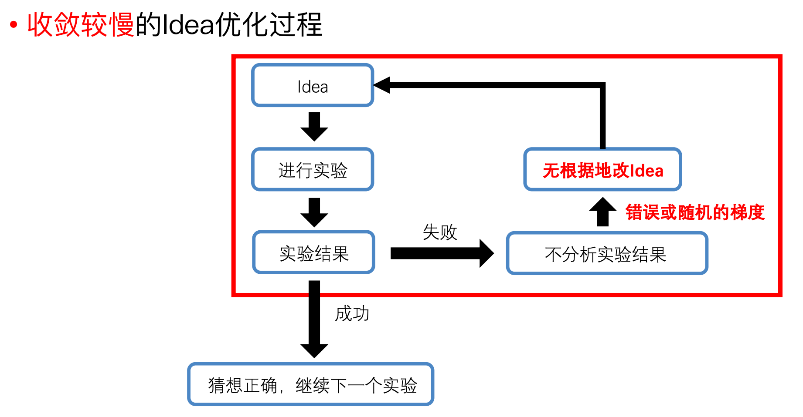
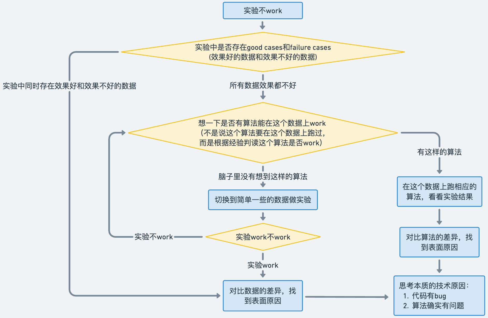
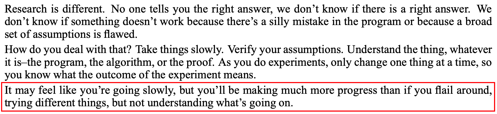

# How to find out why an experiment isn't working

> Document index (GitHub repo): [https://github.com/pengsida/learning_research](https://github.com/pengsida/learning_research)

> **Finding out why an experiment doesn't work is what lets you actually improve the current method.**
>
> Note that the goal of this document is not to propose a novel idea. It is only about finding out why an experiment isn't working.

High-level researchers describe "finding out why an experiment isn't working" as one of the important research abilities of a PhD student

Two excerpts from Bill Freeman's [How to do research](http://people.csail.mit.edu/billf/www/papers/doresearch.pdf) make this point. The screenshots used to live here in the Notion page, but the relevant text can be read directly in the original PDF.

What happens if you don't analyse experimental results

The project moves slowly, very likely doesn't succeed, or gets scooped, so all the time you've already put in is wasted.

How to find out why the current experiment isn't working. Most of this comes from a high-level researcher's <a href="http://people.csail.mit.edu/billf/www/papers/doresearch.pdf">research-teaching document</a>.

Flow chart:

In words:

1. Collect failure cases of the current experiment (results that don't look good, surface-level experimental phenomena).
2. Collect good cases of the current experiment (results that do look good), or find an experimental version that does work.

   

   
How to find an experimental version that works

   Two approaches:
   - Make the task easier: simplify the data complexity (for example, big scene to small scene, complex lighting to simple lighting, complex materials to simple materials), or simplify the task setting (for example, generalisation to fitting, sparse views to dense views, RGB supervision to RGB-D supervision, or reduce the data volume).
   - Remove the algorithmic improvements you added, one at a time.

   

3. Analyse the technical reason for the performance gap between the "version that works" and the "version that doesn't work" (or between the good cases and the failure cases).

   

   
If you have a "version that works" and a "version that doesn't work", how do you proceed

   1. Add things to the version that works, one step at a time, until it stops working. This pinpoints the surface-level reason the experiment isn't working.

      

      
How to do this in practice

      Two approaches:
      - Make the task more complex.
      - Add algorithmic improvements.

      Add only one factor at a time, until you find the factor that breaks it (the more isolated that factor is, the better).

      Experience from a high-level researcher: As you do experiments, **only change one thing at a time**, so you know what the outcome of the experiment means.

      

   2. Once you have a single factor that causes the experiment to break, analyse the technical reason. **List as many possibilities as you can**, then rank them.

      

      
How to do this in practice

      1. There may be a bug in the code.

         

         
How to check the code for bugs is covered in this document: the nine rules of debugging, see <a href="../debug.md">How to debug an algorithm or code</a>.

         You can step through the code line by line and check whether each output matches what you expect. Useful checks include the shape of the data and visualising the output of each step.

         The bug may stem from your own understanding of the algorithm being shaky. In that case, go back to the paper or the underlying theory, get a clearer grasp, then come back and re-check the code.

         

      2. The algorithm itself may have a problem. There are four common reasons an algorithm has a problem: (1) the hyperparameters aren't set correctly, (2) the algorithm is missing some tricks, (3) the data isn't suitable, (4) the algorithm itself genuinely doesn't work.

         

         
How to look for problems in the algorithm

         One useful method is to read related papers, see why their methods work, and see what tricks they used.

         By "related papers" I mean papers that use a similar method module or insight, or that solve a similar technical challenge.

         > Some very strong algorithms don't work on their own. They only start working once a few tricks are added. (For example, NeRF + positional encoding.)

         

      

      Beyond this, the only thing left is to stare at the experimental phenomena and the algorithm and reason about the cause. I don't have a general analysis method here. The strong recommendation is to talk it through with your supervisor and your fellow students.

   

   

   
If you have "good cases" and "failure cases", how do you proceed

   1. Find the data behind the good cases and the failure cases, and analyse the data characteristics. Which aspect of the data is causing the performance gap?
   2. Analyse the technical reason behind the data difference. **List as many possibilities as you can**, then rank them.

      

      
How to do this in practice

      1. There may be a bug in the code.

         

         
How to check the code for bugs is covered in this document: the nine rules of debugging, see <a href="../debug.md">How to debug an algorithm or code</a>.

         You can step through the code line by line and check whether each output matches what you expect. Useful checks include the shape of the data and visualising the output of each step.

         The bug may stem from your own understanding of the algorithm being shaky. In that case, go back to the paper or the underlying theory, get a clearer grasp, then come back and re-check the code.

         

      2. The algorithm itself may have a problem. There are four common reasons an algorithm has a problem: (1) the hyperparameters aren't set correctly, (2) the algorithm is missing some tricks, so it doesn't work on this data, (3) the algorithm itself genuinely doesn't work, so it doesn't work on this data, (4) the data is too hard, so try a simpler dataset.

         

         
How to look for problems in the algorithm

         One useful method is to read related papers, see why their methods work, and see what tricks they used.

         By "related papers" I mean papers that use a similar method module or insight, or that solve a similar technical challenge.

         > Some very strong algorithms don't work on their own. They only start working once a few tricks are added. (For example, NeRF + positional encoding.)

         

      

      Beyond this, the only thing left is to stare at the experimental phenomena and the algorithm and reason about the cause. I don't have a general analysis method here. The strong recommendation is to talk it through with your supervisor and your fellow students.

   

4. Run experiments to verify the technical reasons proposed in the previous step. Every guess has to be verified by experiment in the end. Below is some experimental experience from Zhilin Yang.

   

   
Zhilin Yang's experience: iterate quickly.

   > Zhilin Yang: Next, the most important point in my view is to iterate quickly. When we do research, not every idea is correct. Our ideas often turn out wrong, and most ideas from most people just don't work. I used to follow a rule of writing every result into a Google Spreadsheet, and I noticed that for every four or five hundred (sometimes a thousand) rows, there would be one positive result. So the speed at which you produce results depends on the speed at which you iterate. You have to iterate fast enough to have a chance of producing results quickly. I think this is an important lesson.

   

   

   
<strong>Note: iterating quickly is built on running effective experiments.</strong> Running experiments blindly can make things worse.

   A high-level researcher discussing the difference between "effective experiments" and "blind experiments".

   

   

   > Once you've ruled out the impossible, whatever remains, however improbable, must be true.

5. Propose a solution that addresses the technical reasons behind the failure cases. (You need to build up your own toolbox, knowing what techniques the literature has on offer. Building a [literature tree](../literature-tree.md) (Notion) helps you build that toolbox.)

   Check often that you're heading in the right direction: is the current algorithmic idea actually correct? Try to avoid getting stuck in a local minimum. Talking with your fellow students regularly is a good habit here.

References:

- [Bill Freeman, *How to do research*](https://pengsida.net/files/Bill_Freeman_How_to_do_research.pdf)
- [Zhilin Yang on doing research](https://pengsida.net/files/Zhilin_Yang_How_to_do_research.pdf)
