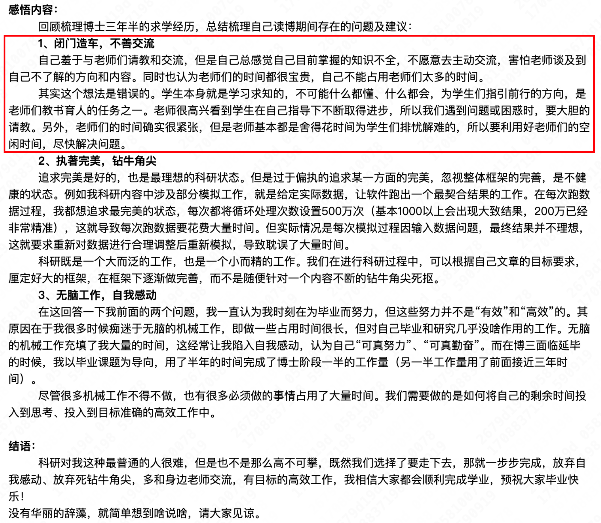

# Common problems when joining a new lab and how to avoid them

## Problems you may run into

1. Working in isolation and not communicating well

	A summary written by a PhD student on cc98: [https://www.cc98.org/topic/5810078/1](https://www.cc98.org/topic/5810078/1)

	

	How to avoid this problem: [Extracting knowledge from supervisors and senior students](../distilling-knowledge-from-mentors.md), [How to discuss efficiently](../getting-advanced/weekly-meeting-slides.md)
