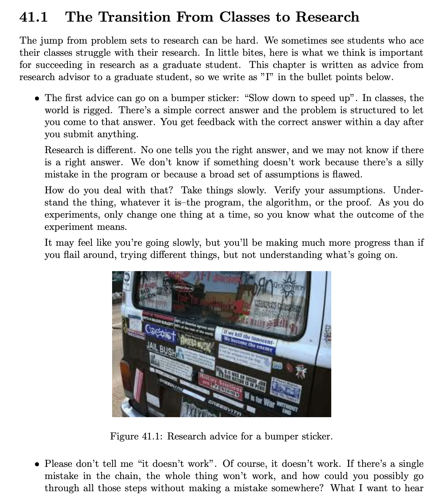
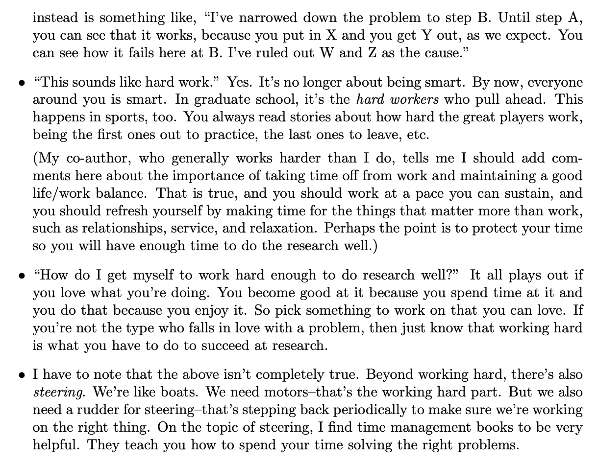
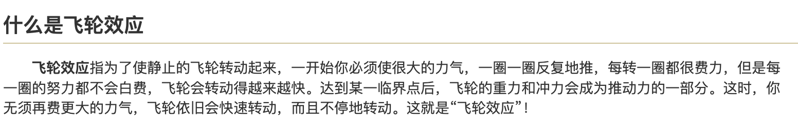
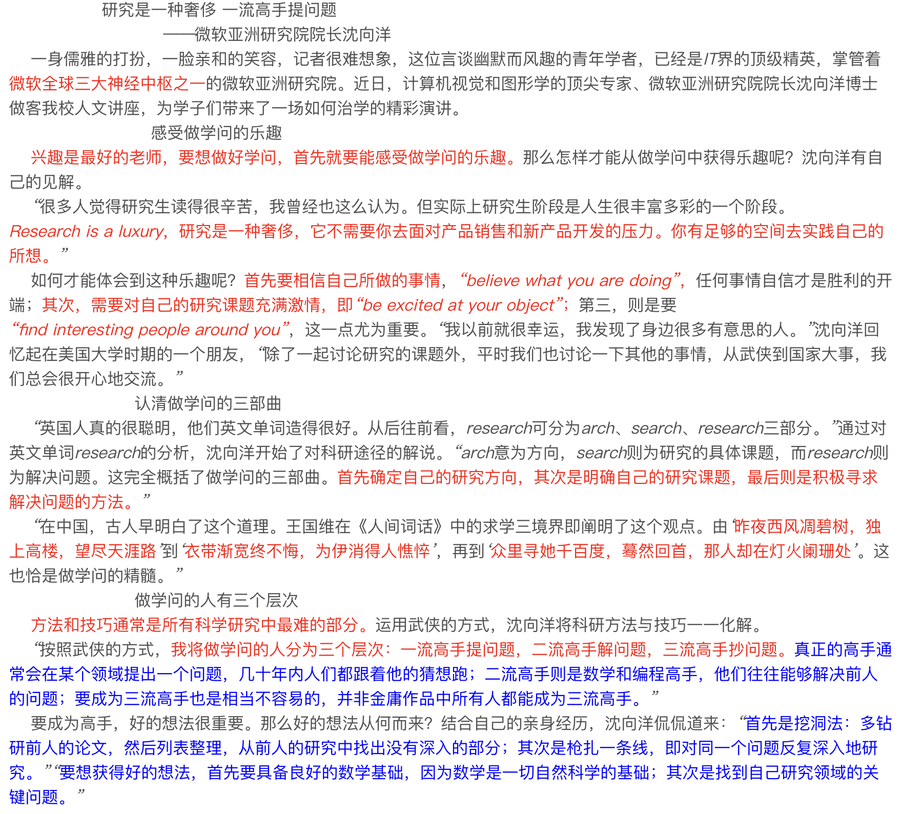

# Mental preparation for stage three

> Document index (GitHub repo): [https://github.com/pengsida/learning_research](https://github.com/pengsida/learning_research)

This article mostly summarises teaching materials written by experienced researchers

How research learning differs from coursework, part 1

Coursework can build a habit of finishing a course first and then using what you learned to do the assignments.

Research learning happens the other way around. You learn an algorithm and apply it at the same time, learning by using. **Make good use of ChatGPT.** (As an analogy to coursework, it is like jumping straight into the assignment without studying the material first, then looking up the relevant content while you do it. GPT works as a powerful search assistant.)

How research learning differs from coursework, part 2 (**important**)

In coursework you are usually told not to copy answers and to finish assignments on your own. That can build a habit of working out every problem or algorithm by yourself.

**In research learning, you should make good use of every resource available to learn efficiently**, extracting knowledge from many places. See this document: [Extracting knowledge from supervisors and senior students](../distilling-knowledge-from-mentors.md).

How research differs from coursework, part 3

**Coursework requires competition:**

Course grading has an annoying property: a normal distribution, where only the top few percent of each class can score above 90.

That setup makes high marks a limited resource. Students inside the class need to compete and keep raising their level above their classmates to get those marks.

**Research learning does not require competition:**

In research, you work on your own paper, you create new value rather than fighting over a fixed pool of resources.

A research project is something you conceive and explore yourself. It is not a pre-set prize that goes to the highest bidder.

> Please do not bring an internal-competition mindset into the lab. Research is built on cooperation and exchange.

How research differs from coursework, part 4: knowledge structure

In coursework, the knowledge structure is usually well organised. Good textbooks and tutorials lay out every concept you need to learn step by step.

In research, the topics are at the frontier and the knowledge points are scattered. Even when there are tutorials online, they may be poorly organised and may not present what you need directly. **If you try to learn frontier research topics through formal classes or textbooks, you often end up studying a lot of unrelated material.**

> In research, the supervisors and senior students in the lab are walking, complete knowledge bases.
> Top-grade undergraduates already know how to look things up in textbooks and tutorials. Treat your supervisor and senior students the same way: ask them and learn from them.

How research differs from coursework, part 5: mental preparation when solving problems

Research and coursework are very different.

- Coursework: every course problem has an answer, and the teacher already knows it. They can structure the course so that you reach the answer step by step.
- Research: on a given problem, you are very likely the person who understands it best and has thought about it most deeply, more than your supervisor. The supervisor does not know the correct solution and can only explore it together with you.

That fact means you have to solve the problem on your own.

Mental preparation when running experiments

Unlike coursework, where assignments usually only fail a few times, research experiments can fail dozens of times or more. **Most research outcomes come out of many failed iterations.**

When an experiment fails, you cannot simply say the approach does not work and switch to another, the way you might in coursework. **Research requires you to analyse why the current experiment did not work.**

You need to become unafraid of failure, and to extract reasons from failed experiments so you can improve the current approach.

Be ready for frequent discussion

In coursework, learning on your own is fine, because the course content is laid out and you only need to follow it.

In research, there is no clearly correct path. Because we are not sure whether we are right, we need to talk through our ideas with others often.

How thinking up solutions differs from coursework

For coursework assignments, you are usually expected not to look at answers, and ideally to solve problems entirely without external tools.

Research is very different.

When thinking through a solution in research, **you should first stand on the shoulders of giants**. Check whether an existing algorithm already solves the problem, and then whether a closely related algorithm could solve it.

> In research, search first, then re-search. The ability to find related algorithms is very important.
>
> Yang Zhilin's view: the essence of technology is combining methods, putting smaller techniques together into bigger ones, and combining old techniques into new ones.

Learning new knowledge can feel hard at the start, but if you keep at it you will see the flywheel effect that humans are capable of.

Feynman on a truth about research:

Reference material:

Research experience from Professor Heung-Yeung Shum

