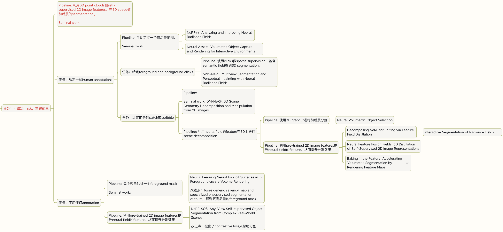

# Stage-two study plan example

Initial goal: study the papers and algorithms in the research direction of static scene rendering.

Next goal: study the papers and algorithms in the research direction of scene decomposition and editing.

Plan:

1. Study the NeRF algorithm.
   1. Read the NeRF paper.
   2. Study the [NeRF code](https://github.com/yenchenlin/nerf-pytorch) until you fully understand the NeRF algorithm.
   3. Reproduce NeRF inside this code framework: [https://github.com/pengsida/learning_nerf](https://github.com/pengsida/learning_nerf).
   4. Capture a new dataset yourself, then run NeRF on it using the code you wrote.
2. Study DFF, the paper related to your senior student's project, and run the corresponding experiments.
   1. Read the [DFF paper](https://pfnet-research.github.io/distilled-feature-fields/).
   2. Talk to your senior student and run the DFF experiments.
   3. Study the [DFF code](https://github.com/pfnet-research/distilled-feature-fields) until you fully understand the DFF algorithm.
3. While running the DFF experiments, read related papers. You don't need to finish them all at once. Read them carefully one by one, and don't rush.

