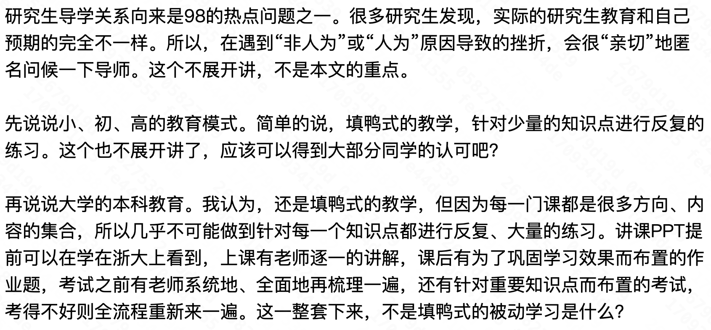
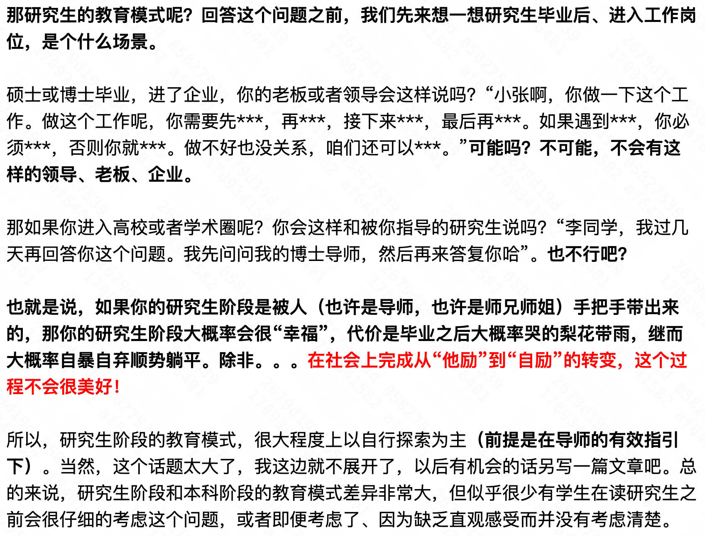
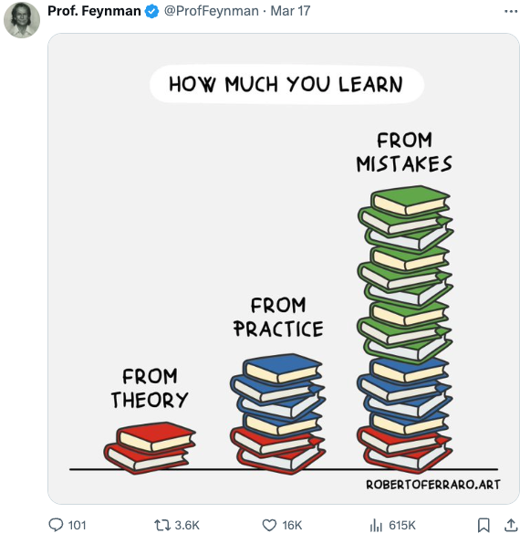

# Undergraduate vs graduate education

The following document supplements this one: [How research learning differs from coursework](./mental-prep-stage-three.md)

Feynman on a piece of truth in research:

