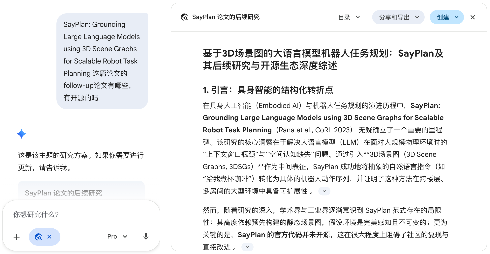

# How to build a literature tree

> Document index (GitHub repo): [https://github.com/pengsida/learning_research](https://github.com/pengsida/learning_research)

How to do a literature review: just ask Deep Research.

Example

> The text below was written in June 2023. It is overdue for an update.

Four kinds of novelty

Type 1 novelty: the seminal work for a milestone task.
Type 2 novelty: the seminal work for a novel pipeline or representation.
Type 3 novelty: the seminal work for a novel module.
Type 4 novelty: work that adds some modules to improve an existing pipeline.

How to build a literature tree:

1. Collect papers from the same direction.
2. Read the papers and work out what milestone tasks already exist in the direction. Mark the first paper that proposed each task (Type 1 novelty).
3. Group the papers by milestone task. Within each task, identify the representative pipelines and representations, and mark the first paper that proposed each pipeline or representation (Type 2 novelty).
4. Sub-divide further by pipeline or representation, and group the papers (Type 3 novelty).
5. As your understanding of the field grows, add new milestone tasks.

How to build a challenge-insight tree:

1. Collect the challenges encountered in the field.
2. Collect the insights that solve those challenges.

Example: [Literature tree and challenge-insight tree for the inverse rendering field](https://alidocs.dingtalk.com/i/nodes/QOG9lyrgJPwBpdn0u1B3aO2PVzN67Mw4). (DingTalk mind map. The DingTalk doc sharing system does not support direct public sharing, so you would need to request access separately. **This mind map is only an example and will not be updated.**)

> The text and the example above are a bit abstract and may not fully reflect what I mean. Since the literature review is the key to coming up with ideas, I suggest talking to senior students in your lab about how to do a literature review.

## See also

- [A specific approach](./specific-approach.md)
- [Planning a general goal and roadmap for a research direction](./planning-research-direction.md)
- [A specific process for coming up with ideas (goal-driven research)](./idea-generation-process.md)
- [How to build the ability to come up with ideas](./getting-advanced/coming-up-with-ideas.md)
