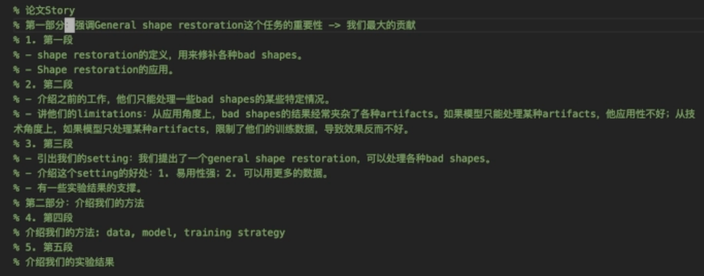
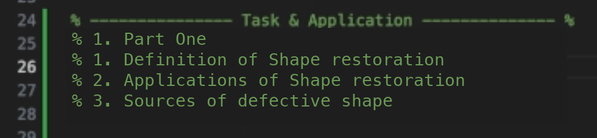
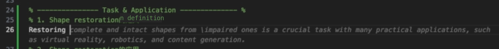
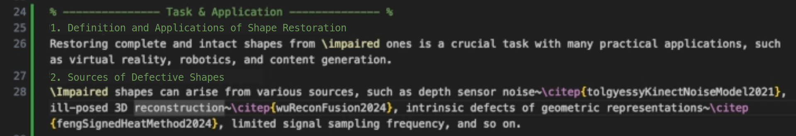
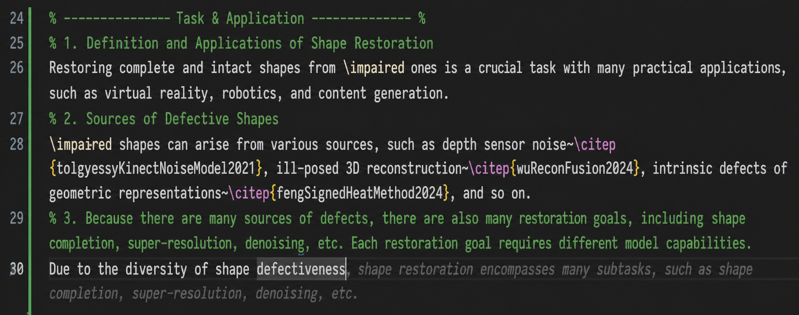
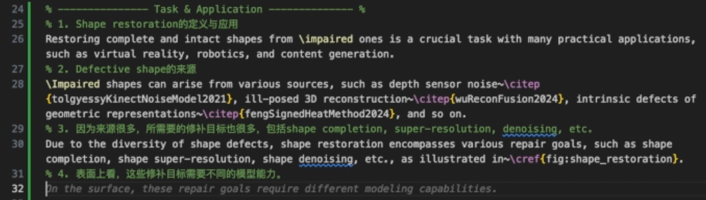
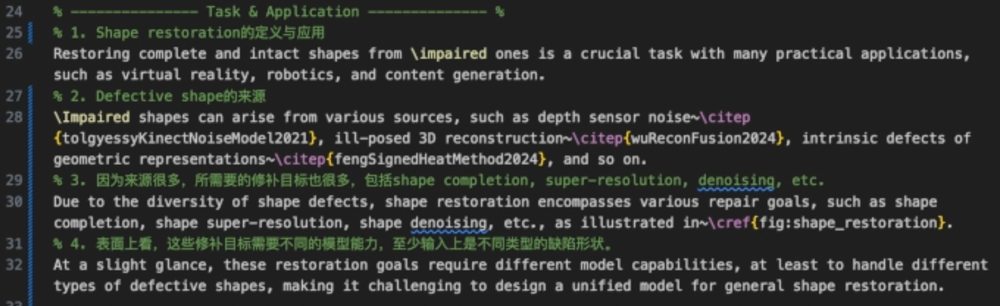
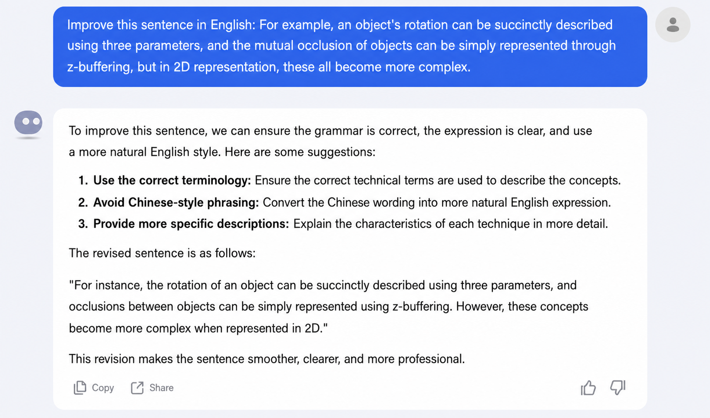
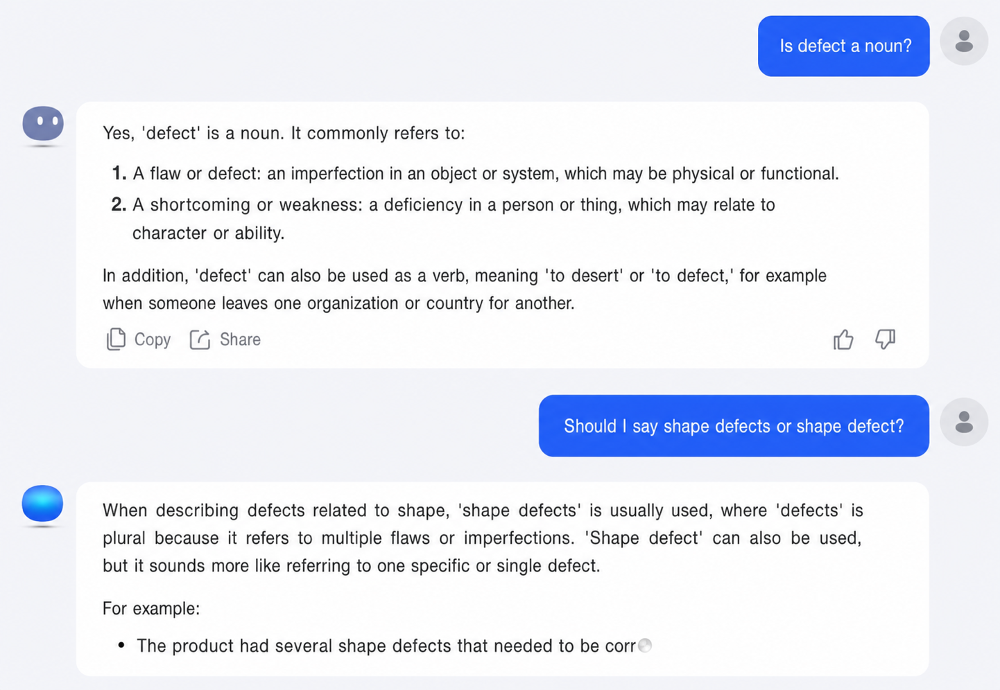
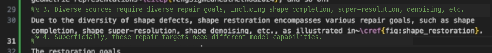

# Using Copilot and GPT to support English writing

Full screen recording of using Copilot and GPT to help write the Introduction: [https://www.bilibili.com/video/BV1jdxDeZEtq](https://www.bilibili.com/video/BV1jdxDeZEtq)

> The core of this technique: first lay out a clear writing outline so you know exactly what you want to say, then use AI to help with the English wording.
> The outline needs to be detailed enough that you know what every single sentence is about.

What is a writing outline

A writing outline is how the author organises the content of an article during writing.

A paper has writing outlines at several levels of granularity:
1. Section-level outline
2. Sub-section-level outline
3. Paragraph-level outline
4. Sentence-level outline

---

Section-level outline: figure out what each section is supposed to cover.
A paper's sections are usually divided into:
1. Abstract
2. Introduction
3. Related work
4. Method
5. Experiment

So the section-level outline is fairly fixed.

---

Sub-section-level outline: figure out what each sub-section is supposed to cover.
Usually only the Method and Experiment sections have sub-sections.

---

Paragraph-level outline: figure out what each paragraph is supposed to cover.
Each paragraph should communicate exactly one message. The flow of ideas between paragraphs needs to be smooth.

---

Sentence-level outline: figure out what each sentence is supposed to say.
The flow of ideas between sentences needs to be smooth, and the content needs to be complete.

How to lay out the writing outline of a paper

Work from coarse to fine when listing the outline:
1. List the section-level outline.
2. For each section, list the sub-section-level outline.
3. For each sub-section, list the paragraph-level outline.
4. For each paragraph, list the sentence-level outline.

[Examples of writing outlines (Notion)](./writing-flow-example.md)

How to use Copilot and GPT to help write **English paragraphs** ([**full video**](https://www.bilibili.com/video/BV1PP4Le6EcW)). Basic workflow:

1. List the overall outline of the Introduction.
	

	
Example

	

	

2. Write paragraph by paragraph.
	1. First, list the idea behind every sentence in the paragraph.
		

		
Example

		

		

	2. Based on the idea for each sentence, use Copilot to help with the writing.
		

		
Example

		The text below is the prompt fed to Copilot.

		

		

	3. While writing sentence by sentence, refine the paragraph-level outline (**this is the key to a clear paragraph**).
		

		
Example

		First version:

		

		Second version:

		

		Third version:

		

		Fourth version:

		

		Fifth version:

		

		

How to use Copilot and GPT to help write **English sentences** ([**full video**](https://www.bilibili.com/video/BV1pkxDeqE1t)). Basic workflow:

1. First, jot down the idea for the sentence.
	

	
Example

	

	

2. Based on that idea, use Copilot to help with the writing.
	

	
Example

	

	

3. The wording Copilot produces is not always accurate, so use GPT to polish it.
	1. Approach 1: write in mixed Chinese and English, and ask GPT to improve the English sentence directly (**works well**).
		

		
Example

		
		

		

	2. Approach 2: ask about specific words.
		

		
Example

		
		
		

		

4. Take the English sentence Copilot and GPT produce, then polish it once more yourself.
5. While writing sentences, refine the sentence-level outline.
	

	
Example

	First version:

	

	Second version:

	

	

