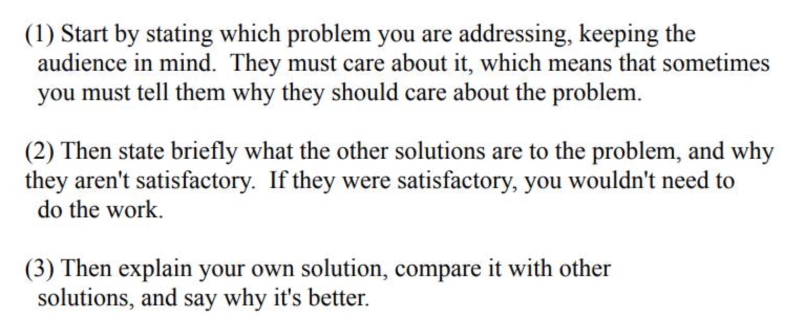
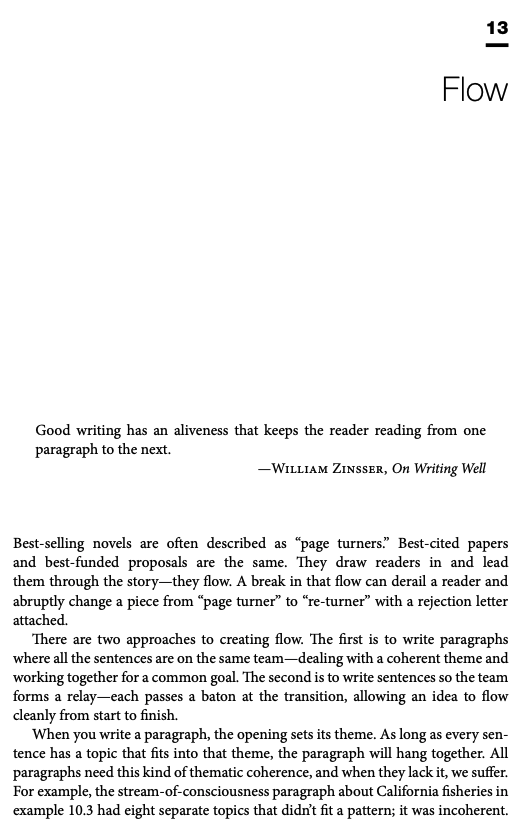

# Writing experience from high-level researchers

> Document index (GitHub repo): [https://github.com/pengsida/learning_research](https://github.com/pengsida/learning_research)

Bill Freeman's experience

- How to write a good CVPR submission (PDF, embedded in source) <!-- zh: how_to_write_a_good_CVPR_submission.pdf -->

Experience from SIGGRAPH paper chairs

- Paper chairs writing (PDF, embedded in source) <!-- zh: paper_chairs_writing.pdf -->

Flow is very important in English writing, both paragraph flow and sentence flow

A great book on English writing: Writing Science. It has a section on flow.

- Writing Science (PDF, embedded in source) <!-- zh: Writing_Science.pdf -->

How to tell whether your writing flows

- Does my writing flow (PDF, embedded in source) <!-- zh: does-my-writing-flow.pdf -->

