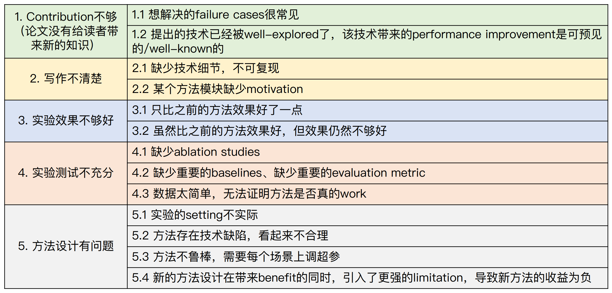

# How to review papers

> Document index (GitHub repo): [https://github.com/pengsida/learning_research](https://github.com/pengsida/learning_research)

Carefully check whether the paper has any reasons to be rejected. Going through the list one by one tells you whether the paper should be rejected.

Reasons a paper gets accepted. The paper needs to do all three of the following:

1. Enough contribution (it should include several of: novel task, novel pipeline, novel pipeline module, novel design choices, new experimental findings, new insights).
2. Experimental results are better than prior methods.
3. Ablation studies and comparison experiments are thorough.

Reasons a paper gets rejected. Common reasons:

1. Not enough contribution (the paper does not give the reader new knowledge, usually a few of the following: the failure cases it tries to solve are very common; the technique it proposes has already been well explored, and the performance improvement it brings is foreseeable or well known).
2. Writing is unclear (missing technical details, not reproducible; a method module has no motivation).
3. Experimental results are not strong enough (only slightly better than prior methods; or better than prior methods but the result is still not good enough).
4. Experiments are not thorough enough (missing ablation studies; missing important baselines; missing important evaluation metrics; data is too easy and cannot show whether the method actually works).
5. Method design has problems (the experimental setting is not realistic; the method has technical flaws and looks unreasonable; the method is brittle and needs hyperparameter tuning per scene; a new design choice brings a benefit but also introduces a stronger limitation, so the net effect of the new method is negative).

## See also

- [Adversarial writing: review your own paper](./adversarial-writing.md)
- [Paper writing template](./template.md)
