# Paper Writing Template

> Document hub (GitHub repo): [https://github.com/pengsida/learning_research](https://github.com/pengsida/learning_research)

A community port of this writing template, "Vibe Writing Skills": [https://github.com/Master-cai/Research-Paper-Writing-Skills](https://github.com/Master-cai/Research-Paper-Writing-Skills).

<details>
<summary>Paper writing planning diagram</summary>

Source file (drawio): [paper-writing-planning.drawio](./assets/template/paper-writing-planning.drawio).

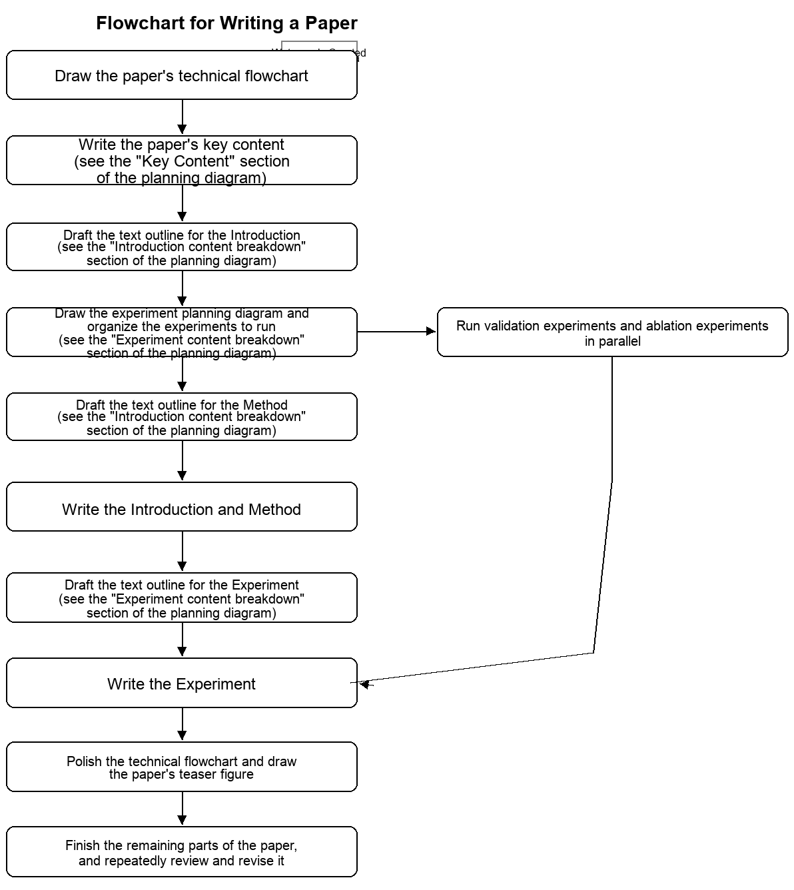

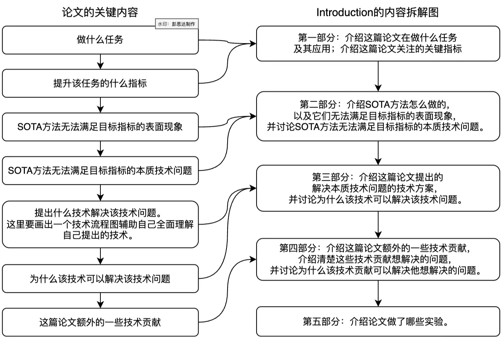

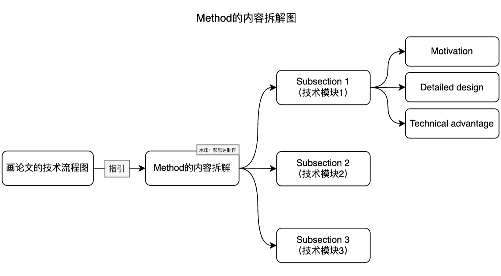

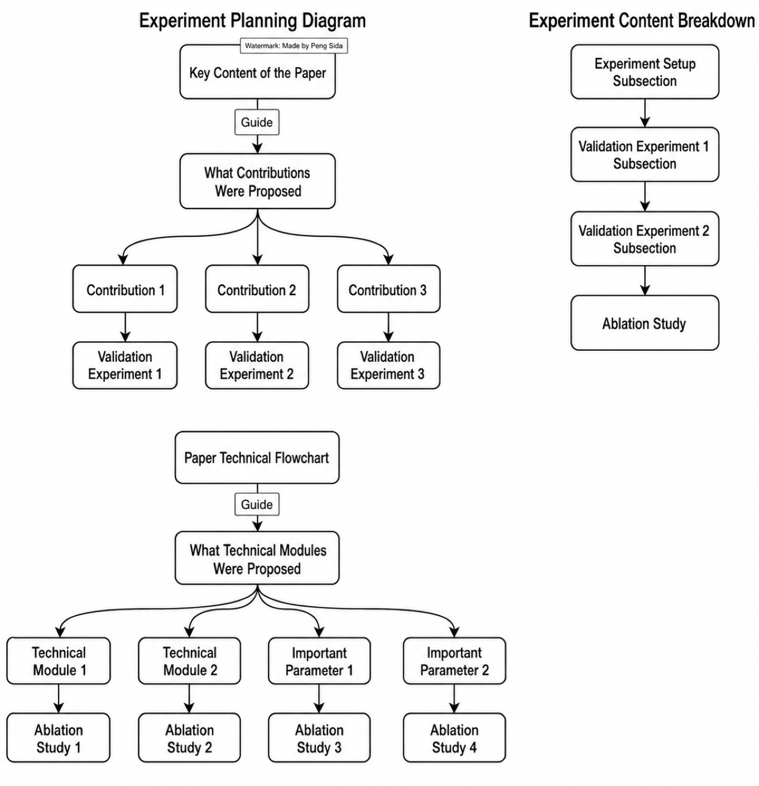

</details>

| Paper writing step | Matching tutorial |
| --- | --- |
| 1. Sketch a clear pipeline figure draft | a. [Paper figure template (not yet public) (Notion)](https://www.notion.so/0051678d2df74d73ae236b9b44875193) (Notion) |
| 2. Sort out the paper's story, draft the writing outline for the Introduction, and list the comparison experiments and ablation studies you want to run | a. [Paper writing template (Notion)](./template.md)<br>b. [How to lay out a writing outline (Notion)](https://www.notion.so/1143fe292ff180feb5d0fe76d05e085b)<br>c. [Paper writing template (Notion)](./template.md) |
| 3. Lay out the writing outline for the Method, then write the Method while running experiments | a. [Paper writing template (Notion)](./template.md)<br>b. [How to lay out a writing outline (Notion)](https://www.notion.so/1143fe292ff180feb5d0fe76d05e085b)<br>c. [How to use Copilot and GPT to support English writing (Notion)](https://www.notion.so/1143fe292ff180feb5d0fe76d05e085b) |
| 4. Revise the Introduction and Method while continuing experiments | a. [How to revise paper writing (Notion)](https://www.notion.so/1293fe292ff180bfa5deeed526821d78) |
| 5. Once experiments are mostly done, lay out the writing outline for the Experiments section, then write it | a. [How to lay out a writing outline (Notion)](https://www.notion.so/1143fe292ff180feb5d0fe76d05e085b)<br>b. [How to use Copilot and GPT to support English writing (Notion)](https://www.notion.so/1143fe292ff180feb5d0fe76d05e085b)<br>c. [Paper writing template (Notion)](./template.md) |
| 6. Polish the pipeline figure and produce the teaser figure | a. [Paper figure template (not yet public) (Notion)](https://www.notion.so/0051678d2df74d73ae236b9b44875193) (Notion) |
| 7. Lay out the writing outline for the Related work, then write it | a. [Paper writing template (Notion)](./template.md)<br>b. [How to lay out a writing outline (Notion)](https://www.notion.so/1143fe292ff180feb5d0fe76d05e085b)<br>c. [How to use Copilot and GPT to support English writing (Notion)](https://www.notion.so/1143fe292ff180feb5d0fe76d05e085b) |
| 8. Review the paper. Revise the Introduction, Method and Experiments | a. [Paper writing template (Notion)](./template.md)<br>b. [How to revise paper writing (Notion)](https://www.notion.so/1293fe292ff180bfa5deeed526821d78) |
| 9. Lay out the writing outline for the Abstract, then write it | a. [Paper writing template (Notion)](./template.md)<br>b. [How to lay out a writing outline (Notion)](https://www.notion.so/1143fe292ff180feb5d0fe76d05e085b)<br>c. [How to use Copilot and GPT to support English writing (Notion)](https://www.notion.so/1143fe292ff180feb5d0fe76d05e085b) |
| 10. Pick a paper title | a. [Paper writing template (Notion)](./template.md) |
| 11. Iterate. Review the paper repeatedly and revise it | a. [Paper writing template (Notion)](./template.md)<br>b. [How to revise paper writing (Notion)](https://www.notion.so/1293fe292ff180bfa5deeed526821d78) |

> The key to a paper getting good reviews: **make the paper look polished and attractive, so the first impression is that it is a high-quality piece of work.**
>
> How to make a paper look polished and high-quality at first glance:
> 1. A good-looking teaser figure and pipeline figure.
> 2. Good-looking tables and result figures.
> 3. Tidy typesetting.

> Paragraph writing principles:
> 1. One paragraph should convey one message, and convey it clearly. Do not blend several messages into a single paragraph.
> 2. The first sentence of a paragraph should tell the reader what the paragraph is about.
>
> The basic recipe for English writing: lay out the writing outline first, then refine the outline of each part, then write the actual English sentences. Pay attention to flow within paragraphs and between sentences. (See this [document (Notion)](./high-level-researchers.md) for a full discussion of flow.)
>
> **Paper writing must be done with patience and care, as the old saying goes "as a craftsman polishes jade." Read it again and again, asking yourself whether the reader can follow.**
>
> **The ability to "self-evaluate whether the writing is clear" is very important. Only when you know there is a problem can you fix it.**

<details>
<summary>The keys to writing a paper</summary>

1. Get the writing outline right before you start writing.
2. Polish like a craftsman: **revise the outline and the English sentences again and again.**

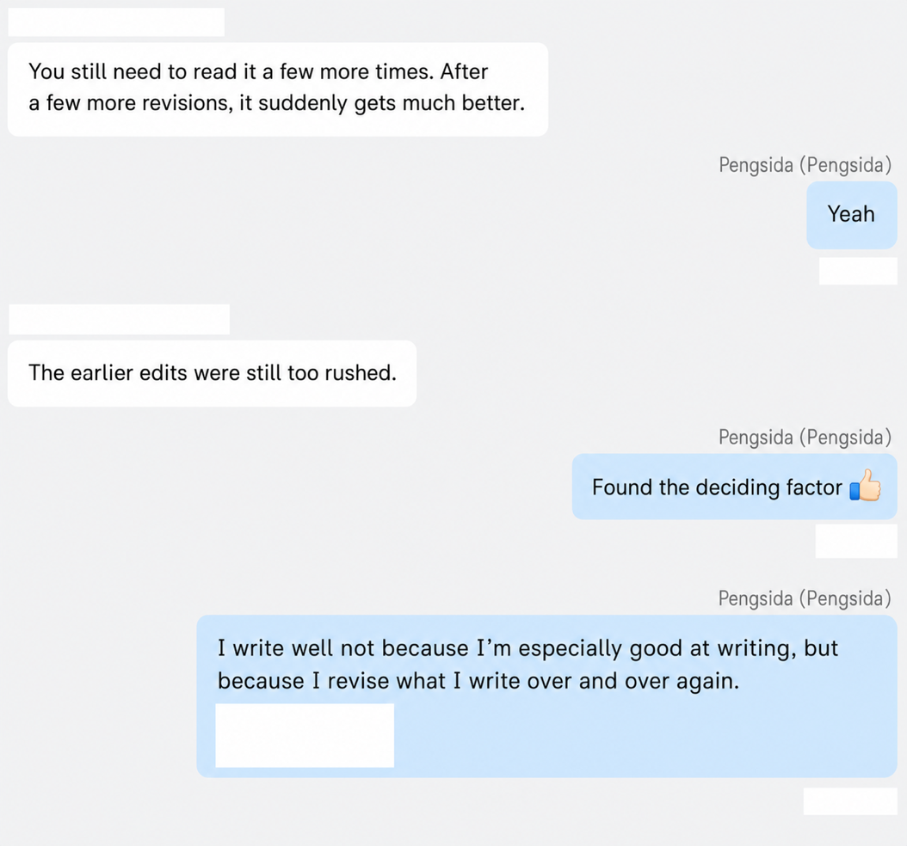

</details>

<details>
<summary>How to tell whether a paragraph is written clearly (<strong>important</strong>)</summary>

1. Read the paragraph from the reader's point of view. A few things to check:
    1. Does the paragraph have one clear topic?
    2. Does the first sentence explain what the paragraph is about?
    3. Can the reader follow every noun (concept) in each sentence? **Is the paragraph self-contained?**
        <details>
        <summary>When does a reader fail to follow a noun in a sentence?</summary>
        </details>
    4. Is the logical link between two sentences continuous?
        <details>
        <summary>When is the logic between two sentences not continuous?</summary>
        </details>
2. Reverse-outlining. Based on the paragraph you have already written, list the writing outline of that paragraph and check whether the outline flows.

</details>

[How to use Copilot and GPT to support English writing (Notion)](https://www.notion.so/1143fe292ff180feb5d0fe76d05e085b) (**important**, a basic skill in the LLM era)

[How to revise the writing of a paper (Notion)](https://www.notion.so/1293fe292ff180bfa5deeed526821d78)

> When to start writing: in general, start writing the paper at least **one month before the submission deadline**.

<details>
<summary>Key time points for paper writing (planning starts one month before the deadline)</summary>

One month before the deadline, the method may not be fully fixed and the experiments are unlikely to be finished. The paper's story, however, is usually settled by then, so you can start writing and start planning the remaining work.

> Starting one month early saves time later, makes the final stretch less painful, and helps you think about which experiments to run.

| Time point | What to write |
| --- | --- |
| Four weeks before the deadline | 1. Tidy up the existing story, including the core contribution and each module of the method together with its motivation.<br>2. List the comparison experiments and ablation studies to be run.<br>3. Write a first draft of the introduction this week. |
| Three weeks before the deadline | This week, try to finalise the method.<br>1. Get the pipeline figure draft clear and locked in.<br>2. Once the pipeline figure is locked in, write a first draft of the method. By the end of this week the method framework should at least be in place, so you can start writing the method itself. If the details of the method are not yet finalised, leave a `\todo{}` in the relevant spot, but get the framework written.<br><br>**By the end of this week, the first draft of the introduction and method must go to your supervisor for revision. Otherwise the supervisor probably will not be able to finish editing the paper.** (Imagine the supervisor in the last few days starting on ten very incomplete papers. What a hellish experience. If you were in that position, how would you feel?) |
| Two weeks before the deadline | This week, write a first draft of experiments, abstract, and related work. |
| Final week | Revise the paper, polish the pipeline figure and teaser, build the demo. |

<details>
<summary>Use a submission progress tracker to manage projects</summary>

Keep a lab-wide submission progress tracker. This way you know how many papers still need editing and you can spot when the supervisor will run out of time.

| Project lead | Introduction | Method | Experiments | Related work | Abstract |
| --- | --- | --- | --- | --- | --- |
| xxx | Specific progress description | | | | |
| xxx | | | | | |
| xxx | | | | | |
| xxx | | | | | |
| xxx | | | | | |

</details>

</details>

<details>
<summary>Paper title</summary>

The title matters because different titles attract reviewers from different fields.

Before picking a title, write down a few important keywords, then build the title from those keywords.

The title and the phrases that name the method should carry concrete meaning. They need to be informative so the reader remembers them. "Informative" means: the technique used, the paper's task, and the problem the paper solves.

</details>

<details>
<summary>Abstract</summary>

> How to write a good abstract: (1) think through the writing outline of the abstract; (2) plug into the templates below; (3) iterate on the abstract.
>
> Before writing, answer the following questions one by one:
> (1) What technical problem do we solve, and why does no well-established solution to this problem exist? **(important)**
> (2) What is our technical contribution?
> (3) Why does our method work, at heart?
> (4) What is the technical advantage of our method, and **what is the new insight we bring? (important)**

<details>
<summary>Version 1: introduce the technical challenge, then describe in one or two sentences the technical contribution that solves the challenge</summary>

```latex
\section{Abstract}
% Task
% Technical challenge for previous methods (build the discussion around the technical challenge we solve)
% One or two sentences introducing the technical contribution that solves the challenge (usually you mention the name of an "xxx technique" rather than walking through every step. The name should be readable and not feel like a jump. This skill is important for writing a good abstract.)
% Benefits of the technical contribution
% Experiment
```

</details>

<details>
<summary>Version 2: introduce the technical challenge, then in one or two sentences introduce the insight that solves the challenge, then in one sentence introduce the technical contribution that realises the insight. (<strong>Personal recommendation</strong>)</summary>

```latex
\section{Abstract}
% Task
%% Example 1: In recent years, generative models have undergone significant advancement due to the success of diffusion models.
%% Example 2: This paper addresses the challenge of novel view synthesis for a human performer from a very sparse set of camera views.

% Technical challenge for previous methods (build the discussion around the technical challenge we solve)
%% Example 1: The success of these models is often attributed to their use of guidance techniques, such as classifier and classifier-free methods, which provides effective mechanisms to tradeoff between fidelity and diversity. However, these methods are not capable of guiding a generated image to be aware of its geometric configuration, e.g., depth, which hinders the application of diffusion models to areas that require a certain level of depth awareness.
%% Example 2: Some recent works have shown that learning implicit neural representations of 3D scenes achieves remarkable view synthesis quality given dense input views. However, the representation learning will be ill-posed if the views are highly sparse.

% One sentence introducing the insight that solves the challenge
%% Example 1: To address this limitation, we propose a novel guidance approach for diffusion models that uses estimated depth information derived from the rich intermediate representations of diffusion models.
%% Example 2: To solve this ill-posed problem, our key idea is to integrate observations over video frames.

% One or two sentences introducing the technical contribution that realises the insight (usually mention the name of an "xxx technique" rather than walking through every step. The name should be readable and not feel like a jump. This skill matters for writing a good abstract.)
%% Example 1: To do this, we first present a label-efficient depth estimation framework using the internal representations of diffusion models. At the sampling phase, we utilize two guidance techniques to self-condition the generated image using the estimated depth map, the first of which uses pseudo-labeling, and the subsequent one uses a depth-domain diffusion prior.
%% Example 2: To this end, we propose Neural Body, a new human body representation which assumes that the learned neural representations at different frames share the same set of latent codes anchored to a deformable mesh

% Benefits of the technical novelty
%% Example 2: so that the observations across frames can be naturally integrated. The deformable mesh also provides geometric guidance for the network to learn 3D representations more efficiently.

% Experiment
```

</details>

<details>
<summary>Version 3: there are several technical contributions; describe each technical contribution and its technical advantage in turn</summary>

```latex
% Task
%% This paper introduces a novel contour-based approach named deep snake for real-time instance segmentation.

%% Unlike some recent methods that directly regress the coordinates of the object boundary points from an image

% One sentence introducing a technical contribution and its technical advantage (this skill matters for writing a good abstract.)
%% deep snake uses a neural network to iteratively deform an initial contour to match the object boundary, which implements the classic idea of snake algorithms with a learning-based approach.

% One sentence introducing a technical contribution and its technical advantage
%% For structured feature learning on the contour, we propose to use circular convolution in deep snake, which better exploits the cycle-graph structure of a contour compared against generic graph convolution.

% One sentence introducing a technical contribution and its technical advantage
%% Based on deep snake, we develop a two-stage pipeline for instance segmentation: initial contour proposal and contour deformation, which can handle errors in object localization.

% Experiment
```

</details>

</details>

<details>
<summary>Introduction</summary>

> How to write a good introduction: (1) think through the writing outline; (2) plug into the templates below; (3) iterate.
>
> How to think through the introduction's writing outline: work backwards, then forwards.
>
> First, work backwards by answering the following questions:
> (1) What technical problem do we solve, and why does no well-established solution exist? **(important)**
> (2) What are the contributions of our pipeline (e.g. proposing a new and valuable task, proposing a new and valuable technical metric, proposing a new technical problem, proposing a new technique)?
> (3) What are the benefits of our contributions, and why do they solve the technical challenge? **What is the new insight we bring? (important)**
> (4) How do we use the discussion of previous methods to introduce the technical challenge we solve and the new insight we bring?
>
> Then work forwards by laying out the paper's story:
> (1) Introduce the paper's task.
> (2) Introduce the technical challenge we solve by discussing previous methods.
> (3) To solve this technical challenge, we propose xx contributions.
> (4) State the technical advantages of our contributions, and **express our new insight (important)**.

```latex
\section{Introduction}
% Task and application
% Technical challenge for previous methods (build the discussion around the technical challenge we solve. The technical challenge includes the limitation and the technical reason)
% Introduce our pipeline that solves the challenge
% Experiment
% Contributions
```

<details>
<summary>Introducing the task and application</summary>

<details>
<summary>Version 1: the task is niche, so introduce the task first, then the application</summary>

```latex
% Introduce the task (if the task is very familiar, you can skip this part)
%% Example: Object pose estimation aims to estimate object's orientation and translation relative to a canonical frame from a single image.
[xxx task] targets at recovering/reconstructing/estimating [xxx output] from [xxx input].

% Introduce the application
%% Example: Accurate pose estimation is essential for a variety of applications such as augmented reality, autonomous driving and robotic manipulation.
[xxx task] has a variety of applications such as [xxx], [xxx], and [xxx].
```

</details>

<details>
<summary>Version 2: the task is well known, so go straight to the application</summary>

```latex
% Introduce the application
%% Example: Accurate pose estimation is essential for a variety of applications such as augmented reality, autonomous driving and robotic manipulation.
[xxx task] has a variety of applications such as [xxx], [xxx], and [xxx].
```

</details>

<details>
<summary>Version 3: introduce the application of the general task first, then introduce the specific task setting. (<strong>Recommended when the setting is fairly new</strong>)</summary>

```latex
% Introduce the application of the general task
%% Example: Accurate pose estimation is essential for a variety of applications such as augmented reality, autonomous driving and robotic manipulation.
[xxx task] has a variety of applications such as [xxx], [xxx], and [xxx].

% Introduce the specific task setting
%% Example: This paper focuses on the specific setting of recovering the 6DoF pose of an object, i.e., rotation and translation in 3D, from a single RGB image of that object.
This paper focuses on the specific setting of recovering/reconstructing/estimating [xxx output] from [xxx input].
```

</details>

<details>
<summary>Version 4: the task is well known, go straight to the application. Then in the opening paragraph, use the discussion of previous methods to introduce the technical challenge you want to solve (failure cases to fix, task metrics to improve)</summary>

> Personally, having the very first paragraph of the introduction state what we want to fix is quite nice, rather than spending several paragraphs of previous methods to lead up to it.
>
> That said, this style only fits the right kind of paper, which is rare. Usually you do need to introduce a few previous methods first to lead up to the technical challenge you want to solve.
>
> Introduction structure that fits version 4:
> Part 1 (introduce task and application; use previous methods 1 to lead directly into the technical challenge)
> -> Part 2 (previous methods 2 try to solve this challenge but have problems)
> -> Part 3 (our method)
>
> Standard introduction structure:
> Part 1 (introduce task and application)
> -> Part 2 (previous methods 1, but with xx limitation)
> -> Part 3 (previous methods 2, with xx limitation. This is where the technical challenge we want to solve is introduced)
> -> Part 4 (our method)

```latex
% Opening paragraph of the introduction in ManhattanSDF
% Opening paragraph of the introduction in Deep Snake

% Introduce the application
%% Example 1: Reconstructing 3D scenes from multi-view images is a cornerstone of many applications such as augmented reality, robotics, and autonomous driving.
%% Example 2: Instance segmentation is the cornerstone of many computer vision tasks, such as video analysis, autonomous driving, and robotic grasping, which require both accuracy and efficiency.

% Use the discussion of previous methods to lead into the technical challenge we want to solve
%% Example 1: Given input images, traditional methods [43, 44, 59] generally estimate the depth map for each image based on the multi-view stereo (MVS) algorithms and then fuse estimated depth maps into 3D models. Although these methods achieve successful reconstruction in most cases, they have difficulty in handling low-textured regions, e.g., floors and walls of indoor scenes, due to the unreliable stereo matching in these regions.
%% Example 2: Most of the state-of-the-art instance segmentation methods [18, 27, 5, 19] perform pixel-wise segmentation within a bounding box given by an object detector [36], which may be sensitive to the inaccurate bounding box. Moreover, representing an object shape as dense binary pixels generally results in costly post-processing.
```

</details>

</details>

<details>
<summary>Introducing the technical challenge for previous methods (<strong>this part is very important</strong>: build the discussion around the technical challenge we solve, so the reader becomes <strong>curious about how to solve it</strong> and recognises the motivation and benefit of our method)</summary>

> **The trick is to think through the logic of "leading up to the technical challenge we solve" before you write.**
>
> For an existing task with existing methods, work through the following questions one by one:
> (1) What technical challenge does our pipeline solve?
> (2) Which method [recent method 2] has this technical challenge?
> (3) Why does recent method 2 exist? Usually it exists to solve some technical challenge of another method [recent method 1]. (This question is optional. Sometimes there is only one recent method, sometimes several.)
> (4) Why does recent method 1 exist? Usually it exists to solve some technical challenge of [traditional method].
>
> For a novel task, work through the following:
> (1) Think clearly about the technical challenge our pipeline solves.

> **Do not write a naive solution first and then write our improvements over that naive solution.** Doing so makes the reader feel that our method is a four-out-of-ten incremental work. Adding things one piece at a time is easy to read, but it also makes the reader assume the result is straightforwardly obvious. They may not realise it is the writing style that is leading them to think so easily. **This kills the reader's curiosity about solving the technical challenge.**
>
> **Even if the work really is a four-out-of-ten increment, you should not write it this way.**

<details>
<summary>Version 1: existing task, existing methods</summary>

```latex
% Discuss the general technical challenges of this task (used to lead into recent methods)
%% Example 1: This problem is quite challenging from many perspectives, including object detection under severe occlusions, variations in lighting and appearance, and cluttered background objects.
%% Example 2: This problem is particularly challenging due to the inherent ambiguity on acquiring human geometry, materials and motions from images.
This problem is particularly challenging due to several factors, including [xxx reason], [xxx reason], and [xxx reason].

% One or two sentences introducing a class of traditional methods, then discussing the technical challenge they face (if traditional methods exist, you should discuss them to show that we know the field well)
%% Introduce the traditional methods
%% Example: Traditional methods have shown that pose estimation can be achieved by establishing the correspondences between an object image and the object model.
To overcome these challenges, traditional methods [describe how they work], [achieve such-and-such results].

%% Discuss the technical challenge they face
%% Example: They rely on hand-crafted features, which are not robust to image variations and background clutters.
However, they [the technical challenge they face].

% One or two sentences introducing recent methods 1, then discussing the technical challenge they face (optional; use the discussion of how they work to lead into the technical challenge. If needed, you can discuss several recent methods, as long as it helps lead into the technical challenge.)
%% Introduce recent methods 1
%% Example: Deep learning based methods train end-to-end neural networks that take an image as input and output its corresponding pose.
Recently, [xxx methods] [describe how they work], [achieve such-and-such results].

%% Discuss the technical challenge they face (the limitation and the technical reason)
%% Example: However, generalization remains as an issue, as it is unclear that such end-to-end methods learn sufficient feature representations for pose estimation.
However, they [existing limitation], because [xxx technical reason].

% One or two sentences discussing recent methods 2, then discussing the technical challenge they face (this needs to lead into the technical challenge we solve)
%% Introduce recent methods 2
%% Example: Some recent methods use CNNs to first regress 2D keypoints and then compute 6D pose parameters using the Perspective-n-Point (PnP) algorithm. In other words, the detected keypoints serve as an intermediate representation for pose estimation. Such two-stage approaches achieve state-of-the-art performance, thanks to robust detection of keypoints.
To overcome this challenge, [xxx methods] [describe how they work], [achieve such-and-such results].

%% Discuss the technical challenge they face (the limitation and the technical reason)
%% Example: However, these methods have difficulty in tackling occluded and truncated objects, since part of their keypoints are invisible. Although CNNs may predict these unseen keypoints by memorizing similar patterns, generalization remains difficult.
However, they [existing limitation], because [xxx technical reason].
```

</details>

<details>
<summary>Version 2: existing task with existing methods, and the insight behind our technical contribution has been used in traditional methods</summary>

```latex
% Introduce a class of traditional/recent methods, then discuss the technical challenge they face (to lead into our insight)
%% Introduce a class of traditional/recent methods
%% Example 1, deep snake: Most of the state-of-the-art instance segmentation methods perform pixel-wise segmentation within a bounding box given by an object detector.
%% Example 2, ManhattanSDF: Given input images, traditional methods generally estimate the depth map for each image based on the multi-view stereo (MVS) algorithms and then fuse estimated depth maps into 3D models.
Traditional/recent methods [describe how they work], [achieve such-and-such results].

%% Discuss the technical challenge they face (the limitation and the technical reason)
%% Example 1, deep snake: They may be sensitive to the inaccurate bounding box. Moreover, representing an object shape as dense binary pixels generally results in costly post-processing.
%% Example 2, ManhattanSDF: Although these methods achieve successful reconstruction in most cases, they have difficulty in handling low-textured regions, e.g., floors and walls of indoor scenes, due to the unreliable stereo matching in these regions.
However, they [existing limitation], because [xxx technical reason].

% Discuss the traditional methods that already used our insight (discuss traditional methods on the same task with similar techniques, hinting that our technique has a traditional pedigree)
%% Example 1, deep snake: An alternative shape representation is the object contour, which is a set of vertices along the object silhouette. In contrast to pixel-based representation, a contour is not limited within a bounding box and has fewer parameters. Such a contour-based representation has long been used in image segmentation since the seminal work by Kass et al., which is well known as snakes or active contours.
%% Example 2, ManhattanSDF: To improve the reconstruction of low-textured regions, a typical approach is leveraging the planar prior of manmade scenes, which has long been explored in literature. A renowned example is the Manhattanworld assumption, i.e., the surfaces of man-made scenes should be aligned with three dominant directions.

%% Introduce the insight
To overcome this problem, a typical approach is [xxx insight], which has long been explored in literature.

%% Introduce how a class of traditional methods worked
These methods [describe how they work].

%% Discuss the technical challenge they face (the limitation and the technical reason)
%% Example 1, deep snake: While many variants have been developed in literature, these methods are prone to local optima as the objective functions are handcrafted and typically nonconvex.
%% Example 2, ManhattanSDF: However, all of them focus on optimizing per-view depth maps instead of the full scene models in 3D space. As a result, depth estimation and plane segmentation could still be inconsistent among views, yielding suboptimal reconstruction quality as demonstrated by our experimental results in Section 5.3.
However, they [existing limitation], because [xxx technical reason].

% One or two sentences discussing recent methods 2, then discussing the technical challenge they face (needs to lead into the technical challenge we solve)
%% Introduce recent method 2
%% Example: There is a recent trend to represent 3D scenes as implicit neural representations and learn the representations from images with differentiable renderers. In particular, [49, 54, 55] use a signed distance field (SDF) to represent the scene and render it into images based on the sphere tracing or volume rendering. Thanks to the welldefined surfaces of SDFs, they recover high-quality 3D geometries from images.
To overcome this challenge, [xxx methods] [describe how they work], [achieve such-and-such results].

%% Discuss the technical challenge they face (limitation and technical reason)
%% Example: However, these methods essentially rely on the multi-view photometric consistency to learn the SDFs. So they still suffer from poor performance in lowtextured planar regions, as shown in Figure 1, as many plausible solutions may satisfy the photometric constraint in low-textured planar regions.
However, they [existing limitation], because [xxx technical reason].
```

</details>

<details>
<summary>Version 3: novel task, no existing methods</summary>

[Example 1](https://arxiv.org/abs/2212.04965), [example 2](https://openaccess.thecvf.com/content/CVPR2021/papers/Martin-Brualla_NeRF_in_the_Wild_Neural_Radiance_Fields_for_Unconstrained_Photo_CVPR_2021_paper.pdf)

```latex
% To achieve xx goal, several requirements need to be met (or several challenges need to be overcome).
%% Example: In this work, our goal is to build a model that captures such object intrinsics from a single image. This problem is challenging for three reasons.

% Describe the first point
%% Example: First, we only have a single image. This makes our work fundamentally different from existing works on 3D-aware image generation models [8, 9, 27, 28], which typically require a large dataset of thousands of instances for training. In comparison, the single image contains at most a few dozen instances, making the inference problem highly under-constrained.

% Describe the second point
%% Example: Second, these already limited instances may vary significantly in pixel values. This is because they have different poses and illumination conditions, but neither of these factors are annotated or known. We also cannot resort to existing tools for pose estimation based on structure from motion, such as COLMAP [35], because the appearance variations violate the assumptions of epipolar geometry.

% Describe the third point
%% Example: Finally, the object intrinsics we aim to infer are probabilistic, not deterministic: no two roses in the natural world are identical, and we want to capture a distribution of their geometry, texture, and material to exploit the underlying multi-view information.
```

</details>

</details>

<details>
<summary>Introducing our pipeline that solves the challenge</summary>

> **Answer the following questions before writing.**
>
> Version 1: existing task with existing methods. Work through the following:
> (1) What technical challenge does our pipeline solve?
> (2) What is our technical contribution?
> (3) Why does our method work, at heart?
> (4) What is the benefit of our method compared with previous methods?
>
> Version 2: novel task. Work through the following:
> (1) What technical challenge does our pipeline solve?
> (2) What is our technical contribution?
> (3) Why does our method work, at heart?

<details>
<summary>Version 1: one contribution with several advantages, and a teaser figure introducing our basic idea</summary>

```latex
% In this paper, we propose a novel framework ...
%% Example: In this paper, we introduce a novel implicit neural representation for dynamic humans, named Neural Body, to solve the challenge of novel view synthesis from sparse views.
In this paper, we propose a novel framework/representation, named [method name] for [xxx task].

% A teaser figure showing the basic idea
%% Example: The basic idea is illustrated in Figure 2.
The basic idea is illustrated in [xxx Figure].

% One sentence introducing our key novelty/contribution (this skill matters for writing a good introduction. You need to convey our key idea in one or two sentences so the reader can follow.)
%% Example: For the implicit fields at different frames, instead of learning them separately, Neural Body generates them from the same set of latent codes.
Our innovation is in [one sentence introducing our key novelty].

% Describe how we do it
%% Example: Specifically, we anchor a set of latent codes to the vertices of a deformable human model (SMPL in this work), namely that their spatial locations vary with the human pose. To obtain the 3D representation at a frame, we first transform the code locations based on the human pose, which can be reliably estimated from sparse camera views. Then, a network is designed to regress the density and color for any 3D point based on these latent codes. Both the latent codes and the network are jointly learned from images of all video frames during the reconstruction.
Specifically, [describe how we do it].

% Introduce the advantage of our method (why it works at heart, what the benefit is over previous methods)
%% Example: This model is inspired by the latent variable model in statistics, which enables us to effectively integrate observations at different frames.
In contrast to previous methods, [the advantage of our method].

% Introduce another advantage
%% Example: Another advantage of the proposed method is that the deformable model provides a geometric prior (rough surface location) to enable more efficient learning of implicit fields.
Another advantage of the proposed method is that [our other advantage].
```

</details>

<details>
<summary>Version 2: two contributions, and a teaser figure introducing our basic idea</summary>

```latex
% In this paper, we propose a novel framework ...
%% Example: In this paper, we introduce a novel implicit neural representation for dynamic humans, named Neural Body, to solve the challenge of novel view synthesis from sparse views.
In this paper, we propose a novel framework/representation, named [method name] for [xxx task].

% One sentence introducing our key novelty/contribution
%% Example: To that end, we propose techniques to represent a given subject with rare token identifiers and fine-tune a pre-trained, diffusion-based text-to-image framework that operates in two steps; generating a low-resolution image from text and subsequently applying super-resolution (SR) diffusion models.
Our innovation is in [one sentence introducing our key novelty].

% A teaser figure showing the basic idea
% Example: The basic idea is illustrated in Figure 2.
The basic idea is illustrated in [xxx Figure].

% Describe how we do it
%% Example: We first fine-tune the low-resolution text-toimage model with the input images and text prompts containing a unique identifier followed by the class name of the subject (e.g., "A [V] dog").
Specifically, [describe how we do it].

% Introduce the advantage of our method (why it works at heart, what the benefit is over previous methods)
%% Example: This model is inspired by the latent variable model in statistics, which enables us to effectively integrate observations at different frames.
In contrast to previous methods, [the advantage of our method].

% Introduce another technical contribution (usually one that solves a technical challenge faced by contribution 1, otherwise the two contributions feel loosely tied together)

%% Discuss the other technical challenge
%% Example: In order to prevent overfitting and language drift [35, 40] that cause the model to associate the class name (e.g., "dog") with the specific instance
However, [describe the other technical challenge].

%% Describe how technical contribution 2 works
%% Example: we propose an autogenous, class-specific prior preservation loss, which leverages the semantic prior on the class that is embedded in the model, and encourages it to generate diverse instances of the same class as our subject.
Specifically, [describe how we do it].
```

</details>

<details>
<summary>Version 3: building on a previous method's pipeline, propose a new module. With a teaser figure introducing our basic idea</summary>

```latex
% In this paper, we propose a learning-based snake algorithm, named deep snake, for real-time instance segmentation.

% Inspired by previous methods [21, 25], deep snake takes an initial contour as input and deforms it by regressing vertex-wise offsets.

% Our innovation is introducing the circular convolution for efficient feature learning on a contour, as illustrated in Figure 1.

% We observe that the contour is a cycle graph that consists of a sequence of vertices connected in a closed cycle. Since every vertex has the same degree equal to two, we can apply the standard 1D convolution on the vertex features.

% Considering that the contour is periodic, deep snake introduces the circular convolution, which indicates that an aperiodic function (1D kernel) is convolved in the standard way with a periodic function (features defined on the contour).

% The kernel of circular convolution encodes not only the feature of each vertex but also the relationship among neighboring vertices. In contrast, the generic GCN performs pooling to aggregate information from neighboring vertices. The kernel function in our circular convolution amounts to a learnable aggregation function, which is more expressive and results in better performance than using a generic GCN, as demonstrated by our experimental results in Section 5.2.
```

</details>

<details>
<summary>Version 4: our contribution comes from an important observation</summary>

Introduce the key innovation first, then discuss an observation that the reader can grasp immediately (used as the motivation for our method), then describe our method, then discuss the benefits of our method.

```latex
% In this paper, we propose a learning-based snake algorithm, named deep snake, for real-time instance segmentation.

% Our innovation is introducing the circular convolution for efficient feature learning on a contour, as illustrated in Figure 1.

% We observe that the contour is a cycle graph that consists of a sequence of vertices connected in a closed cycle. Since every vertex has the same degree equal to two, we can apply the standard 1D convolution on the vertex features.

% Considering that the contour is periodic, deep snake introduces the circular convolution, which indicates that an aperiodic function (1D kernel) is convolved in the standard way with a periodic function (features defined on the contour).

% The kernel of circular convolution encodes not only the feature of each vertex but also the relationship among neighboring vertices. In contrast, the generic GCN performs pooling to aggregate information from neighboring vertices. The kernel function in our circular convolution amounts to a learnable aggregation function, which is more expressive and results in better performance than using a generic GCN, as demonstrated by our experimental results in Section 5.2.
```

</details>

<details>
<summary>Styles we do not recommend</summary>

<details>
<summary>The method is fairly simple, and you do not plan to spell it out in the introduction. You only present the insights and an abstracted version of the method, hoping the reviewer feels the method is novel. (<strong>Generally not recommended. Aim to spell out the core contribution in the introduction.</strong>)</summary>

> The trick in this template is making a simple pipeline sound novel. Note: do not just sound novel about the insight, **make the pipeline steps themselves sound novel.**

```latex
% To tackle this problem, we propose a novel 3D GAN training method to generate photo-realistic images irrespective of the viewing angle.

% Introduce the key idea
% Our key idea is as follows. To ease the challenging problem of learning photorealistic and multi-view consistent image synthesis, we cast the problem into two subproblems, each of which can be solved more easily.

% Explain why the key idea works, but do not discuss the pipeline in detail. (Or describe the benefit of the key idea.)
%% Example: Specifically, we formulate the problem as a combination of two simple discrimination problems, one of which learns to discriminate whether a synthesized image looks real or not, and the other learns to discriminate whether a synthesized image agrees with the camera pose. Unlike the formulations of the previous methods, which try to learn the real image distribution for each pose, or to learn pose estimation, our subproblems are much easier as each of them is analogous to a basic binary classification problem.

% Introduce a pipeline module, but using new concepts/terms; do not explain how the whole pipeline works in detail. (Or do not introduce the pipeline at all.)
%% Example: Based on this key idea, we propose a dual-branched discriminator, which has two branches for learning photorealism and pose consistency, respectively. As these branches are supervised explicitly for their respective purposes, high-quality images with pose consistency can be produced at each viewing angle, and consequently, the generator creates high-quality images and shapes. (This passage does not explain how it works in detail.)

% Introduce another contribution
%% Example: In addition, we propose a pose-matching loss to give supervision to the discriminator for the pose consistency, by considering a positive pose (i.e., rendering pose or ground truth pose) and a negative pose (i.e., irrelevant pose) for a given image. (This passage does not explain how it works in detail.)

% Introduce why the method works at heart and the benefit over previous methods
%% Example: For example, the frontal viewpoint is one of the irrelevant poses for a side-view image. As reported in the experiments, this loss helps improve image and shape quality. This can be interpreted as a simplification of a classification problem from a large number of classes into binary, which is composed of positive and negative pairs.
```

</details>

</details>

</details>

<details>
<summary>Experiment</summary>
</details>

<details>
<summary>Contributions</summary>
</details>

</details>

<details>
<summary>Method</summary>

> How to write the method clearly: (1) answer the questions below; (2) sketch the pipeline figure; (3) write the method step by step.
>
> Questions:
> (1) Which modules does the method have?
> (2) For each module, answer three questions: how the module works, why this module is used, and why the module works. **Organising the answers as a mind map or table can help.**

Steps for writing the method:

1. Sketch the pipeline figure.
2. Based on the sketch, organise the writing outline of the method section: which method modules each subsection covers.
3. Organise the writing outline of each subsection. Each subsection should contain three parts: motivation of the module, module design, and the technical advantages of the module. Think through the outline of each part. (**Important for explaining a pipeline module clearly.**)
4. Start writing. Write the module design first, so the method has a basic body.
5. Then add the motivation and the technical advantages of each module into the method.

The three elements of a pipeline module:

1. Module design: a description of the module's details, including the construction of a representation, the design of a network, and how the module operates step by step (given xxx input, the first step does xxx, the second step does xxx, the third step does xxx, and finally outputs xxx).
2. Motivation of the module: why the paper uses this module.
3. Technical advantages of the module: why this module has xx technical advantages.

<details>
<summary><strong>Neural Body as a worked example of these three elements</strong></summary>

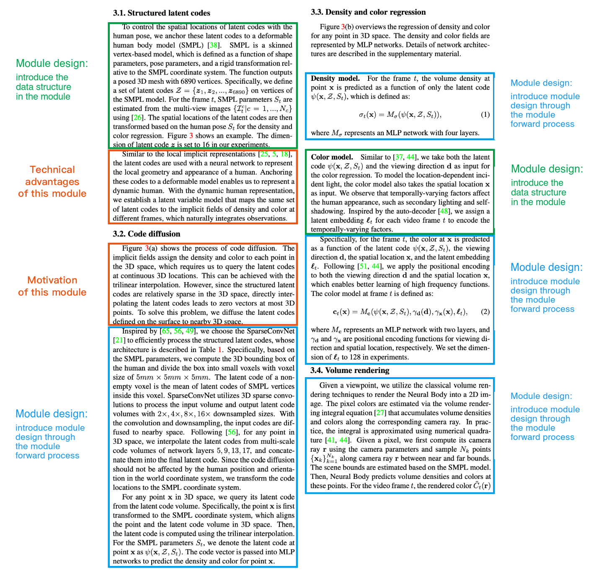

</details>

<details>
<summary>How to write module design</summary>

Module design usually has two parts:

1. A description of specific data structures or network structures inside the module.
2. Explaining the module design by describing the module's forward process: given xxx input, the first step does xxx, the second step does xxx, the third step does xxx, and finally outputs xxx.

<details>
<summary>Instant NGP as a worked example</summary>

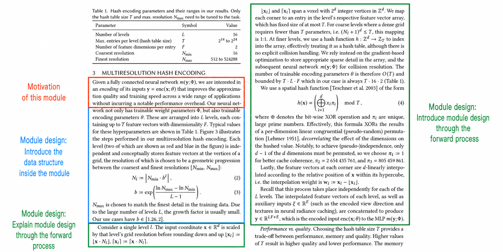

</details>

</details>

<details>
<summary>How to write module motivation</summary>

Write motivation in a problem-driven way: there is a problem, so we design xx to solve it.

Typical opening sentences:

1. A remaining problem/challenge is ...
2. However, we ...
3. Previous methods have difficulty in ...

</details>

<details>
<summary>How to check whether your method is easy to understand</summary>

1. Outline writing: after finishing the paper, summarise the writing outline of the method again and check whether the outline flows.
2. Paragraph writing: the first sentence of a paragraph must let the reader know what the paragraph is about, and one paragraph must convey one thing well.
3. Sentence writing:
    1. Carefully check whether the **motivation** of every sentence in the method is clear. Keep the reader aware of one thing at all times: **why are we doing the thing this sentence describes?**
    2. Carefully check that consecutive sentences flow (see this [document (Notion)](./high-level-researchers.md) for the discussion of flow.)
    3. Carefully check that nouns in the paper are consistent. Try not to keep changing them.

</details>

```latex
\section{Method}
% Overview
% Section 3.1
% Section 3.2
% Section 3.3
```

<details>
<summary>Overview</summary>

```latex
% Overview
% One or two sentences introducing the setting
%% Example 1: Given a sparse multi-view video of a performer, our task is to generate a free-viewpoint video of the performer.
%% Example 2: Given an image, the task of pose estimation is to detect objects and estimate their orientations and translations in the 3D space.

% One or two sentences introducing the paper's core contribution
%% Example 1: We build upon prior work for static scenes [46], to which we add the notion of time, and estimate 3D motion by explicitly modeling forward and backward scene flow as dense 3D vector fields.
%% Example 2: Inspired by [21, 25], we perform object segmentation by deforming an initial contour to match object boundary.
%% Example 3: Inspired by recent methods [29, 30, 36], we estimate the object pose using a two-stage pipeline: we first detect 2D object keypoints using CNNs and then compute 6D pose parameters using the PnP algorithm. Our innovation is in a new representation for 2D object keypoints as well as a modified PnP algorithm for pose estimation.

% If the pipeline/framework is novel, draw a figure to introduce it
%% Example: The overview of the proposed model is illustrated in Figure 3.

% What Section 3.1 describes
%% Example 1: Neural Body starts from a set of structured latent codes attached to the surface of a deformable human model (Section 3.1).
%% Example 2: In this section, we first describe how to model 3D scenes with MLP maps (Section 3.1).

% What Section 3.2 describes
%% Example 1: The latent code at any location around the surface can be obtained with a code diffusion process (Section 3.2) and then decoded to density and color values by neural networks (Section 3.3).
%% Example 2: Then, Section 3.2 discusses how to represent volumetric videos with dynamic MLP maps.

% What Section 3.3 describes
%% Example 3: Finally, we introduce some strategies to speed up the rendering process (Section 3.3).
```

</details>

<details>
<summary>Section 3.1</summary>

Basic writing outline:

1. Motivation of the module
2. Module forward process / module design
3. Technical advantages of the module

<details>
<summary>Neural Body as a worked example</summary>

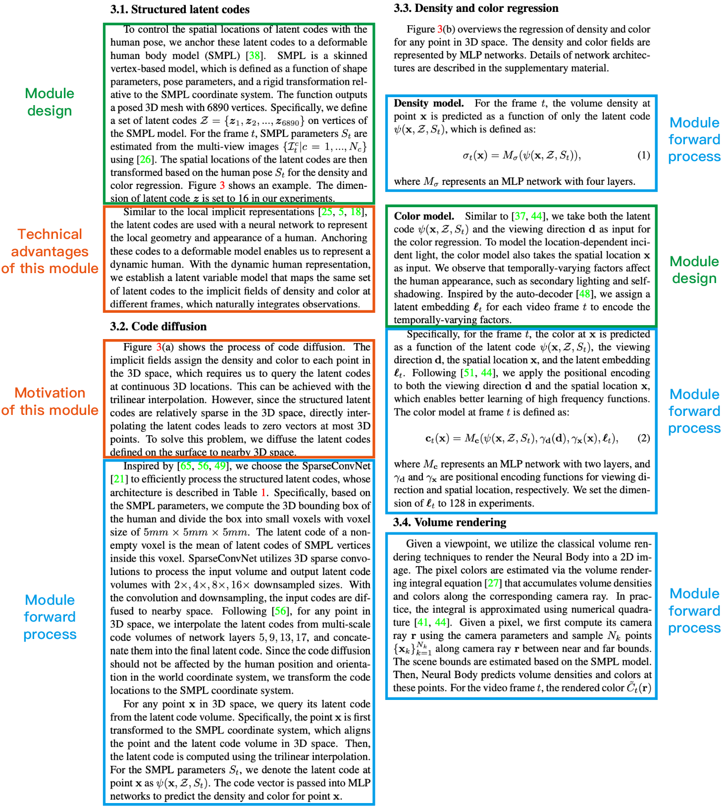

</details>

</details>

</details>

<details>
<summary>Implementation details</summary>

Network depth, feature vector dimension and other hyper-parameters; coordinate transformations, coordinate normalisation and other implementation details.

Usually mentioned at the end of a section, or in a dedicated implementation details section.

</details>

<details>
<summary>Drawing figures</summary>

[Paper figure template](./figures-template.md)

> **Method figures matter a lot.** The pipeline figure inside the method needs to look different from previous methods. Otherwise the reader will get the impression that the work has no novelty. If the whole pipeline (from input to output) is not very novel, you should highlight the novel module inside the pipeline figure. Another option is to skip the big figure and use several small figures, but the paper may then look less polished.
>
> **The pipeline figure is not for making the reader understand; it is for highlighting novelty. The text part of the method is what makes the reader understand.**
>
> Positive examples are NSFF and KiloNeRF. A negative example is AniSDF.

</details>

<details>
<summary>Drawing tables</summary>

Reference tutorial: [https://x.com/jbhuang0604/status/1626372600824844289](https://x.com/jbhuang0604/status/1626372600824844289)

Examples of good-looking tables:


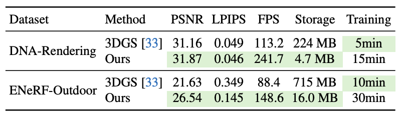

Iterate step by step:

1. Put the caption above the table

    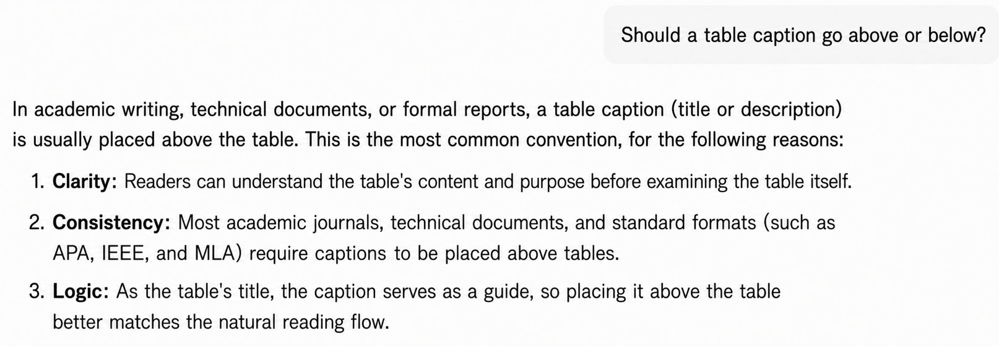

2. Avoid vertical lines, and do not connect vertical and horizontal lines: change `\hline` in LaTeX to `\toprule`, `\midrule`, `\bottomrule`

    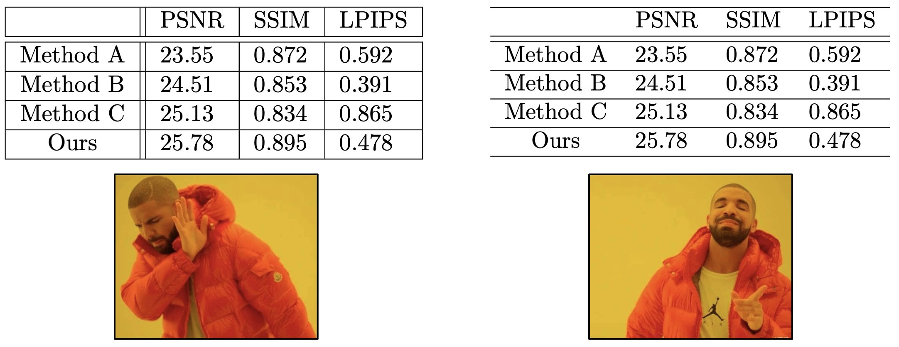

3. Use horizontal lines sparingly; too many disrupt the eye

    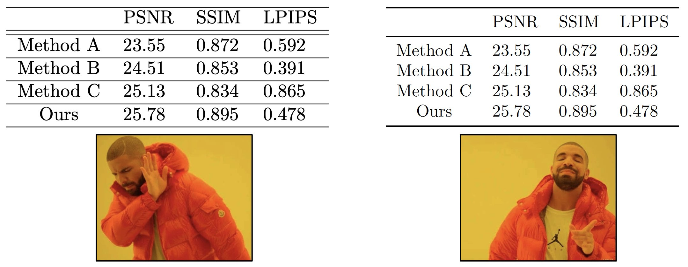

4. Colour the highlighted numbers

    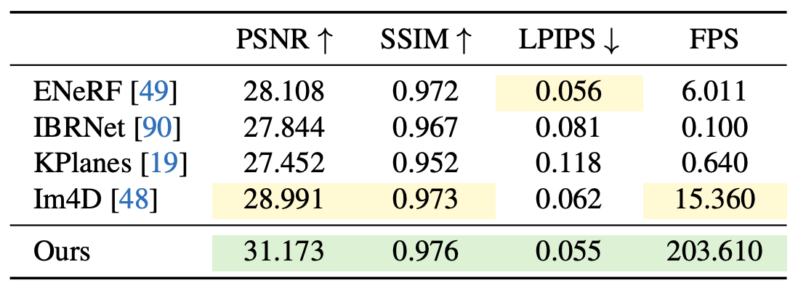

</details>

<details>
<summary>Experiments</summary>

> Writing good experiments means answering three questions:
> (1) How do we show our method is stronger than existing methods? Which comparison experiments do we run?
> (2) How do we show that the modules in the method are effective? Which ablation studies do we run?
> (3) How do we showcase the upper limit of our method? Which more challenging data do we run demos on?

> In the experiments text, the figure and table captions are quite important.
>
> Table captions and figure captions need to spell out the experimental setting and notation. If there is nothing else to add, a single sentence summarising the result is fine.
>
> Caption text should not turn into a long discussion of the result, since that just repeats the body text.

> Layout tip for experiment figures and tables: a single-column figure or table looks better in the right column of the paper, because reading habits draw the eye to the top-left corner first.

<details>
<summary>Which comparison experiments to run</summary>

<details>
<summary>Version 1: baseline methods exist</summary>

You need to compare with relevant, recent baseline methods.

</details>

<details>
<summary>Version 2: the task is new and there are no directly relevant baseline methods</summary>

<details>
<summary>Some examples</summary>

1. Example 1: build variants of the method

    [Variant comparison example, [https://arxiv.org/pdf/2008.02268.pdf](https://arxiv.org/pdf/2008.02268.pdf)](https://arxiv.org/pdf/2008.02268.pdf)

</details>

</details>

</details>

<details>
<summary>Which ablation studies to run</summary>

A paper contains some core contributions and a number of design choices inside each pipeline module. Readers usually **care a lot about how the core contributions affect performance**, and **wonder whether the design choices are really useful**.

Ablation studies therefore usually contain two parts:

1. A big table with matching qualitative comparison figures, listing the effect of the paper's core contributions and a few important components on the method's performance.

    <details>
    <summary>Some examples</summary>

    1. Example 1

        [Ablation table example 1, [https://arxiv.org/pdf/2003.08934.pdf](https://arxiv.org/pdf/2003.08934.pdf)](https://arxiv.org/pdf/2003.08934.pdf)

    2. Example 2

        [Ablation table example 2, [https://arxiv.org/pdf/2304.06717.pdf](https://arxiv.org/pdf/2304.06717.pdf)](https://arxiv.org/pdf/2304.06717.pdf)

    3. Example 3

        [Ablation table example 3, [https://arxiv.org/pdf/2302.12237.pdf](https://arxiv.org/pdf/2302.12237.pdf)](https://arxiv.org/pdf/2302.12237.pdf)

    </details>

2. Several smaller tables with matching qualitative comparison figures. Each small table lists the effect of design choices inside one pipeline module on the method's performance (sensitivity to hyper-parameters, sensitivity to input data quality, the impact of removing a particular design choice).

    <details>
    <summary>Some examples</summary>

    1. Example 1

        [Smaller ablation table example, [https://arxiv.org/pdf/2302.12237.pdf](https://arxiv.org/pdf/2302.12237.pdf)](https://arxiv.org/pdf/2302.12237.pdf)

    </details>

</details>

<details>
<summary>Which applications/demos to run (<strong>has a very large effect on the paper's impact</strong>)</summary>

[How to make appealing demos and applications](../demos-and-applications.md)

</details>

</details>

<details>
<summary>Related work</summary>

> Steps for writing a good Related work:
> (1) First, list the papers most relevant to your method. (**The most important part of related work.** If you do not discuss them, some reviewers will reject the paper outright.)
> (2) Then, based on the paper's research direction and the techniques used, decide which topics the related work should cover, and list the papers to discuss under each topic.
> (3) Finally, organise the writing outline of the related work based on the papers listed in the first two steps.

</details>

<details>
<summary>Conclusion</summary>

In addition to the standard conclusion, you also need to write Limitations. Otherwise reviewers often treat "no limitations written" as a weakness.

The limitations usually describe the limitations caused by the task goal or task setting (similar to discussing future work), rather than technical defects.

<details>
<summary>Example</summary>

1. Common videos are more than a few minutes. However, this work only deals with videos of 100 to 300 frames, which are relatively short, thus limiting the applications. How to model a long volumetric video remains an interesting problem.

</details>

<details>
<summary>Notes on the above point</summary>

Some students have questions about the point above. See this [issue](https://github.com/pengsida/learning_research/issues/12). The question is: **what is the essential difference between a "technical defect" and "a limitation caused by the task goal or task setting"?**

> About the Conclusion section, I'm not quite clear.
> About the Conclusion, you wrote: `Limitations usually describe the limitations caused by the task goal or task setting (similar to discussing future work), rather than technical defects.`,
> and then you gave an example:
> `Common videos are more than a few minutes. However, this work only deals with videos of 100 to 300 frames, which are relatively short, thus limiting the applications. How to model a long volumetric video remains an interesting problem.`
> In your example, `this work only deals with videos of 100 to 300 frames` looks to me like a technical defect too, namely the method cannot handle long sequences.
> What is the essential difference between `technical defect` and `a limitation caused by the task goal or task setting`?
> For instance, if my proposed algorithm uses less GPU memory than current methods but takes longer to train, is that a technical defect or a task-goal-driven limitation?

My reply: **"as long as you do not fall below the metric of the current SOTA method, it is not a technical defect."**

> The line between "technical defect" and "a limitation caused by the task goal or task setting" really is blurry.
> **In general, a paper should improve one metric without obviously hurting other metrics.**
> In your example, "the proposed algorithm uses less GPU memory than current methods but takes longer to train" hurts an existing metric, so it might be treated as a serious limitation.
> In my example, "this work only deals with videos of 100 to 300 frames" is fine because current SOTA methods can also only handle relatively short videos, so it really is future work.

</details>

</details>

<details>
<summary>How to revise a paper</summary>

At the end of the paper, add a self-review question list, split into five aspects. Ask questions in each aspect and revise the paper based on those questions:

1. Contribution is not strong enough (the paper does not bring new knowledge to the reader; usually it includes a few of these: the failure cases the paper wants to fix are very common; the technique has already been well explored, so the performance improvement is predictable or well known; the technique is fairly straightforward).
2. Writing is not clear (technical details are missing, results are not reproducible; a method module lacks motivation).
3. Experimental results are not strong enough (only marginally better than previous methods; better than previous methods, but still not good enough overall).
4. Experimental evaluation is not thorough (missing ablation studies; missing important baselines; missing important evaluation metrics; data is too simple to show whether the method really works).
5. Method design has problems (the experimental setting is unrealistic; the method has technical defects and looks unreasonable; the method is not stable and needs hyper-parameter tuning per scene; a new design brings benefits but also introduces stronger limitations, so the net gain is negative).

</details>

> **Be careful with every claim in the paper (especially in the abstract and introduction). Claims must not be wrong, and they must be supported by experiments. Otherwise some reviewers will reject the paper outright.**

**A very important way to keep the paper's quality high: aim for perfectionism.**

1. Adversarial writing: review your own paper, think through every question a reviewer might ask, and address them one by one.

    [How to review papers](./reviewing-papers.md)

2. Ask your supervisor to give as many comments on your paper as possible. The more, the better. (This is essentially a pre-review by the supervisor. The more comments the supervisor gives that you fix, the fewer issues remain for the reviewers to raise.)
