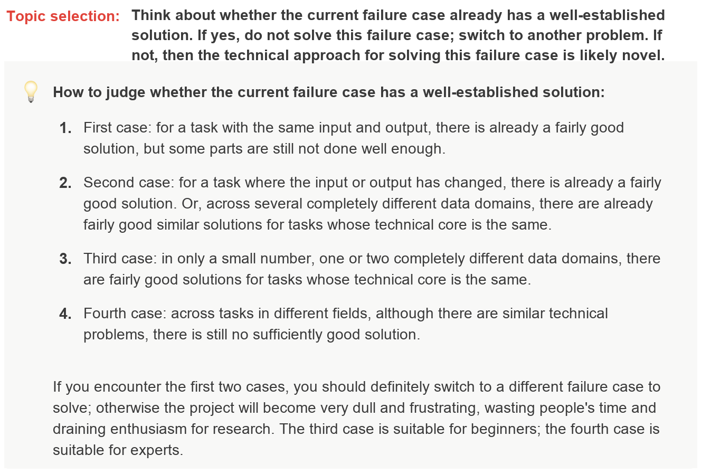
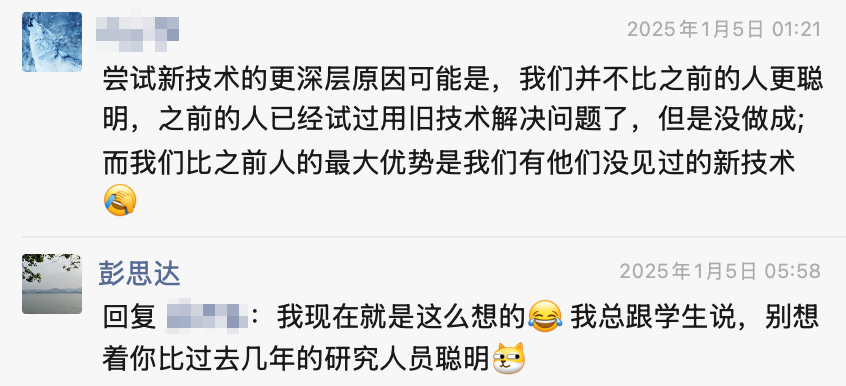

# Project core technical problem analysis template

> The top-level project design content for this document has been moved into the strategic planning slide deck. This document is mainly for recording the specific plans during project execution, the problems encountered, the proposed techniques, and the experimental notes.

### Project setting

Input: xx

Output: xx

Which industries do you want to apply this task to (one or more): xx

<details>
<summary>What are the key needs of the target industries for this task (in priority order)</summary>

xx

</details>

What key need does this project want to meet: xx

---

### Overall project plan

- [ ] 1. Set up the baseline. Run the baseline and see how far its performance sits from the key need.
- [ ] 2. Analyse the underlying technical problems that cause the gap.
- [ ] 3. Use first principles to design ideas that solve the problem.
- [ ] 4. Run exploratory experiments.

---

### High-priority problems hit during the project

---

### Related work survey

Technical approach 1: xx

1. Paper 1
2. Paper 2

Limitations of technical approach 1:

Why it has these limitations:

Technical approach 2: xx

1. Paper 1
2. Paper 2

Limitations of technical approach 2:

Why it has these limitations:

Papers that are not the same task but are still related:

Technical approach 3: xx

1. Paper 1

---

### Confirm whether the application need you started with is the most important and most valuable need right now

> Einstein once said: If I had an hour to solve a problem I'd spend 55 minutes thinking about the problem and 5 minutes thinking about solutions.

<details>
<summary>Reading of Einstein's quote</summary>

Question: what does this sentence mean: If I had an hour to solve a problem I'd spend 55 minutes thinking about the problem and 5 minutes thinking about solutions.

```
Deep thinking complete (took 14 seconds)

The user's question is about what the sentence means: "If I had an hour to solve a problem I'd spend 55 minutes thinking about the problem and 5 minutes thinking about solutions." This is an English sentence and I need to explain what it conveys.

The core idea: if there is an hour to solve a problem, the author would spend 55 minutes thinking about the problem itself, and only 5 minutes thinking about the solution. It places weight on understanding the problem.

The line is usually attributed to Albert Einstein. The attribution may not be accurate, but it carries an important message about how to approach problem solving.

The main point: when solving a problem, deeply understanding the problem is more important than rushing to find a solution. Spending more time analysing the problem, defining it, and understanding its root causes leads to more effective and more efficient solutions.

- 55 minutes thinking about the problem: this includes clarifying the problem, gathering information, identifying root causes, considering different angles, and avoiding faulty assumptions.
- 5 minutes thinking about the solution: once the problem is well understood, the solution often becomes obvious or easier to put in place.

The principle behind it:

- Many problem-solving failures come from not understanding the problem well enough.
- Investing time in defining the problem reduces mistakes, avoids wasted effort, and saves time overall.
- It is similar to the saying "sharpening the axe does not delay the woodcutting", in the sense that good preparation lifts efficiency.

In a wider context, this applies to science, engineering, business, and personal problems. It encourages critical thinking and systems thinking.
```

The line comes from Albert Einstein, and it conveys a core philosophy of problem solving in an efficient way: **when solving a problem, deeply understanding and defining the problem itself matters far more than rushing to find a solution.** Specifically, putting effort into the problem analysis stage produces solutions that are more effective and more lasting.

### Literal meaning

- If you have one hour to solve a problem, the author would put 55 minutes into thinking about the problem, for example analysing the root cause, gathering information, clarifying ambiguities, and identifying possible obstacles, and only 5 minutes into thinking about the solution, for example drawing up the action plan or the way to execute it.

### Deeper meaning

1. **Understanding the problem is the key to success.** Many problem-solving efforts fail because the problem itself is not understood well enough, for example because the problem is defined wrong or the root cause is overlooked. Spending time analysing the problem thoroughly avoids the trap of "solving the wrong problem with the right method".
2. **Efficiency and effectiveness first.** On the surface, this looks like wasted time, but in fact good preparation (the 55 minutes) makes the later solution work (the 5 minutes) more accurate and efficient. This is similar to the Chinese saying "sharpening the axe does not delay the woodcutting": sharpening the axe takes time, but it makes cutting wood faster afterwards.
3. **Encouraging critical thinking.** It encourages people to question, explore, and verify the problem first rather than rushing into action. This applies to science, business, engineering, and personal life. For example:
    - **In business**: if a company's sales drop, spending time analysing the cause (such as a market shift or a product defect) is more effective than just launching a new promotion.
    - **In personal life**: if you feel under stress, do not rush for a way to relieve it. First work out where the stress is coming from (workload, relationships, and so on).

### Why does it matter?

- **It saves time overall.** A wrong problem definition can lead to repeated failures, which wastes resources. Once the problem has been analysed thoroughly, the solution often falls into place.
- **It builds systems thinking.** It helps avoid one-sided or impulsive decisions and develops a habit of deep thinking.
- **Real-world use.** Many widely used methods, such as "5 Whys" (from the Toyota Production System) or design thinking, follow the same principle: most of the time goes on problem definition and only a small share goes on execution.

In short, the core message is: **"Spending time understanding the problem properly is half the work of solving it."** It reminds us that when facing a challenge, patience and insight matter more than the urge to act.

</details>

<details>
<summary>Analysis</summary>

Which industry do you want to push forward: xx

Within that industry, which needs of the task are still not met (sort by importance):

1. xx
2. xx

Of the needs above, which one has the largest impact (think about which need affects more industries and which one shows up more often):

1. xx
2. xx

</details>

Based on the analysis above, decide whether the application need you started with is the most important and most valuable need right now: yes / no

---

### Confirm the core technical problem the project wants to solve

The core technical problem behind that limitation: xx

<details>
<summary>Which case does the problem fall into: case 1 / 2 / 3 / 4</summary>



</details>

---

### Problem decomposition

To solve the core technical problem, the key is to solve the following sub-problems:

1. xx
2. xx

---

### Possible solutions for the core technical problem

Solution 1: xx

Solution 2: xx

---

### New techniques that may be useful

> Solving the problem means we have to do better than earlier researchers. We need a better answer than them on this problem.
>
> There are two ways to do that:
>
> 1. There is a new technical breakthrough, or a technique from another field, or an old technique that nobody has picked up yet, and we can ride that fresh technique to surpass the earlier work.
>
>     
>
> 2. We are genuinely smarter than the earlier people (across researchers worldwide) and invent a new technical approach ourselves.

In this research direction, what new techniques do we have that earlier people did not have, or what techniques from other fields, or what old techniques nobody has picked up yet (this is the key to the project working out):

1. xx
2. xx

Which of the sub-problems listed above can new technique 1 solve:

1. xx
2. xx

How to use new technique 1 to solve the core technical problem:
