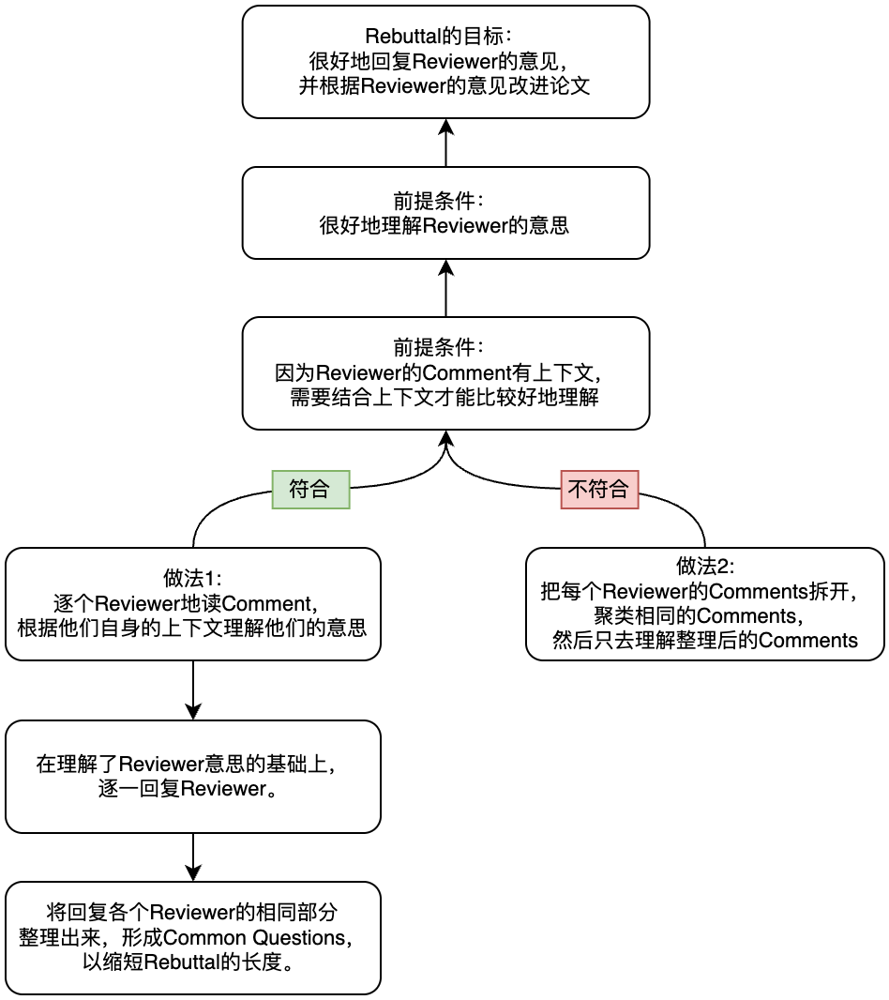

# How to do a rebuttal

> Document index (GitHub repo): [https://github.com/pengsida/learning_research](https://github.com/pengsida/learning_research)

Rebuttal writing style:

1. Answer what is asked. Do not bring in other things, since that distracts the reviewer.
2. Put the reviewer's question at the start of the paragraph.
3. As far as possible, answer the reviewer's questions in the order they were asked.
4. As far as possible, list all of a reviewer's questions under that reviewer's section, then reply to each one. Even if there are common questions, refer to common questions from inside the reviewer section.

For an example of the writing style above, see this attached file: `Rebuttal style example.pdf` (attachment on the original Notion page).

Rebuttal procedure:

First, organise the review content

The new review-organising tool is based on drawio (**recommended**, gives you a clearer overall view and is easier to read): `Rebuttal organising template.drawio` (attachment on the original Notion page).

The Excel-based review-organising tool

[https://docs.google.com/spreadsheets/d/1TS2l5SrbExHxA1i_xrm2Sbd5dz_uS4CqAjoAskiZNX0/edit?usp=sharing](https://docs.google.com/spreadsheets/d/1TS2l5SrbExHxA1i_xrm2Sbd5dz_uS4CqAjoAskiZNX0/edit?usp=sharing)

A blank review-organising template:

[https://docs.google.com/spreadsheets/d/17sH8sMqroFrmLKfogcC-9AyJpWKi8Ugru1NoKtFAIDo/edit?usp=sharing](https://docs.google.com/spreadsheets/d/17sH8sMqroFrmLKfogcC-9AyJpWKi8Ugru1NoKtFAIDo/edit?usp=sharing)

> Answer this question clearly: why did the reviewer give this score?

Then answer the questions raised in the justification and weaknesses

Tutorial articles on writing a rebuttal:

[https://deviparikh.medium.com/how-we-write-rebuttals-dc84742fece1](https://deviparikh.medium.com/how-we-write-rebuttals-dc84742fece1)

[https://research.siggraph.org/blog/guides/writing-a-rebuttal-for-siggraph/](https://research.siggraph.org/blog/guides/writing-a-rebuttal-for-siggraph/)

> Rebuttal writing style: answer the reviewer's question head-on, so the reviewer can tell at a glance what you are answering.
>
> General principles:
>
> 1. Whatever the reviewer asks for, that is what we give.
> 2. Do not introduce new problems in the reply (otherwise it is easy to get rejected because of that).

After finishing the first draft of the rebuttal, mark each reviewer's main questions (usually given in the justification), then check repeatedly whether you have answered the reviewer's questions correctly and whether they would convince the reviewer. Also ask a fellow student to look at it and check whether you have addressed the reviewer's main questions sensibly.

> Why only mark the main questions? **Because each reviewer normally only has a few main concerns.** Some reviewers write a lot, but once it gets long they themselves cannot remember all of it, and after a while they forget. **The one or two key points in the review are what they will firmly remember, and what they care about most.**
>
> Of course, every question from the reviewer should still be answered well. The point is just that after finishing the first draft of the rebuttal, most of the effort should go into making sure those one or two questions are answered correctly. Also ask a few fellow students to confirm that those questions have been answered correctly.

